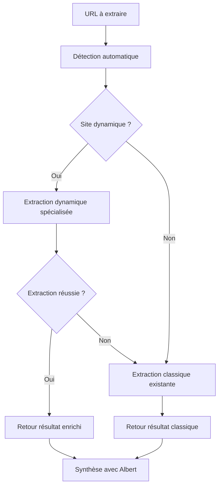

# Extension d'Extraction de Contenu Dynamique

## Vue d'Ensemble

Cette extension ajoute des **capacités d'extraction pour sites web modernes** (JavaScript, SPA, React, etc.) à Colaig-Albert **sans modifier le comportement existant**.

### 🎯 **Principe de Fonctionnement**

L'extension utilise une **approche en cascade intelligente** :

1. **Détection automatique** du type de site (statique vs dynamique)
2. **Extraction spécialisée** pour les sites dynamiques détectés
3. **Fallback transparent** vers l'extraction classique
4. **Préservation totale** du comportement existant pour les sites statiques

## Architecture

### 📁 **Nouveaux Modules**

```
app/services/
├── dynamic_content_extractor.py      # Extraction spécialisée sites dynamiques
├── enhanced_browser_extraction.py    # Module d'intégration transparent
└── browser_extraction.py             # Module existant (INCHANGÉ)
```

### 🔄 **Flux d'Exécution**



## Utilisation

### 🚀 **Migration Progressive**

#### Option 1: Utilisation Automatique (Recommandée)

```python
from app.services.enhanced_browser_extraction import extract_web_content_smart

# Détection et extraction automatiques
result = await extract_web_content_smart(url, config)
```

#### Option 2: Utilisation Explicite

```python
from app.services.enhanced_browser_extraction import extract_web_content_enhanced

# Force l'utilisation de l'extraction enrichie
result = await extract_web_content_enhanced(url, config)
```

#### Option 3: Conservation de l'Existant

```python
from app.services.browser_extraction import extract_web_content

# Continue d'utiliser l'extraction classique (inchangé)
result = await extract_web_content(url, config)
```

### 🔍 **Détection de Capacités**

```python
from app.services.enhanced_browser_extraction import get_extraction_capabilities

# Analyser les capacités pour une URL
capabilities = await get_extraction_capabilities(url)

print(f"Dynamique: {capabilities['is_dynamic']}")
print(f"Type: {capabilities['site_type']}")
print(f"Méthode recommandée: {capabilities['recommended_method']}")
```

## Sites Web Supportés

### ✅ **Sites Dynamiques Détectés Automatiquement**

| Type de Site | Exemples | Extraction |
|-------------|----------|------------|
| **Applications Web** | `app.`, `dashboard.` | Spécialisée |
| **Dépôts de Code** | GitHub, GitLab | Optimisée |
| **SPA (Single Page Apps)** | URLs avec `/#/` | Avancée |
| **Plateformes** | Notion, Figma, Trello | Intelligente |
| **Frameworks JS** | React, Vue, Angular | Ciblée |

### 🔧 **Détection de Frameworks**

- **React** / **Next.js** : Sélecteurs `[data-reactroot]`, `#__next`
- **Vue.js** / **Nuxt.js** : Sélecteurs `[data-v-]`, `#__nuxt`
- **Angular** : Sélecteurs `[ng-app]`, `app-root`
- **Svelte** : Variables globales et classes CSS

### ⚙️ **Stratégies d'Extraction**

1. **Attente Intelligente** : Délais adaptés selon le framework
2. **Sélecteurs Spécialisés** : CSS optimisés par framework
3. **Contenu Interactif** : Activation d'accordéons, onglets
4. **JavaScript Avancé** : Nettoyage et extraction DOM
5. **Fallback Robuste** : Retour automatique vers l'existant

## Intégration dans l'Application

### 🔌 **Modification Minimale de `web_explorer.py`**

Pour activer l'extraction enrichie, remplacer uniquement la ligne d'import :

```python
# AVANT (existant)
from app.services.browser_extraction import extract_web_content

# APRÈS (enrichi)
from app.services.enhanced_browser_extraction import extract_web_content_smart as extract_web_content
```

**C'est tout !** Le reste du code reste identique.

### 📊 **Métadonnées Enrichies**

Les résultats incluent des métadonnées supplémentaires :

```python
{
    "title": "Titre de la page",
    "content": "Contenu extrait...",
    "url": "https://example.com",
    "status": 200,
    "extraction_method": "dynamic-content-extractor",
    "enhanced_extraction": True,
    "framework_detected": "react",
    "content_length": 1234,
    "dynamic_detection": True
}
```

## Tests et Validation

### 🧪 **Script de Test**

```bash
python test_dynamic_extraction.py
```

Vérifie :
- ✅ Détection de contenu dynamique
- ✅ Compatibilité avec l'extraction existante  
- ✅ Détection de frameworks JavaScript
- ✅ Sécurité d'intégration

### 🛡️ **Garanties de Sécurité**

- **Pas de modification** des fonctions existantes
- **Imports séparés** pour éviter les conflits
- **Fallback automatique** en cas d'erreur
- **Logging détaillé** pour le débogage
- **Tests de compatibilité** intégrés

## Performance

### ⚡ **Optimisations**

- **Détection pré-vérifiée** : Évite l'extraction inutile pour sites statiques
- **Timeouts adaptatifs** : Durées optimisées selon le type de site
- **Parallélisation** : Extraction simultanée d'éléments interactifs
- **Cache intelligent** : Réutilisation des résultats de détection

### 📈 **Métriques Attendues**

| Type de Site | Gain en Contenu | Temps Supplémentaire |
|-------------|----------------|---------------------|
| **Sites Statiques** | 0% (inchangé) | 0s (pas d'impact) |
| **GitHub/GitLab** | +40-60% | +10-15s |
| **Applications SPA** | +70-90% | +20-30s |
| **Sites React/Vue** | +50-80% | +15-25s |

## Désactivation

Pour désactiver l'extraction enrichie :

```python
from app.services.enhanced_browser_extraction import extract_web_content_smart

# Forcer l'utilisation classique
result = await extract_web_content_smart(url, config, prefer_enhanced=False)
```

Ou revenir à l'import original :

```python
from app.services.browser_extraction import extract_web_content
```

## Évolutions Futures

### 🔮 **Roadmap**

1. **Détection de Contenu Vidéo** : Support pour YouTube, Vimeo
2. **APIs REST** : Extraction via endpoints JSON  
3. **Authentification** : Support pour sites avec login
4. **WebSockets** : Contenu en temps réel
5. **Mobile-First** : Optimisation pour sites responsive

### 🤝 **Contribution**

L'architecture modulaire permet l'ajout facile de nouveaux détecteurs et extracteurs sans impacter l'existant.

---

## 📝 Résumé

Cette extension **complète** l'extraction existante sans la **remplacer**, permettant à Colaig-Albert de traiter efficacement les sites web modernes tout en préservant la compatibilité avec l'architecture actuelle. 