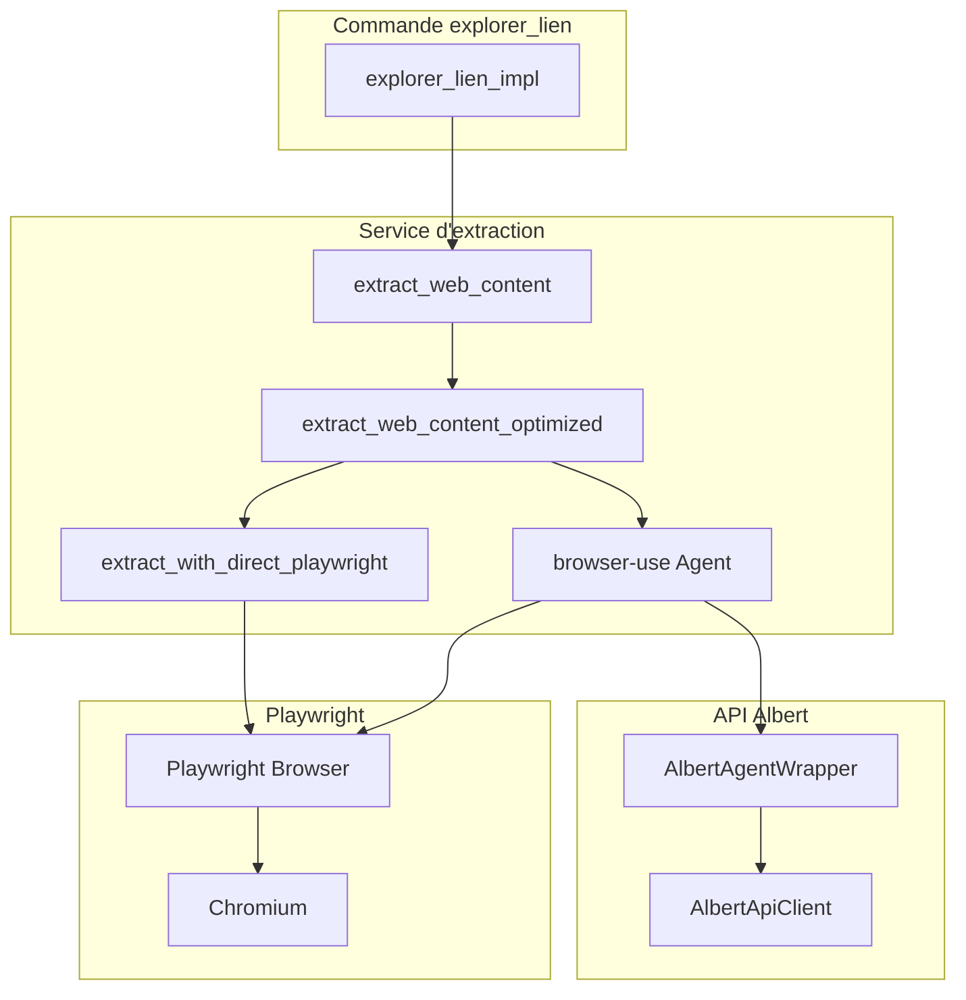

# Guide Complet : Extraction de Contenu Web avec Playwright et API Albert

## Vue d'ensemble

Ce guide détaille l'implémentation de l'extraction de contenu web dans le projet Colaig-Albert, qui utilise Playwright pour l'automatisation du navigateur et l'API Albert pour le traitement et la synthèse du contenu extrait.

L'architecture combine plusieurs approches :
1. **Extraction directe avec Playwright** (rapide, sans IA)
2. **Extraction intelligente avec browser-use + Albert** (complète, avec IA)
3. **Fallback HTTP** (quand Playwright n'est pas disponible)

## Architecture du Système

### Composants Principaux



## Installation et Configuration

### 1. Dépendances Minimales Requises

#### Dans `pyproject.toml` :
```toml
dependencies = [
    "browser-use==0.1.41",
    "langchain-openai>=0.3.11",
    "playwright>=1.40.0",
    "httpx>=0.27.2",
    "openai>=1.68.2,<2.0.0",
    "aiohttp==3.9.3",
    "pydantic>=2.10.4,<2.11.0"
]
```

#### Packages système (Linux/Ubuntu) :
```bash
apt-get update && apt-get install -y --no-install-recommends \
    libglib2.0-0 libgobject-2.0-0 libnss3 libnssutil3 libsmime3 libnspr4 \
    libdbus-1-3 libatk1.0-0 libatk-bridge2.0-0 libcups2 libgio-2.0-0 \
    libexpat1 libx11-6 libxcomposite1 libxdamage1 libxext6 libxfixes3 \
    libxrandr2 libgbm1 libxcb1 libxkbcommon0 libpango-1.0-0 libcairo2 \
    libasound2 libatspi2.0-0
```

### 2. Installation de Playwright

#### Script automatique :
```python
# scripts/install_playwright.py
def install_playwright():
    """Installe Playwright et ses dépendances."""
    # Installer playwright
    subprocess.run([sys.executable, "-m", "pip", "install", "playwright"], check=True)
    
    # Installer les navigateurs (Chromium uniquement)
    subprocess.run([sys.executable, "-m", "playwright", "install", "--with-deps", "chromium"], check=True)
    
    # Configuration des variables d'environnement
    os.environ["PLAYWRIGHT_HEADLESS"] = "true"
    os.environ["PLAYWRIGHT_SKIP_BROWSER_DOWNLOAD"] = "0"
    os.environ["PLAYWRIGHT_BROWSERS_PATH"] = "0"
```

#### Installation manuelle :
```bash
# Installation des packages Python
pip install playwright browser-use langchain-openai

# Installation de Chromium
python -m playwright install chromium

# Avec dépendances système
python -m playwright install --with-deps chromium
```

### 3. Configuration Environnement

#### Variables d'environnement obligatoires :
```bash
# API Albert
ALBERT_API_URL=https://albert.api.etalab.gouv.fr/v1
ALBERT_API_TOKEN=votre_token_api_albert
ALBERT_MODEL=meta-llama/Llama-3.1-8B-Instruct
ALBERT_MODEL_EMBEDDING=BAAI/bge-m3

# Playwright (mode headless)
PLAYWRIGHT_HEADLESS=true
PLAYWRIGHT_SKIP_BROWSER_DOWNLOAD=0
PLAYWRIGHT_BROWSERS_PATH=0
DISPLAY=""

# Extraction web
ALLOW_FALLBACK_EXTRACTION=true
```

#### Fichier de configuration :
```python
# app/config.py
class Config(BaseConfig):
    # API Albert
    albert_api_url: str = Field("https://albert.api.etalab.gouv.fr/v1")
    albert_api_token: str = Field(..., description="Token API Albert")
    albert_model: str = Field("meta-llama/Llama-3.1-8B-Instruct")
    albert_model_embedding: str = Field("BAAI/bge-m3")
    
    # Extraction web
    allow_fallback_extraction: bool = Field(True)
```

## Implémentation Détaillée

### 1. Fonction Principale : `explorer_lien`

```python
# app/commands/web_commands/web_explorer.py
async def explore_link_impl(link, matrix_client, room_id, event_id, config, webdav_service=None, is_silent=False):
    """
    Implémentation complète de l'exploration de liens web.
    
    Processus :
    1. Validation et normalisation de l'URL
    2. Vérification du cache
    3. Extraction du contenu avec browser-use
    4. Génération de résumé avec Albert
    5. Mise en cache et retour du résultat
    """
    try:
        # 1. Normalisation de l'URL
        if not link.startswith(('http://', 'https://')):
            link = 'https://' + link
            
        # 2. Vérification du cache
        web_cache = WebCache(webdav_service)
        cached_result = await web_cache.get_cached_result(link)
        if cached_result:
            return cached_result
        
        # 3. Extraction du contenu
        response = await extract_web_content(link, config)
        content = response.get("content", "")
        
        if not content:
            raise ValueError("Aucun contenu extrait")
            
        # Troncature si nécessaire
        if len(content) > 12000:
            content = content[:12000] + "...\n\n[Contenu tronqué car trop long]"
            
        # 4. Génération du résumé avec Albert
        prompt = f"""Tu es un assistant qui résume efficacement le contenu d'une page web.
        
Voici le contenu extrait de {link} :

---
{content}
---

Fais-en un résumé clair et concis qui capture les informations essentielles.
Organise le résumé en sections si c'est pertinent.
Ton résumé ne doit pas dépasser 500 mots. Ne mentionne pas que tu es un modèle d'IA."""
        
        aclient = AlbertApiClient(base_url=config.albert_api_url, api_key=config.albert_api_token)
        summary = await aclient.generate(
            model=config.albert_model,
            messages=[{"role": "user", "content": prompt}]
        )
        
        # 5. Mise en cache
        await web_cache.cache_result(link, summary)
        
        return summary
        
    except Exception as e:
        logger.error(f"Erreur lors de l'exploration du lien: {str(e)}")
        return None
```

### 2. Service d'Extraction Principal

```python
# app/services/browser_extraction.py
async def extract_web_content(url: str, config) -> Dict[str, Any]:
    """
    Fonction principale d'extraction avec plusieurs stratégies :
    1. Extraction optimisée (directe + agent si nécessaire)
    2. Extraction classique avec browser-use
    3. Fallback HTTP si Playwright indisponible
    """
    # Vérification de la disponibilité de browser-use
    await ensure_browser_use_available()
    
    try:
        # ÉTAPE 1: Tentative d'extraction optimisée
        optimized_result = await extract_web_content_optimized(url, config)
        if optimized_result:
            return optimized_result
        
        # ÉTAPE 2: Extraction classique avec browser-use
        if _browser_use_available:
            return await _extract_with_browser_use_agent(url, config)
        
        # ÉTAPE 3: Fallback HTTP
        else:
            return await extract_with_httpx(url)
            
    except Exception as e:
        logger.error(f"Erreur lors de l'extraction: {str(e)}")
        raise BrowserExtractionError(f"Échec de l'extraction: {str(e)}")
```

### 3. Extraction Directe avec Playwright

```python
async def extract_with_direct_playwright(url: str) -> Dict[str, Any]:
    """
    Extraction directe et rapide sans IA.
    Optimisée pour les sites avec structure prévisible.
    """
    try:
        from playwright.async_api import async_playwright
        
        async with async_playwright() as p:
            # Configuration optimisée du navigateur
            browser = await p.chromium.launch(
                headless=True,
                args=['--disable-gpu', '--no-sandbox', '--disable-dev-shm-usage']
            )
            
            context = await browser.new_context(
                viewport={"width": 1280, "height": 1080},
                user_agent="Mozilla/5.0 (Windows NT 10.0; Win64; x64) Chrome/120.0.0.0 Safari/537.36"
            )
            
            page = await context.new_page()
            
            # Navigation avec gestion d'erreurs
            try:
                await page.goto(url, wait_until="networkidle", timeout=45000)
                await page.wait_for_load_state("networkidle")
                await asyncio.sleep(2)  # Attente contenu dynamique
            except Exception as nav_error:
                logger.warning(f"Navigation issue: {str(nav_error)}")
            
            # Extraction du titre
            title = await page.title()
            
            # Sélecteurs spécifiques par domaine
            selectors = _get_domain_specific_selectors(url)
            
            # Tentative d'extraction avec sélecteurs
            content = await _extract_with_selectors(page, selectors)
            
            # Fallback JavaScript si nécessaire
            if not content or len(content.strip()) < 200:
                content = await _extract_with_javascript(page)
            
            await browser.close()
            
            if content and len(content.strip()) > 300:
                return {
                    "title": title,
                    "content": content.strip(),
                    "url": url,
                    "status": 200,
                    "extraction_method": "direct-playwright"
                }
            else:
                return None
                
    except Exception as e:
        logger.error(f"Erreur extraction directe Playwright: {str(e)}")
        return None

def _get_domain_specific_selectors(url: str) -> List[str]:
    """Retourne des sélecteurs optimisés selon le domaine."""
    selectors = []
    
    if "legifrance.gouv.fr" in url:
        selectors = ['.corpsTexte', '#texte_article_contenu', '#mentionsLegales', '#content']
    elif "service-public.fr" in url:
        selectors = ['#contenu', '.main-content', 'article', '.pane-content']
    elif "github.com" in url:
        selectors = ['.markdown-body', '.repository-content', 'readme-toc', 'article']
    
    # Sélecteurs génériques
    selectors.extend([
        'main', '[role="main"]', 'article', '.article', '#article',
        '.post', '#post', '.content', '#content', '.page-content',
        '.main-content', '#main-content', '.text', '.body'
    ])
    
    return selectors
```

### 4. Wrapper Albert pour browser-use

```python
class AlbertAgentWrapper(BaseChatModel):
    """
    Wrapper permettant d'utiliser l'API Albert avec browser-use.
    Adapte l'interface d'Albert pour la compatibilité LangChain.
    """
    
    # Attributs Pydantic
    api_key: str = Field(description="Clé API pour Albert")
    base_url: str = Field(description="URL de base pour l'API Albert")
    model_name: str = Field(description="Nom du modèle à utiliser")
    
    # Attributs privés
    _aclient: Any = PrivateAttr()
    _dict_storage: Dict[str, Any] = PrivateAttr(default_factory=dict)
    
    def __init__(self, api_key: str, base_url: str, model: str, **kwargs):
        """Initialisation du wrapper avec les paramètres Albert."""
        super().__init__(api_key=api_key, base_url=base_url, model_name=model, **kwargs)
        self._aclient = AlbertApiClient(base_url=base_url, api_key=api_key)
        self._dict_storage = {}
    
    async def _agenerate(self, messages: List[BaseMessage], **kwargs):
        """
        Génération asynchrone compatible avec browser-use.
        Convertit les messages LangChain vers le format Albert.
        """
        try:
            # Conversion des messages LangChain vers format Albert
            albert_messages = []
            for msg in messages:
                if isinstance(msg, HumanMessage):
                    albert_messages.append({"role": "user", "content": msg.content})
                elif isinstance(msg, AIMessage):
                    albert_messages.append({"role": "assistant", "content": msg.content})
                else:
                    albert_messages.append({"role": "system", "content": msg.content})
            
            # Appel à l'API Albert
            response = await self._aclient.generate(
                model=self.model_name,
                messages=albert_messages,
                **kwargs
            )
            
            return AIMessage(content=response)
            
        except Exception as e:
            logger.error(f"Erreur génération Albert: {str(e)}")
            raise
    
    async def __call__(self, messages=None, **kwargs):
        """Interface principale appelée par browser-use."""
        if messages is None:
            messages = []
        
        # Gestion du format string direct
        if isinstance(messages, str):
            messages = [HumanMessage(content=messages)]
        elif isinstance(messages, list) and len(messages) > 0 and isinstance(messages[0], dict):
            # Format dict Albert -> LangChain
            converted = []
            for msg in messages:
                if msg.get("role") == "user":
                    converted.append(HumanMessage(content=msg["content"]))
                elif msg.get("role") == "assistant":
                    converted.append(AIMessage(content=msg["content"]))
                else:
                    converted.append(HumanMessage(content=msg["content"]))
            messages = converted
        
        result = await self._agenerate(messages, **kwargs)
        return result.content
```

### 5. Configuration de l'Agent browser-use

```python
async def setup_browser_agent(config) -> Agent:
    """
    Configure un agent browser-use avec Albert.
    """
    # Assurer que Playwright est installé
    await ensure_playwright_installed()
    
    # Configuration des variables d'environnement
    os.environ["PLAYWRIGHT_HEADLESS"] = "true"
    
    # Paramètres Albert
    api_key = config.albert_api_token
    base_url = config.albert_api_url
    model = config.albert_model
    
    # Tâche d'extraction spécialisée
    extraction_task = """
Visite l'URL fournie et extrais uniquement le contenu principal.
ÉTAPES:
1. Utilise browser.goto(url) pour accéder à la page
2. Attends le chargement complet avec browser.wait_for_load_state("networkidle")
3. Identifie le contenu principal (ignore menus, publicités, en-têtes, pieds de page)
4. Extrais le titre et le contenu principal
5. Retourne au format: TITRE: [titre]\nCONTENU: [contenu structuré]
"""
    
    # Plan par défaut (certains modèles ne planifient pas bien)
    default_plan = [
        "Ouvrir le navigateur et accéder à l'URL",
        "Attendre le chargement complet de la page",
        "Rechercher le titre principal de la page", 
        "Rechercher le contenu principal",
        "Extraire le texte pertinent",
        "Retourner le contenu structuré"
    ]
    
    # Création de l'agent
    agent = Agent(
        task=extraction_task,
        llm=AlbertAgentWrapper(api_key=api_key, base_url=base_url, model=model),
        default_plan=default_plan
    )
    
    return agent
```

### 6. Client Albert API

```python
# app/core_llm.py
class AlbertApiClient:
    """
    Client pour l'API Albert avec toutes les fonctionnalités requises.
    """
    
    def __init__(self, base_url: str, api_key: str):
        # Nettoyage de l'URL de base
        self.base_url = base_url.rstrip('/').replace('/v1', '')
        self.api_key = api_key
        
        # Client OpenAI pour les complétions
        self.openai_client = OpenAI(
            api_key=api_key,
            base_url=f"{self.base_url}/v1"
        )
        
        # Client HTTP pour les autres opérations
        self.http_client = httpx.AsyncClient(
            timeout=60.0,
            headers={
                "Authorization": f"Bearer {self.api_key}",
                "Content-Type": "application/json"
            },
            limits=httpx.Limits(max_keepalive_connections=5, max_connections=10),
            http2=True
        )
        self._last_chunks: list[dict] = []

    async def generate(self, model: str, **sampling_params) -> str:
        """Génère du texte avec le modèle spécifié."""
        url = f"{self.base_url}/v1/chat/completions"
        headers = {
            "Authorization": f"Bearer {self.api_key}",
            "Content-Type": "application/json",
        }
        
        data = {
            "model": model,
            **sampling_params
        }
        
        async with httpx.AsyncClient(timeout=120.0) as client:
            response = await client.post(url, json=data, headers=headers)
            response.raise_for_status()
            result = response.json()
            
            if "choices" in result and len(result["choices"]) > 0:
                return result["choices"][0]["message"]["content"]
            else:
                raise ValueError("Réponse inattendue de l'API Albert")

    async def get_embeddings(self, texts: List[str], model: str) -> List[List[float]]:
        """Génère les embeddings pour une liste de textes."""
        url = f"{self.base_url}/v1/embeddings"
        data = {
            "model": model,
            "input": texts
        }
        
        async with httpx.AsyncClient(timeout=120.0) as client:
            response = await client.post(url, json=data, headers=self.http_client.headers)
            response.raise_for_status()
            result = response.json()
            
            if "data" in result:
                return [item["embedding"] for item in result["data"]]
            else:
                raise ValueError("Réponse inattendue de l'API Albert pour les embeddings")

    async def semantic_search(self, model: str, query: str, limit: int, collections: list[str]) -> list[dict]:
        """Recherche sémantique via l'API Albert."""
        params = {
            "prompt": query,
            "model": model,
            "collections": collections,
            "k": limit,
        }
        response = await self.http_client.post(f"{self.base_url}/v1/search", json=params)
        response.raise_for_status()
        data = response.json()
        return [v["chunk"] for v in data["data"]]

    async def close(self):
        """Ferme proprement le client HTTP."""
        await self.http_client.aclose()
```

## Utilisation Pratique

### 1. Utilisation Simple

```python
from app.services.browser_extraction import extract_web_content
from app.config import Config

config = Config()
result = await extract_web_content("https://example.com", config)
print(result["content"])
```

### 2. Utilisation avec la Commande

```python
from app.commands.web_commands.web_explorer import explore_link_impl

# Dans un contexte Matrix
summary = await explore_link_impl(
    link="https://legifrance.gouv.fr/...",
    matrix_client=client,
    room_id=room_id, 
    event_id=event_id,
    config=config
)
```

### 3. Test d'Extraction Directe

```python
from app.services.browser_extraction import extract_with_direct_playwright

result = await extract_with_direct_playwright("https://github.com/microsoft/playwright")
if result:
    print(f"Titre: {result['title']}")
    print(f"Contenu: {result['content'][:500]}...")
```

## Dépannage et Optimisation

### 1. Problèmes Courants

#### Playwright non installé :
```bash
# Vérification
python -c "from playwright.async_api import async_playwright"

# Installation si erreur
python -m playwright install chromium
```

#### Dépendances système manquantes :
```bash
# Ubuntu/Debian
sudo apt-get install -y libglib2.0-0 libnss3 libatk1.0-0 libx11-6

# Alpine
apk add --no-cache glib nss atk libx11

# Ou installation automatique
python -m playwright install-deps
```

#### Mode headless non configuré :
```bash
export PLAYWRIGHT_HEADLESS=true
export DISPLAY=""
```

### 2. Optimisations

#### Cache des résultats :
```python
# Implémentation du cache WebDAV
class WebCache:
    async def get_cached_result(self, url: str) -> Optional[str]:
        """Récupère le résultat mis en cache."""
        cache_key = hashlib.md5(url.encode()).hexdigest()
        # Logique de récupération du cache
        
    async def cache_result(self, url: str, result: str):
        """Met en cache le résultat."""
        cache_key = hashlib.md5(url.encode()).hexdigest()
        # Logique de mise en cache
```

#### Timeouts configurables :
```python
# Dans la configuration
EXTRACTION_TIMEOUT = 30  # secondes
NAVIGATION_TIMEOUT = 45  # secondes

# Utilisation
async with asyncio.timeout(EXTRACTION_TIMEOUT):
    result = await extract_web_content(url, config)
```

#### Retry automatique :
```python
from tenacity import retry, stop_after_attempt, wait_exponential

@retry(stop=stop_after_attempt(3), wait=wait_exponential(multiplier=1, min=4, max=10))
async def robust_extract_web_content(url: str, config):
    return await extract_web_content(url, config)
```

### 3. Monitoring et Logs

```python
import logging

# Configuration du logging pour l'extraction
logger = logging.getLogger("browser_extraction")
logger.setLevel(logging.INFO)

# Métriques d'extraction
extraction_metrics = {
    "total_extractions": 0,
    "successful_extractions": 0,
    "failed_extractions": 0,
    "average_extraction_time": 0.0,
    "playwright_available": True,
    "browser_use_available": True
}

async def track_extraction_metrics(func):
    """Décorateur pour tracker les métriques d'extraction."""
    start_time = time.time()
    try:
        result = await func()
        extraction_metrics["successful_extractions"] += 1
        return result
    except Exception as e:
        extraction_metrics["failed_extractions"] += 1
        logger.error(f"Extraction failed: {str(e)}")
        raise
    finally:
        extraction_metrics["total_extractions"] += 1
        extraction_time = time.time() - start_time
        extraction_metrics["average_extraction_time"] = (
            (extraction_metrics["average_extraction_time"] * (extraction_metrics["total_extractions"] - 1) + extraction_time) 
            / extraction_metrics["total_extractions"]
        )
```

## Sécurité et Bonnes Pratiques

### 1. Validation des URLs

```python
from urllib.parse import urlparse
import re

def validate_url(url: str) -> bool:
    """Valide qu'une URL est sûre à traiter."""
    try:
        parsed = urlparse(url)
        
        # Vérifier le schéma
        if parsed.scheme not in ['http', 'https']:
            return False
            
        # Bloquer les IPs privées
        if re.match(r'^(127\.|10\.|192\.168\.|172\.(1[6-9]|2[0-9]|3[01])\.)', parsed.hostname or ''):
            return False
            
        # Bloquer les ports non standard
        if parsed.port and parsed.port not in [80, 443]:
            return False
            
        return True
    except Exception:
        return False
```

### 2. Limitation des Ressources

```python
# Configuration des limites
MAX_CONTENT_LENGTH = 50 * 1024 * 1024  # 50MB
MAX_EXTRACTION_TIME = 120  # 2 minutes
MAX_CONCURRENT_EXTRACTIONS = 5

# Semaphore pour limiter les extractions concurrentes
extraction_semaphore = asyncio.Semaphore(MAX_CONCURRENT_EXTRACTIONS)

async def limited_extract_web_content(url: str, config):
    async with extraction_semaphore:
        async with asyncio.timeout(MAX_EXTRACTION_TIME):
            return await extract_web_content(url, config)
```

### 3. Gestion des User-Agent

```python
# Rotation des User-Agent pour éviter la détection
USER_AGENTS = [
    "Mozilla/5.0 (Windows NT 10.0; Win64; x64) AppleWebKit/537.36 (KHTML, like Gecko) Chrome/120.0.0.0 Safari/537.36",
    "Mozilla/5.0 (Macintosh; Intel Mac OS X 10_15_7) AppleWebKit/537.36 (KHTML, like Gecko) Chrome/120.0.0.0 Safari/537.36",
    "Mozilla/5.0 (X11; Linux x86_64) AppleWebKit/537.36 (KHTML, like Gecko) Chrome/120.0.0.0 Safari/537.36"
]

import random

def get_random_user_agent() -> str:
    return random.choice(USER_AGENTS)

# Utilisation dans l'extraction
context = await browser.new_context(
    user_agent=get_random_user_agent(),
    viewport={"width": 1280, "height": 1080}
)
```

## Conclusion

Cette implémentation offre une solution robuste et flexible pour l'extraction de contenu web, combinant :

- **Performance** : Extraction directe rapide avec Playwright
- **Intelligence** : Traitement avancé avec l'API Albert
- **Fiabilité** : Multiples stratégies de fallback
- **Sécurité** : Validation et limitation des ressources
- **Maintenabilité** : Architecture modulaire et bien documentée

Le système peut traiter une grande variété de sites web, des pages statiques simples aux applications JavaScript complexes, tout en fournissant des résumés intelligents via l'API Albert. 