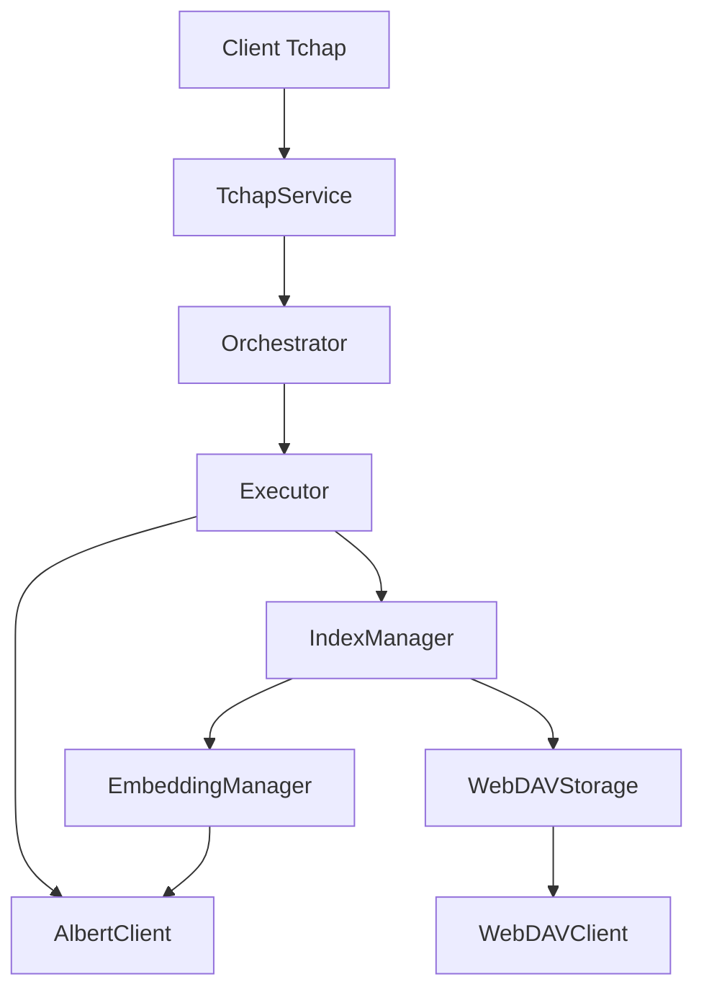
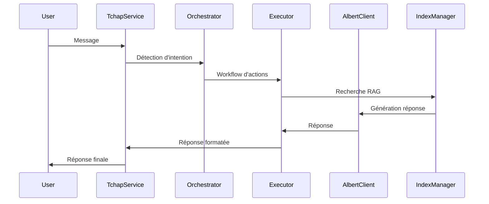

# COLAIG - Assistant Conversationnel avec RAG

COLAIG est un assistant conversationnel intelligent qui utilise le Retrieval-Augmented Generation (RAG) pour fournir des réponses précises basées sur une base documentaire.

## Caractéristiques Principales

- Intégration avec Tchap pour la messagerie
- Stockage WebDAV pour les documents
- Indexation vectorielle avec FAISS
- Gestion asynchrone des opérations
- Architecture modulaire et extensible

## Architecture



## Modules Principaux

1. **Tools**
   - Clients pour les services externes (Albert, WebDAV, Tchap)
   - Gestion du rate limiting

2. **Storage**
   - Stockage persistant avec WebDAV
   - Gestion des conversations et documents

3. **Indexing**
   - Gestion des embeddings
   - Index vectoriel FAISS
   - Parseurs de documents

4. **Services**
   - Service Tchap pour la messagerie
   - Gestion des conversations

5. **Core**
   - Orchestrateur de workflows
   - Exécuteur d'actions
   - Factory pour l'injection de dépendances

## Démarrage Rapide

1. Configuration de l'environnement :
```bash
cp .env.example .env
# Éditer .env avec vos configurations
```

2. Installation des dépendances :
```bash
pip install -r requirements.txt
```

3. Lancement de l'application :
```bash
python -m colaig
```

## Documentation Détaillée

- [Architecture](./architecture/overview.md)
- [Modules](./modules/)
- [API](./api/endpoints.md)
- [Déploiement](./deployment/configuration.md)

## Flux de Données Principal



# Documentation COLAIG

Cette documentation détaille l'architecture et le fonctionnement de COLAIG, un assistant conversationnel basé sur le modèle de langage Albert pour Tchap.

## Structure

```
docs/
├── README.md                 # Ce fichier
├── core/                     # Composants core
│   ├── orchestrator.md      # Orchestrateur des workflows
│   ├── executor.md          # Exécuteur d'actions
│   ├── storage.md           # Gestionnaire de stockage
│   ├── albert_client.md     # Client Albert
│   └── tchap_client.md      # Client Tchap
├── indexing/                 # Module d'indexation
│   ├── embedding_manager.md  # Gestionnaire d'embeddings
│   ├── index_manager.md     # Gestionnaire d'index
│   ├── document_parser.md   # Parseur de documents
│   └── indexing_process.md  # Processus d'indexation
└── data-flow.md             # Flux de données
```

## Composants Core

### Orchestrator
L'Orchestrator est le composant central qui :
- Détecte les intentions des utilisateurs
- Génère les workflows appropriés
- Coordonne les actions entre les composants
- Gère le contexte des conversations

### Executor
L'Executor est responsable de :
- L'exécution des actions de workflow
- La gestion des ressources (CPU, mémoire)
- Le monitoring des performances
- La gestion des timeouts et retries

### Storage Manager
Le Storage Manager gère :
- Le stockage et la récupération des documents
- Les métadonnées
- La persistance des index
- L'archivage des conversations

### Albert Client
Le Client Albert gère :
- La communication avec l'API Albert
- Le formatage des prompts
- La gestion des tokens
- Le rate limiting

### Tchap Client
Le Client Tchap gère :
- La communication avec l'API Tchap
- L'authentification
- Les messages
- Les rooms et les utilisateurs

## Module d'Indexation

### Embedding Manager
Le Gestionnaire d'Embeddings est responsable de :
- La génération d'embeddings pour les documents
- La gestion du cache d'embeddings
- Le traitement par lots
- Le rate limiting

### Index Manager
Le Gestionnaire d'Index gère :
- L'index vectoriel FAISS
- Les métadonnées des documents
- La recherche sémantique
- La persistance de l'index

### Document Parser
Le Parseur de Documents s'occupe de :
- L'extraction du contenu des documents
- Le chunking intelligent
- La détection des formats
- L'extraction des métadonnées

### Indexing Process
Le Processus d'Indexation coordonne :
- Le flux d'indexation complet
- La gestion des erreurs
- Le monitoring
- L'optimisation des ressources

## Flux de Données

Le fichier `data-flow.md` décrit :
- Les flux de données principaux
- Les flux d'indexation
- Les flux de stockage
- Les flux de recherche
- Les flux de messages Tchap

## Utilisation

Chaque fichier de documentation contient :
1. Une vue d'ensemble du composant
2. Son architecture détaillée
3. Ses interfaces et API
4. Des exemples d'utilisation
5. La gestion des erreurs
6. Les possibilités d'extension

## Contribution

Pour contribuer à la documentation :
1. Créez une branche pour vos modifications
2. Suivez le format Markdown existant
3. Incluez des diagrammes si nécessaire (format Mermaid)
4. Ajoutez des exemples de code pertinents
5. Soumettez une pull request 