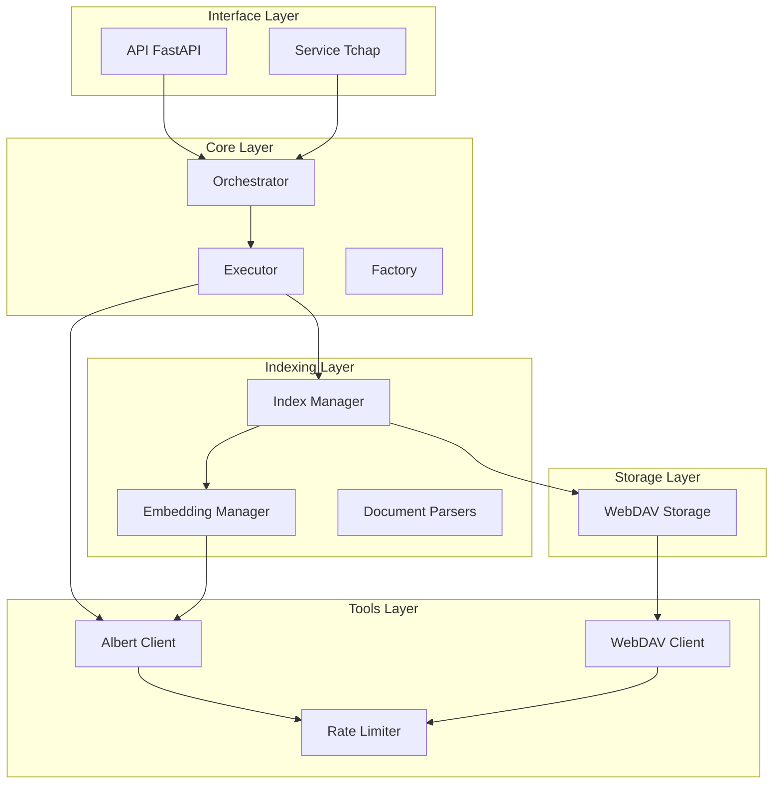
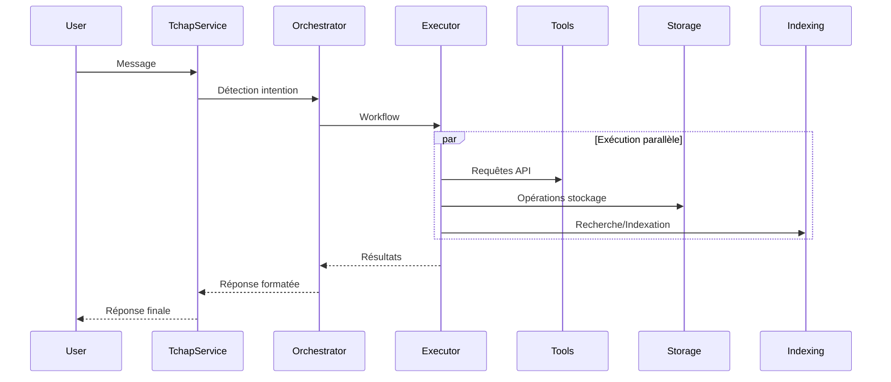

# Composants Principaux

## Vue d'Ensemble des Composants



## Composants Core

### 1. Orchestrator
- **Rôle** : Coordination des workflows et détection d'intention
- **Responsabilités** :
  - Analyse des requêtes utilisateur
  - Génération des workflows
  - Coordination des actions

### 2. Executor
- **Rôle** : Exécution des actions du workflow
- **Responsabilités** :
  - Exécution des recherches RAG
  - Gestion des requêtes directes
  - Coordination avec les services externes

### 3. Factory
- **Rôle** : Injection de dépendances et configuration
- **Responsabilités** :
  - Création des instances de services
  - Gestion des dépendances
  - Configuration de l'application

## Composants Tools

### 1. Albert Client
- **Rôle** : Interface avec l'API Albert
- **Responsabilités** :
  - Génération d'embeddings
  - Complétion de chat
  - Gestion des collections

### 2. WebDAV Client
- **Rôle** : Interface avec le stockage WebDAV
- **Responsabilités** :
  - Opérations de fichiers
  - Gestion des métadonnées
  - Synchronisation

### 3. Rate Limiter
- **Rôle** : Contrôle du débit des requêtes
- **Responsabilités** :
  - Limitation des requêtes
  - Gestion des lots
  - Cache des opérations

## Composants Storage

### WebDAV Storage
- **Rôle** : Stockage persistant
- **Responsabilités** :
  - Stockage des documents
  - Gestion des index
  - Gestion des conversations

## Composants Indexing

### 1. Embedding Manager
- **Rôle** : Gestion des embeddings
- **Responsabilités** :
  - Génération d'embeddings
  - Cache des embeddings
  - Traitement par lots

### 2. Index Manager
- **Rôle** : Gestion de l'index vectoriel
- **Responsabilités** :
  - Indexation des documents
  - Recherche sémantique
  - Gestion de la mémoire

### 3. Document Parsers
- **Rôle** : Traitement des documents
- **Responsabilités** :
  - Parsing des formats
  - Extraction du texte
  - Chunking

## Composants Services

### Tchap Service
- **Rôle** : Interface avec Tchap
- **Responsabilités** :
  - Gestion des messages
  - Gestion des salles
  - Synchronisation

## Interactions entre Composants



## Configuration des Composants

Chaque composant est configurable via :
1. Variables d'environnement
2. Fichiers de configuration
3. Factory d'injection de dépendances

Exemple de configuration :
```python
class ComponentConfig:
    def __init__(self):
        self.load_env()
        self.validate()

    def load_env(self):
        self.api_key = os.getenv("API_KEY")
        self.base_url = os.getenv("BASE_URL")
        self.rate_limit = int(os.getenv("RATE_LIMIT", "60"))

    def validate(self):
        if not self.api_key:
            raise ValueError("API_KEY is required")
```

## Extension des Composants

Chaque composant peut être étendu via :
1. Interfaces abstraites
2. Factory d'injection
3. Configuration personnalisée

Exemple d'extension :
```python
class CustomStorage(StorageInterface):
    async def save_document(self, document: Document):
        # Implémentation personnalisée
        pass
``` 