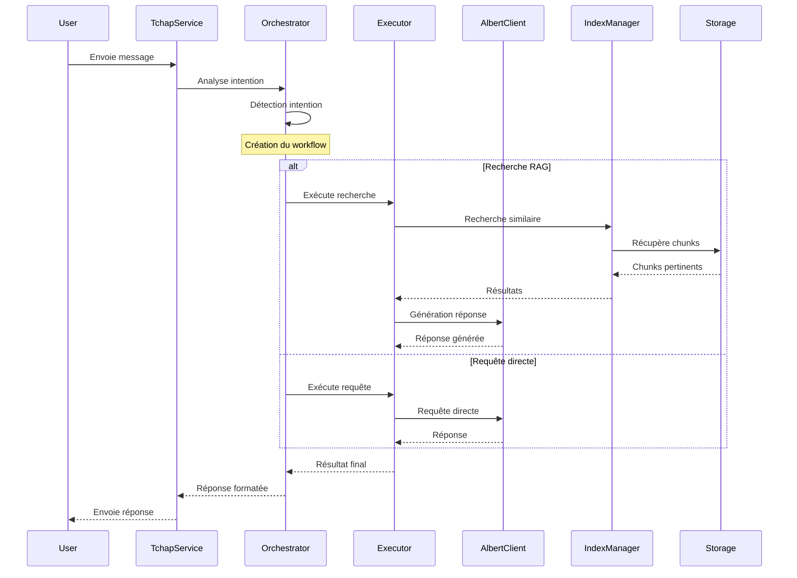
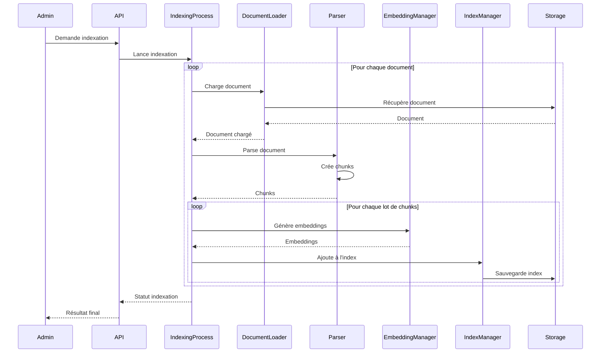
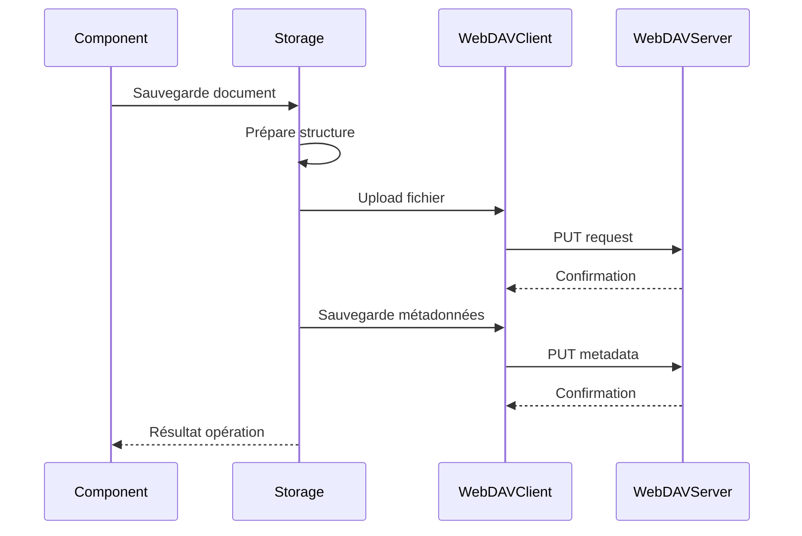
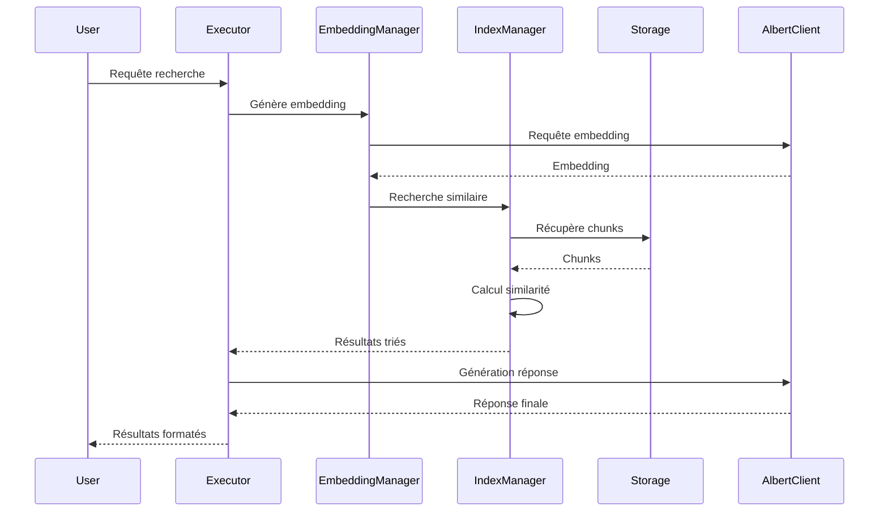
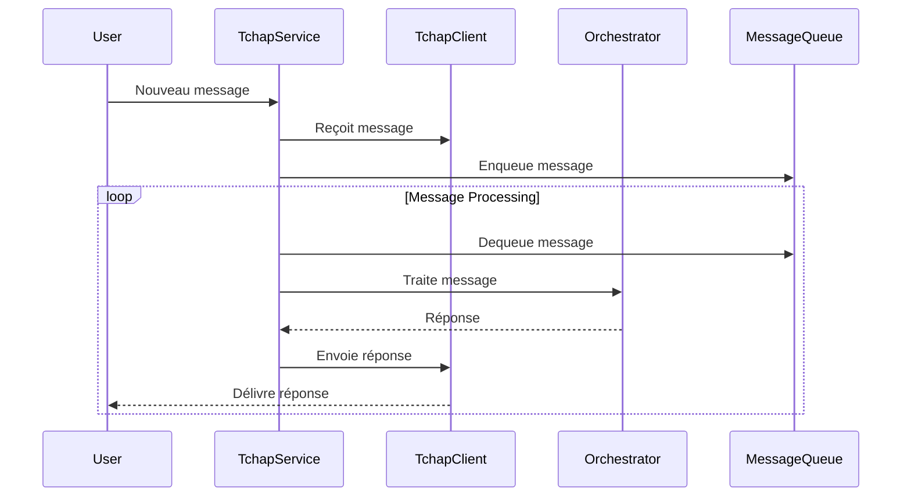
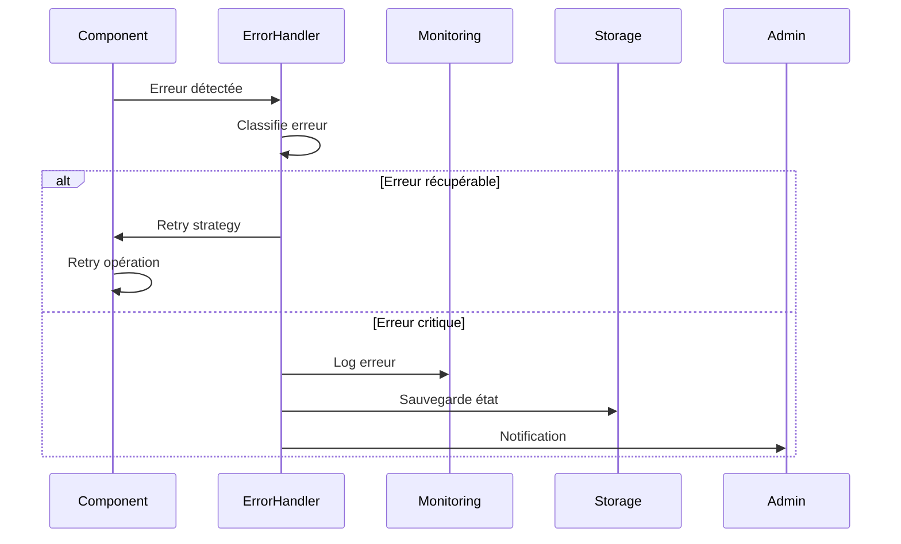

# Flux de Données

## Flux Principal



## Flux d'Indexation



## Flux de Stockage



## Flux de Recherche



## Flux de Messages Tchap



## Types de Données

### Messages
```python
class Message:
    id: str
    content: str
    sender: str
    timestamp: datetime
    role: str
    metadata: Dict
```

### Documents
```python
class Document:
    id: str
    title: str
    content: str
    chunks: List[DocumentChunk]
    metadata: Dict
```

### Embeddings
```python
class Embedding:
    vector: List[float]  # Dimension 768
    metadata: Dict
```

### Résultats de Recherche
```python
class SearchResult:
    chunk: DocumentChunk
    score: float
    metadata: Dict
```

## Gestion des Erreurs



## Persistance des Données

### Structure WebDAV
```
/colaig/
├── system/
│   └── status.json
├── index/
│   ├── faiss.bin
│   └── metadata.pkl
├── conversations/
│   └── {conversation_id}/
│       ├── metadata.json
│       └── messages/
└── documents/
    └── {document_id}/
        ├── metadata.json
        └── chunks/
```

### Format des Métadonnées
```json
{
    "system_status": {
        "last_indexing": "2024-02-20T14:30:00",
        "document_count": 1000,
        "conversation_count": 50
    },
    "document_metadata": {
        "id": "doc123",
        "title": "Document Title",
        "created_at": "2024-02-20T14:30:00",
        "chunk_count": 10
    }
}
``` 