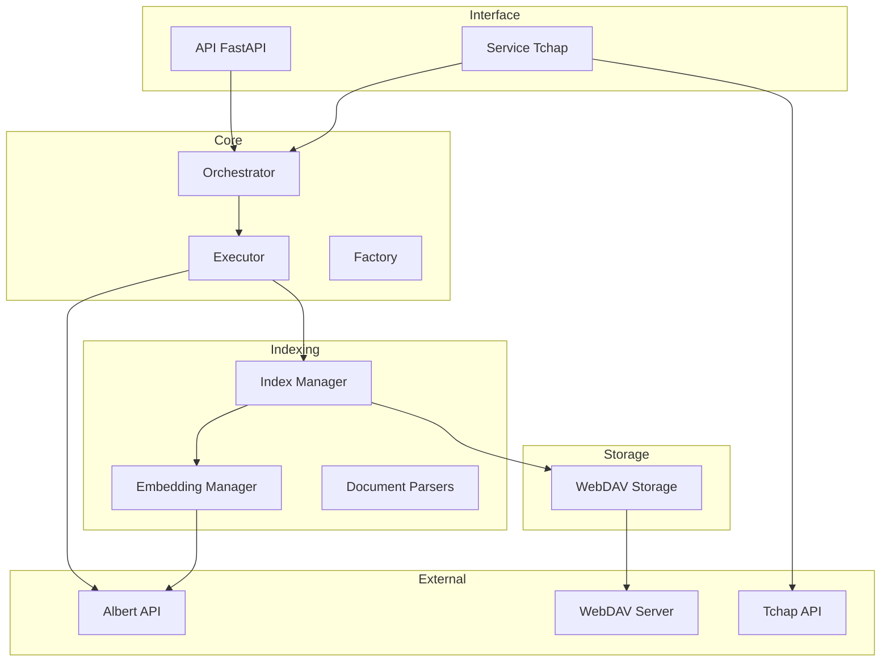
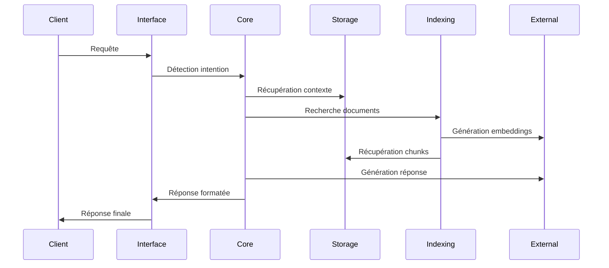
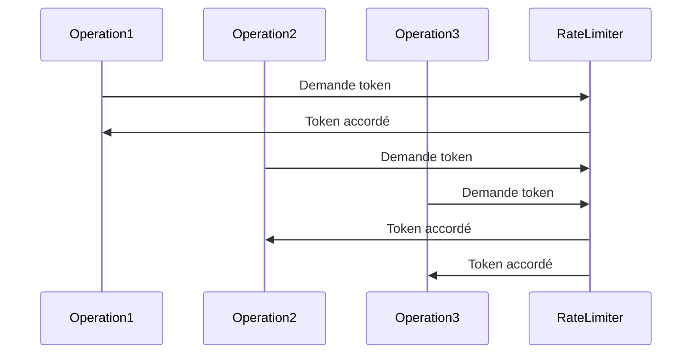

# Architecture de COLAIG

## Vue d'Ensemble

COLAIG est construit sur une architecture modulaire asynchrone, utilisant le pattern RAG (Retrieval-Augmented Generation) pour fournir des réponses contextuelles précises.

## Architecture Technique

## Composants Principaux

### 1. Interface Utilisateur
- **API FastAPI** : Points d'entrée REST
- **Service Tchap** : Interface de messagerie

### 2. Core
- **Orchestrator** : Gestion des workflows et intentions
- **Executor** : Exécution des actions
- **Factory** : Injection de dépendances

### 3. Storage
- **WebDAV Storage** : Stockage persistant
  - Documents
  - Conversations
  - Index

### 4. Indexing
- **Index Manager** : Gestion de l'index FAISS
- **Embedding Manager** : Gestion des embeddings
- **Document Parsers** : Traitement des documents

### 5. Services Externes
- **Albert API** : LLM et embeddings
- **WebDAV Server** : Stockage distant
- **Tchap API** : Messagerie gouvernementale

## Flux de Données

## Gestion Asynchrone

COLAIG utilise `asyncio` pour la gestion asynchrone des opérations :

## Sécurité et Rate Limiting

- Authentification par token
- Rate limiting par service
- Gestion des sessions
- Protection contre les accès concurrents

## Extensibilité

Le système est conçu pour être facilement extensible :

1. Nouveaux parsers de documents
2. Nouveaux services de stockage
3. Nouveaux types d'actions
4. Nouveaux clients externes

## Configuration

La configuration se fait via :
- Variables d'environnement
- Fichiers de configuration
- Injection de dépendances 