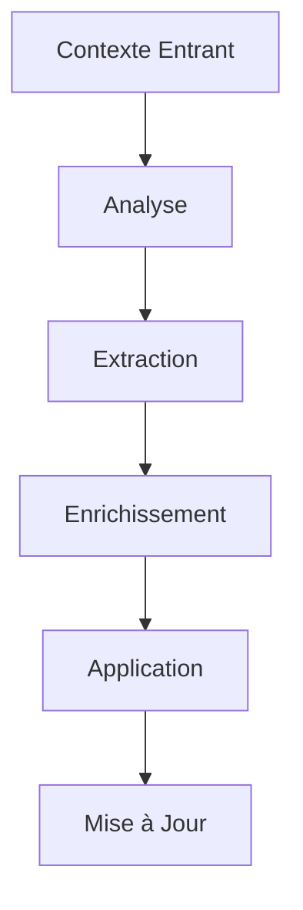

# Gestion du Contexte

## Introduction

La gestion du contexte est un élément crucial du système de comportement de Colaig. Elle permet de maintenir une compréhension cohérente de la conversation et d'adapter les réponses en fonction de multiples facteurs contextuels.

## Architecture du Système

### Vue d'Ensemble



## Types de Contexte

### 1. Contexte de Session
```python
SessionContext = {
    "history": List[Dict],  # Historique des messages
    "active_topics": Set[str],  # Sujets actifs
    "conversation_style": str,  # Style de conversation
    "user_preferences": Dict  # Préférences utilisateur
}
```

### 2. Contexte de Salle
```python
RoomContext = {
    "custom_config": Dict,  # Configuration personnalisée
    "room_settings": Dict,  # Paramètres de la salle
    "active_features": List[str]  # Fonctionnalités actives
}
```

### 3. Contexte Comportemental
```python
BehaviorContext = {
    "current_intent": str,  # Intention actuelle
    "active_behaviors": List[str],  # Comportements actifs
    "priority_overrides": Dict  # Priorités personnalisées
}
```

## Composants Principaux

### 1. Gestionnaire de Contexte

```python
class ContextHandler:
    async def analyze_context(
        self,
        query: str,
        session_context: Optional[Dict],
        room_context: Optional[Dict]
    ) -> Dict[str, Any]:
        """
        Analyse complète du contexte avec :
        - Extraction des topics
        - Détection du style
        - Analyse des règles
        - Gestion des paramètres
        """
```

### 2. Extracteur de Topics

```python
class TopicExtractor:
    def extract_topics(
        self,
        messages: List[str]
    ) -> Set[str]:
        """
        Extraction des sujets avec :
        - Analyse sémantique
        - Regroupement thématique
        - Filtrage des stopwords
        """
```

### 3. Détecteur de Style

```python
class StyleDetector:
    def detect_style(
        self,
        query: str,
        style_config: Dict
    ) -> str:
        """
        Détection du style avec :
        - Analyse des indicateurs
        - Matching des patterns
        - Application des règles
        """
```

## Processus de Gestion

### 1. Initialisation du Contexte

```python
async def initialize_context(
    session_id: str,
    room_id: str
) -> ContextData:
    """
    1. Chargement des configurations
    2. Initialisation des structures
    3. Configuration des paramètres par défaut
    """
```

### 2. Mise à Jour du Contexte

```python
async def update_context(
    context_data: ContextData,
    new_message: Dict
) -> ContextData:
    """
    1. Ajout du nouveau message
    2. Mise à jour des topics
    3. Actualisation du style
    4. Nettoyage si nécessaire
    """
```

### 3. Application du Contexte

```python
async def apply_context(
    behavior_config: Dict,
    context_data: ContextData
) -> Dict:
    """
    1. Fusion des configurations
    2. Application des priorités
    3. Adaptation des paramètres
    """
```

## Gestion de l'Historique

### 1. Structure de l'Historique

```python
MessageHistory = {
    "messages": List[Dict],
    "metadata": {
        "last_update": datetime,
        "topic_summary": List[str],
        "style_evolution": List[str]
    }
}
```

### 2. Nettoyage de l'Historique

```python
async def cleanup_history(
    history: MessageHistory,
    max_age: int = 3600,
    max_messages: int = 50
) -> MessageHistory:
    """
    1. Suppression des messages anciens
    2. Limitation de la taille
    3. Mise à jour des métadonnées
    """
```

## Optimisation des Performances

### 1. Stratégies de Cache

```python
class ContextCache:
    def __init__(self):
        self.topic_cache = LRUCache(maxsize=1000)
        self.style_cache = LRUCache(maxsize=100)
        self.config_cache = TTLCache(maxsize=500, ttl=3600)
```

### 2. Gestion de la Mémoire

- Limitation de la taille de l'historique
- Nettoyage périodique du cache
- Optimisation des structures de données

### 3. Parallélisation

```python
async def parallel_context_analysis(
    query: str,
    context_data: ContextData
) -> Dict:
    """
    Analyse parallèle :
    - Topics
    - Style
    - Règles
    """
```

## Configuration

### 1. Paramètres de Base

```json
{
    "context_handling": {
        "history_management": {
            "max_length": 10,
            "memory_duration": 3600,
            "cleanup_interval": 300
        },
        "topic_tracking": {
            "relevance_threshold": 0.3,
            "max_topics": 5
        }
    }
}
```

### 2. Règles de Style

```json
{
    "style_variations": {
        "formal": {
            "indicators": ["pourriez-vous", "s'il vous plaît"],
            "prompt_suffix": "Adoptez un ton formel."
        },
        "casual": {
            "indicators": ["salut", "hey"],
            "prompt_suffix": "Adoptez un ton cordial."
        }
    }
}
```

## Exemples d'Utilisation

### 1. Analyse Simple

```python
context = await context_handler.analyze_context(
    query="configurer l'API",
    session_context={"history": []}
)
```

### 2. Analyse Complète

```python
context = await context_handler.analyze_context(
    query="aide-moi à configurer une nouvelle API",
    session_context={
        "history": [...],
        "active_topics": ["api", "configuration"]
    },
    room_context={
        "custom_config": {
            "api_integration": True
        }
    }
)
```

## Bonnes Pratiques

### 1. Gestion du Contexte
- Maintenir un historique concis
- Nettoyer régulièrement
- Valider les données

### 2. Performance
- Utiliser le cache efficacement
- Optimiser les analyses
- Limiter la taille des données

### 3. Sécurité
- Valider les entrées
- Gérer les permissions
- Protéger les données sensibles 