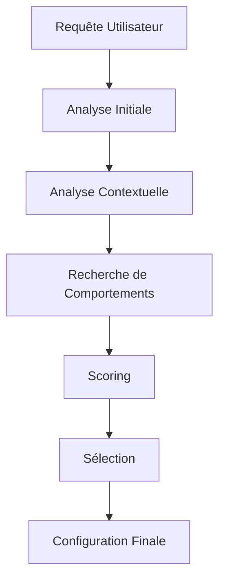

# Analyse d'Intention

## Introduction

L'analyse d'intention est un processus crucial qui permet à Colaig de comprendre et de répondre de manière appropriée aux requêtes des utilisateurs. Ce système combine plusieurs techniques d'analyse pour déterminer le comportement le plus adapté à chaque situation.

## Processus d'Analyse

### Vue d'Ensemble



## Composants du Système

### 1. Analyse Initiale

```python
async def analyze_intent(
    self,
    query: str,
    session_context: Optional[Dict] = None,
    room_context: Optional[Dict] = None
) -> Dict[str, Any]:
```

#### Fonctionnalités
- Analyse de la requête brute
- Extraction des mots-clés
- Identification des intentions primaires

#### Configuration par Défaut
```json
{
    "detected_intent": "standard_rag",
    "confidence": 1.0,
    "action_config": {
        "base": {
            "search_params": {
                "include_behavior": true,
                "include_documents": false
            }
        }
    }
}
```

### 2. Analyse Contextuelle

```python
async def _analyze_context(
    self,
    query: str,
    session_context: Optional[Dict],
    room_context: Optional[Dict]
) -> Dict[str, Any]:
```

#### Éléments Analysés
1. **Historique de Conversation**
   - Messages récents
   - Thèmes abordés
   - Intentions précédentes

2. **Contexte de Session**
   - État de la conversation
   - Configurations actives
   - Préférences utilisateur

3. **Contexte de Salle**
   - Paramètres spécifiques
   - Configurations personnalisées
   - Règles particulières

### 3. Recherche de Comportements

#### Processus de Recherche
1. **Recherche Sémantique**
   ```python
   chunks = await self.search(
       query=query,
       behavior_type="action",
       limit=3
   )
   ```

2. **Filtrage des Résultats**
   - Par type de comportement
   - Par pertinence
   - Par priorité

### 4. Système de Scoring

#### Critères de Score

1. **Score de Base**
   ```python
   base_score = config["priority"]
   ```

2. **Score Thématique**
   ```python
   topic_overlap = len(
       set(self._extract_topics([query])) & 
       context_info["active_topics"]
   )
   topic_score = topic_overlap * 0.2
   ```

3. **Score de Style**
   ```python
   style_match = (
       config["config"]["prompt"].get("style", "") == 
       context_info["conversation_style"]
   )
   style_score = 0.1 if style_match else 0
   ```

4. **Score des Règles**
   ```python
   rule_match = any(
       rule["type"] == config["intent"]
       for rule in context_info["relevant_rules"]
   )
   rule_score = 0.15 if rule_match else 0
   ```

#### Calcul du Score Final
```python
final_score = base_score + topic_score + style_score + rule_score
```

### 5. Sélection du Comportement

#### Critères de Sélection
1. Score minimum requis (0.6)
2. Priorité du comportement
3. Pertinence contextuelle

#### Processus de Fallback
```python
if best_intent["score"] < 0.4:
    return {
        "intent": "standard_rag",
        "score": 0.0,
        "config": self._get_default_config()
    }
```

## Configuration des Comportements

### Structure de Configuration

```json
{
    "type": "action",
    "description": "Description du comportement",
    "priority": 0.8,
    "configuration": {
        "base": {
            "parameters": {}
        },
        "tools": {},
        "prompt": {},
        "context_specific": {}
    }
}
```

### Personnalisation

1. **Ajout de Nouveaux Comportements**
   - Création de fichiers JSON
   - Définition des priorités
   - Configuration des paramètres

2. **Modification des Comportements Existants**
   - Ajustement des priorités
   - Mise à jour des configurations
   - Adaptation des règles

## Optimisation et Performance

### Stratégies d'Optimisation

1. **Cache**
   - Mise en cache des résultats fréquents
   - Cache des configurations
   - Cache des analyses contextuelles

2. **Limitation des Recherches**
   - Filtrage précoce
   - Limitation des résultats
   - Priorisation intelligente

### Gestion des Ressources

1. **Mémoire**
   - Nettoyage périodique du cache
   - Limitation de la taille des contextes
   - Optimisation des structures de données

2. **CPU**
   - Analyses asynchrones
   - Parallélisation des recherches
   - Optimisation des calculs de score

## Bonnes Pratiques

### 1. Configuration
- Définir des priorités cohérentes
- Documenter les comportements
- Maintenir des descriptions claires

### 2. Performance
- Optimiser les recherches
- Gérer efficacement le cache
- Limiter la complexité des analyses

### 3. Maintenance
- Surveiller les performances
- Mettre à jour les configurations
- Nettoyer les ressources inutilisées

## Exemples d'Utilisation

### 1. Analyse Simple
```python
result = await behavior_index.analyze_intent(
    query="configurer l'API",
    session_context={"history": []}
)
```

### 2. Analyse Complexe
```python
result = await behavior_index.analyze_intent(
    query="aide-moi à intégrer une nouvelle API",
    session_context={
        "history": [...],
        "active_topics": ["api", "configuration"]
    },
    room_context={
        "custom_config": {
            "api_integration": true
        }
    }
)
``` 