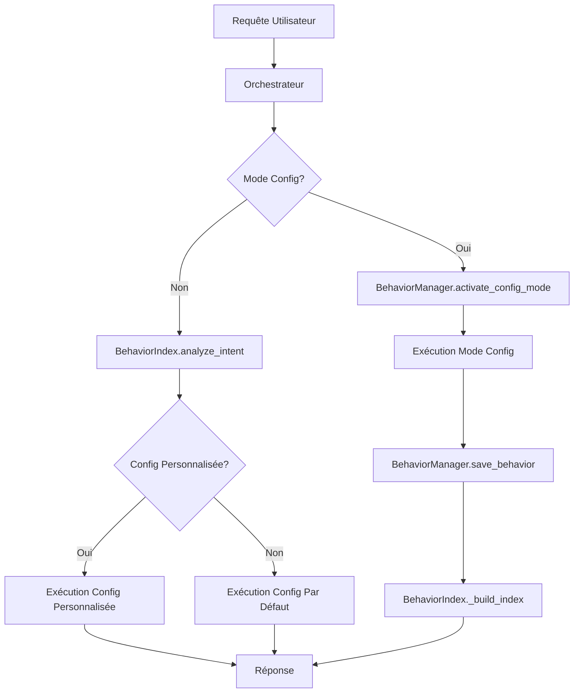

# Guide Développeur du Système de Comportement

## Introduction

Ce guide technique est destiné aux développeurs qui souhaitent étendre ou modifier le système de comportement de Colaig. Il détaille l'architecture interne, les interfaces de programmation et les meilleures pratiques pour contribuer au système.

## Architecture Technique

### Diagramme de Classes

```mermaid
classDiagram
    class BehaviorManager {
        -_registered_types: Dict
        -_webdav: WebDAVService
        -_index: BehaviorIndex
        -_initialized: bool
        -_sync_lock: Lock
        -_cache: Dict
        -_config_mode: Dict
        +initialize()
        +close()
        +get_behavior()
        +save_behavior()
        +list_behaviors()
        +delete_behavior()
        +is_config_command()
        +activate_config_mode()
        +deactivate_config_mode()
        +is_config_mode_active()
        +get_config_mode_context()
    }
    
    class BehaviorIndex {
        -config: Config
        -webdav: WebDAVService
        -_index: BehaviorFAISSIndex
        -_topic_cache: Dict
        +initialize()
        +search()
        +analyze_intent()
        -_analyze_context()
        -_get_intent_configurations()
        -_score_intents()
        -_select_best_intent()
        -_get_embedding()
        -_load_index()
        -_build_index()
        -_save_index()
    }
    
    class BehaviorFAISSIndex {
        -dimension: int
        -_index: faiss.Index
        -behavior_map: Dict
        +add_behavior()
        +search()
    }
    
    class BehaviorChunk {
        +id: str
        +content: str
        +behavior_type: str
        +priority: float
        +metadata: Dict
        +embedding: List[float]
        +last_updated: datetime
    }
    
    class BehaviorPriority {
        +LOW: float
        +MEDIUM: float
        +HIGH: float
        +CRITICAL: float
        +validate()
    }
    
    BehaviorManager --> BehaviorIndex : utilise
    BehaviorIndex --> BehaviorFAISSIndex : utilise
    BehaviorFAISSIndex --> BehaviorChunk : stocke
    BehaviorChunk --> BehaviorPriority : utilise
```



### Flux de Données



## Extension du Système

### 1. Ajout d'un Nouveau Type de Comportement

Pour ajouter un nouveau type de comportement, vous devez :

1. Enregistrer le type dans le `BehaviorManager` :

```python
# Dans un module d'initialisation
from services.behavior_manager import BehaviorManager

BehaviorManager.register_behavior_type(
    "workflows",
    "Flux de travail personnalisés",
    default_files=["document_processing.json", "approval_workflow.json"],
    required=False
)
```

2. Créer les configurations par défaut :

```python
# Étendre la méthode _get_default_config dans BehaviorManager
async def _get_default_config(self, behavior_type: str, file_name: str) -> Dict[str, Any]:
    base_config = {
        "type": behavior_type.rstrip('s'),
        "description": f"Configuration par défaut pour {file_name}",
        "priority": 0.8
    }
    
    # Ajouter le support pour le nouveau type
    if behavior_type == "workflows":
        if file_name == "document_processing.json":
            base_config.update({
                "configuration": {
                    "steps": [
                        {"name": "extract", "description": "Extraction du contenu"},
                        {"name": "analyze", "description": "Analyse du contenu"},
                        {"name": "categorize", "description": "Catégorisation"}
                    ],
                    "transitions": [
                        {"from": "extract", "to": "analyze", "condition": "success"},
                        {"from": "analyze", "to": "categorize", "condition": "success"}
                    ]
                }
            })
    
    return base_config
```

3. Mettre à jour l'analyse d'intention pour prendre en compte le nouveau type :

```python
# Dans BehaviorIndex._score_intents
async def _score_intents(self, intent_configs: List[Dict[str, Any]], query: str, context_info: Dict[str, Any]) -> List[Dict[str, Any]]:
    # Code existant...
    
    # Ajouter un bonus pour les workflows si pertinent
    if "workflow" in query.lower() or "processus" in query.lower():
        for config in scored_intents:
            if config["intent"].startswith("workflow"):
                config["score"] += 0.2
                config["details"]["workflow_bonus"] = 0.2
    
    # Code existant...
```

### 2. Personnalisation de l'Analyse d'Intention

Pour personnaliser l'analyse d'intention, vous pouvez étendre la méthode `analyze_intent` :

```python
# Sous-classe de BehaviorIndex
class EnhancedBehaviorIndex(BehaviorIndex):
    async def analyze_intent(
        self,
        query: str,
        session_context: Optional[Dict] = None,
        room_context: Optional[Dict] = None
    ) -> Dict[str, Any]:
        # Analyse préliminaire
        preliminary_analysis = self._pre_analyze(query)
        
        # Si analyse préliminaire concluante, court-circuiter le processus standard
        if preliminary_analysis.get("confidence", 0) > 0.9:
            return preliminary_analysis
            
        # Sinon, utiliser l'analyse standard
        return await super().analyze_intent(query, session_context, room_context)
        
    def _pre_analyze(self, query: str) -> Dict[str, Any]:
        """Analyse préliminaire rapide basée sur des règles"""
        # Implémentation personnalisée...
        return {"confidence": 0.0}  # Par défaut, pas concluant
```

### 3. Ajout de Nouvelles Sources de Données

Pour intégrer de nouvelles sources de données au système de comportement :

```python
# Extension du BehaviorManager
class ExtendedBehaviorManager(BehaviorManager):
    async def initialize(self) -> None:
        await super().initialize()
        
        # Initialiser les sources supplémentaires
        await self._init_database_source()
        await self._init_api_source()
        
    async def _init_database_source(self) -> None:
        """Initialise la source de données depuis une base de données"""
        # Implémentation...
        
    async def get_behavior_from_db(
        self,
        behavior_id: str,
        behavior_type: str
    ) -> Optional[Dict[str, Any]]:
        """Récupère un comportement depuis la base de données"""
        # Implémentation...
```

### 4. Optimisation des Performances

Pour optimiser les performances du système :

```python
# Dans BehaviorIndex
class OptimizedBehaviorIndex(BehaviorIndex):
    def __init__(self, config: Config, webdav_service: WebDAVService):
        super().__init__(config, webdav_service)
        self._query_cache = LRUCache(maxsize=100)
        
    async def search(
        self,
        query: str,
        behavior_type: Optional[str] = None,
        limit: int = 5
    ) -> List[BehaviorChunk]:
        # Vérifier le cache
        cache_key = f"{query}:{behavior_type}:{limit}"
        if cache_key in self._query_cache:
            return self._query_cache[cache_key]
            
        # Exécuter la recherche
        results = await super().search(query, behavior_type, limit)
        
        # Mettre en cache
        self._query_cache[cache_key] = results
        return results
```

## Intégration avec d'Autres Systèmes

### 1. Intégration avec le Système RAG

Le système de comportement s'intègre avec le système RAG existant :

```python
# Dans un service d'orchestration
async def process_query(query: str, context: Dict[str, Any]) -> Dict[str, Any]:
    # 1. Analyser l'intention
    intent_analysis = await behavior_index.analyze_intent(
        query, 
        session_context=context.get("session"),
        room_context=context.get("room")
    )
    
    # 2. Déterminer le comportement à utiliser
    if intent_analysis["confidence"] > 0.6:
        # Utiliser le comportement personnalisé
        config = intent_analysis["action_config"]
        
        # Adapter les paramètres RAG selon la configuration
        rag_params = {
            "include_behavior": config["base"]["search_params"]["include_behavior"],
            "include_documents": config["base"]["search_params"]["include_documents"],
            "limit": config["base"]["search_params"]["limit"]
        }
        
        # Exécuter la recherche RAG avec les paramètres personnalisés
        rag_results = await rag_service.search(query, **rag_params)
    else:
        # Utiliser le comportement RAG standard
        rag_results = await rag_service.search(query)
    
    return {
        "intent": intent_analysis["detected_intent"],
        "results": rag_results,
        "context_info": intent_analysis["context_info"]
    }
```

### 2. Intégration avec le Système de Conversation

```python
# Dans un gestionnaire de conversation
async def handle_message(room_id: str, user_id: str, message: str) -> str:
    # 1. Vérifier si c'est une commande de configuration
    if await behavior_manager.is_config_command(message):
        config = await behavior_manager.activate_config_mode(room_id)
        return config["configuration"]["base_prompt"]
        
    # 2. Vérifier si le mode configuration est actif
    if await behavior_manager.is_config_mode_active(room_id):
        config_context = await behavior_manager.get_config_mode_context(room_id)
        # Traiter avec le mode configuration
        return await config_processor.process(message, config_context)
        
    # 3. Traitement standard
    context = await context_manager.get_context(room_id)
    response = await query_processor.process(message, context)
    return response
```

## Bonnes Pratiques de Développement

### 1. Gestion des Erreurs

Utilisez une gestion des erreurs robuste et cohérente :

```python
async def safe_operation(func, *args, **kwargs):
    """Wrapper pour les opérations avec gestion d'erreur cohérente"""
    try:
        return await func(*args, **kwargs)
    except WebDAVError as e:
        logger.error(f"Erreur WebDAV: {str(e)}")
        # Stratégie de retry
        for i in range(3):
            try:
                logger.info(f"Tentative de reconnexion {i+1}/3")
                await webdav_service.reconnect()
                return await func(*args, **kwargs)
            except Exception:
                await asyncio.sleep(1 * (i + 1))
        raise RuntimeError(f"Échec après 3 tentatives: {str(e)}")
    except ValueError as e:
        logger.warning(f"Erreur de validation: {str(e)}")
        return None
    except Exception as e:
        logger.error(f"Erreur inattendue: {str(e)}")
        raise
```

### 2. Tests Unitaires

Écrivez des tests unitaires pour chaque composant :

```python
# tests/test_behavior_manager.py
import pytest
from unittest.mock import AsyncMock, MagicMock
from services.behavior_manager import BehaviorManager

@pytest.fixture
def mock_config():
    config = MagicMock()
    config.colaig_behavior_path = ".colaig/behavior"
    config.colaig_config_timeout = 3600
    return config

@pytest.fixture
def mock_webdav():
    webdav = AsyncMock()
    webdav.exists.return_value = True
    webdav.read_document.return_value = '{"type": "action", "priority": 0.8}'
    return webdav

@pytest.mark.asyncio
async def test_get_behavior(mock_config, mock_webdav):
    # Arrangement
    manager = BehaviorManager(mock_config)
    manager._webdav = mock_webdav
    manager._initialized = True
    
    # Action
    behavior = await manager.get_behavior("test_behavior", "actions")
    
    # Assertion
    assert behavior is not None
    assert behavior["type"] == "action"
    assert behavior["priority"] == 0.8
    mock_webdav.read_document.assert_called_once()
```

### 3. Documentation du Code

Documentez clairement votre code :

```python
class BehaviorManager:
    """
    Gestionnaire des comportements avec synchronisation WebDAV.
    
    Cette classe est responsable de :
    1. La gestion du cycle de vie des comportements
    2. La synchronisation avec le stockage WebDAV
    3. L'activation/désactivation du mode configuration
    
    Attributes:
        config (Config): Configuration de l'application
        _webdav (WebDAVService): Service WebDAV pour le stockage
        _index (BehaviorIndex): Index comportemental
        _initialized (bool): État d'initialisation
        _sync_lock (Lock): Verrou pour les opérations de synchronisation
        _cache (Dict): Cache des comportements
        _config_mode (Dict): État du mode configuration par salle
    """
    
    async def get_behavior(
        self,
        behavior_id: str,
        behavior_type: str
    ) -> Optional[Dict[str, Any]]:
        """
        Récupère un comportement depuis WebDAV.
        
        Args:
            behavior_id: Identifiant du comportement
            behavior_type: Type de comportement (actions, tools, prompts, rules)
            
        Returns:
            Dict contenant la configuration du comportement ou None si non trouvé
            
        Raises:
            RuntimeError: Si le gestionnaire n'est pas initialisé
        """
```

## Déploiement et Maintenance

### 1. Sauvegarde et Restauration

Implémentez des fonctionnalités de sauvegarde et restauration :

```python
# Dans BehaviorManager
async def export_behaviors(self, export_path: str) -> bool:
    """Exporte tous les comportements vers un fichier ZIP"""
    try:
        import zipfile
        import tempfile
        import os
        
        with tempfile.TemporaryDirectory() as temp_dir:
            # 1. Créer la structure
            for behavior_type in self.behavior_types:
                os.makedirs(os.path.join(temp_dir, behavior_type), exist_ok=True)
                
            # 2. Exporter les comportements
            for behavior_type in self.behavior_types:
                behaviors = await self.list_behaviors(behavior_type)
                for behavior_id in behaviors:
                    behavior = await self.get_behavior(behavior_id, behavior_type)
                    if behavior:
                        with open(os.path.join(temp_dir, behavior_type, f"{behavior_id}.json"), "w") as f:
                            json.dump(behavior, f, indent=2)
            
            # 3. Créer l'archive
            with zipfile.ZipFile(export_path, "w") as zipf:
                for root, _, files in os.walk(temp_dir):
                    for file in files:
                        file_path = os.path.join(root, file)
                        arcname = os.path.relpath(file_path, temp_dir)
                        zipf.write(file_path, arcname)
                        
            return True
    except Exception as e:
        logger.error(f"Erreur exportation comportements: {str(e)}")
        return False
        
async def import_behaviors(self, import_path: str, overwrite: bool = False) -> bool:
    """Importe des comportements depuis un fichier ZIP"""
    # Implémentation similaire pour l'import
```

### 2. Monitoring et Métriques

Ajoutez des métriques pour surveiller le système :

```python
# Dans BehaviorIndex
class MonitoredBehaviorIndex(BehaviorIndex):
    def __init__(self, config: Config, webdav_service: WebDAVService):
        super().__init__(config, webdav_service)
        self.metrics = {
            "searches": 0,
            "intent_analyses": 0,
            "cache_hits": 0,
            "cache_misses": 0,
            "avg_search_time": 0,
            "total_search_time": 0
        }
        
    async def search(self, query: str, behavior_type: Optional[str] = None, limit: int = 5) -> List[BehaviorChunk]:
        start_time = time.time()
        self.metrics["searches"] += 1
        
        result = await super().search(query, behavior_type, limit)
        
        elapsed = time.time() - start_time
        self.metrics["total_search_time"] += elapsed
        self.metrics["avg_search_time"] = self.metrics["total_search_time"] / self.metrics["searches"]
        
        return result
        
    def get_metrics(self) -> Dict[str, Any]:
        """Retourne les métriques actuelles"""
        return self.metrics.copy()
```

## Conclusion

Le système de comportement de Colaig est conçu pour être extensible et modulaire. En suivant les principes et les exemples de ce guide, vous pouvez étendre ses fonctionnalités tout en maintenant sa cohérence et sa robustesse.

Pour toute contribution au code source, veuillez suivre les conventions de codage du projet et soumettre des tests unitaires complets avec vos modifications. 