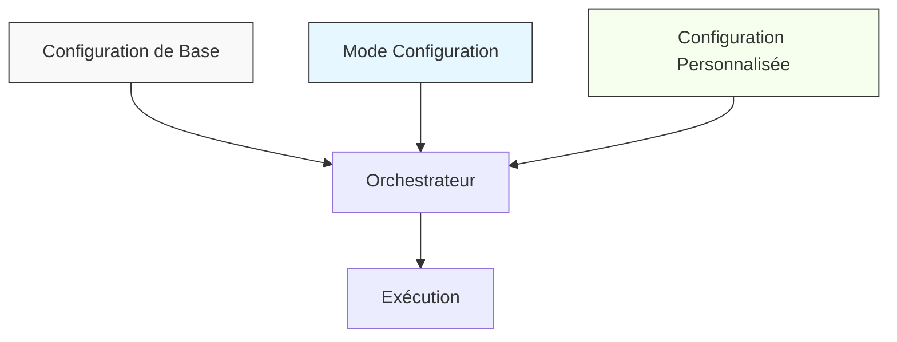
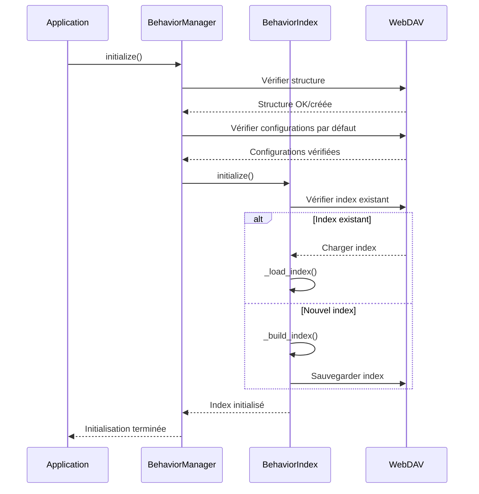
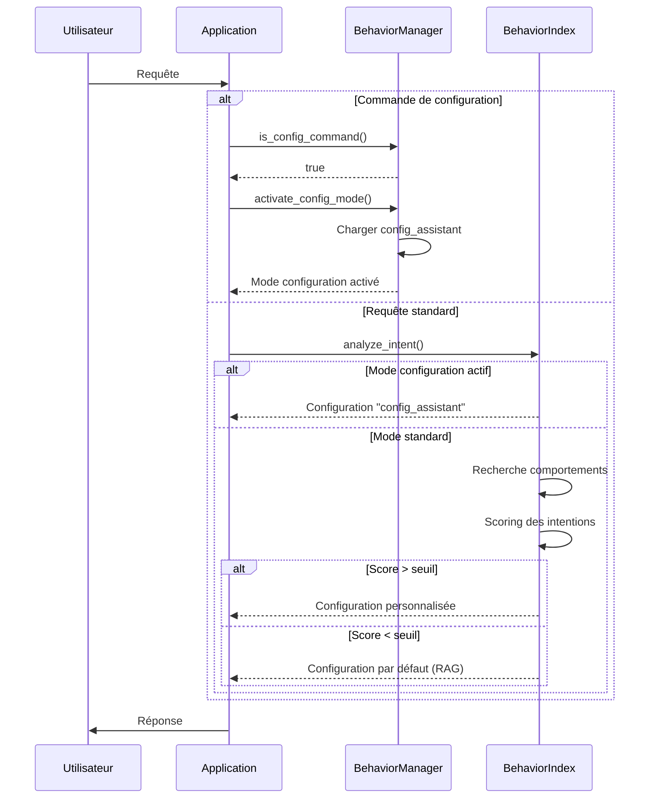

# Implémentation du Système de Comportement

## Vue d'Ensemble

Le système de comportement de Colaig est conçu pour offrir une flexibilité maximale tout en maintenant une structure cohérente. Cette documentation détaille l'implémentation technique, les choix architecturaux et les solutions apportées aux problèmes rencontrés.

## Architecture Technique

### Structure à Trois Niveaux

Le système repose sur une architecture à trois niveaux de configuration :



1. **Configuration de Base (RAG Standard)**
   - Comportement par défaut de Colaig
   - Fonctionnalités RAG essentielles
   - Toujours disponible comme fallback

2. **Mode Configuration**
   - Activé par commande spécifique
   - Fournit les outils pour créer des configurations
   - Interface guidée pour l'utilisateur

3. **Configuration Personnalisée**
   - Créée via le mode configuration
   - Prioritaire sur la configuration de base
   - Stockée sur WebDAV pour persistance

### Composants Principaux

#### BehaviorManager

Responsable de la gestion globale des comportements :
- Enregistrement des types de comportement
- Gestion du cycle de vie des comportements
- Synchronisation avec WebDAV
- Activation/désactivation du mode configuration

```python
class BehaviorManager:
    _registered_types = {
        "actions": {...},
        "tools": {...},
        "prompts": {...},
        "rules": {...}
    }
    
    # Méthodes principales
    async def initialize(self) -> None: ...
    async def get_behavior(self, behavior_id: str, behavior_type: str) -> Optional[Dict[str, Any]]: ...
    async def save_behavior(self, behavior_id: str, behavior_type: str, behavior_data: Dict[str, Any]) -> bool: ...
    async def activate_config_mode(self, room_id: str) -> Dict[str, Any]: ...
```

#### BehaviorIndex

Gère l'indexation et la recherche sémantique des comportements :
- Indexation vectorielle avec FAISS
- Analyse d'intention
- Scoring et sélection des comportements

```python
class BehaviorIndex:
    async def initialize(self) -> None: ...
    async def search(self, query: str, behavior_type: Optional[str] = None, limit: int = 5) -> List[BehaviorChunk]: ...
    async def analyze_intent(self, query: str, session_context: Optional[Dict] = None, room_context: Optional[Dict] = None) -> Dict[str, Any]: ...
```

#### BehaviorFAISSIndex

Implémente l'indexation vectorielle spécifique aux comportements :
- Stockage des embeddings
- Recherche par similarité
- Mapping entre index et comportements

## Flux d'Exécution

### Initialisation



### Traitement d'une Requête



## Modularité et Extensibilité

### Types de Comportement

Le système permet d'enregistrer dynamiquement de nouveaux types de comportement :

```python
BehaviorManager.register_behavior_type(
    "workflows",
    "Flux de travail personnalisés",
    default_files=["document_processing.json"],
    required=False
)
```

### Configuration Flexible

Chaque comportement est défini par un fichier JSON avec une structure flexible :

```json
{
  "type": "action",
  "description": "Action personnalisée",
  "priority": 0.8,
  "configuration": {
    "custom_field_1": "value",
    "custom_field_2": {
      "nested": "structure"
    }
  }
}
```

### Intégration avec le Système RAG

Le système de comportement s'intègre naturellement avec le système RAG existant :

```python
# Dans BehaviorIndex.analyze_intent
if best_intent["score"] >= 0.6:
    return {
        "detected_intent": best_intent["intent"],
        "confidence": best_intent["score"],
        "action_config": best_intent["config"],
        "context_info": context_info
    }
else:
    # Fallback sur le comportement RAG standard
    return default_response
```

## Problèmes Résolus

### 1. Couplage Fort avec WebDAV

**Problème** : Dépendance excessive au système de fichiers WebDAV.

**Solution** : 
- Abstraction des opérations de stockage
- Cache local pour réduire les requêtes
- Gestion robuste des erreurs

```python
async def get_behavior(self, behavior_id: str, behavior_type: str) -> Optional[Dict[str, Any]]:
    try:
        # Vérifier le cache d'abord
        cache_key = f"{behavior_type}:{behavior_id}"
        if cache_key in self._cache:
            return self._cache[cache_key]
            
        # Sinon, récupérer depuis WebDAV
        behavior_path = os.path.join(self.config.colaig_behavior_path, behavior_type, f"{behavior_id}.json")
        content = await self._webdav.read_document(behavior_path)
        result = json.loads(content)
        
        # Mettre en cache
        self._cache[cache_key] = result
        return result
    except Exception as e:
        logger.error(f"Erreur lecture comportement {behavior_id}: {str(e)}")
        return None
```

### 2. Gestion du Contexte Complexe

**Problème** : Difficulté à maintenir le contexte entre les requêtes.

**Solution** :
- Contexte par salle pour le mode configuration
- Analyse contextuelle pour la détection d'intention
- Extraction de topics pour enrichir le contexte

```python
async def _analyze_context(self, query: str, session_context: Optional[Dict], room_context: Optional[Dict]) -> Dict[str, Any]:
    context_info = {
        "active_topics": set(),
        "conversation_style": "formal",
        "relevant_rules": [],
        "custom_params": {}
    }
    
    # Extraire les topics des messages récents
    if session_context and "history" in session_context:
        recent_messages = [msg["content"] for msg in session_context["history"][-3:]]
        context_info["active_topics"].update(self._extract_topics(recent_messages))
    
    # Ajouter les paramètres personnalisés
    if room_context and "custom_config" in room_context:
        context_info["custom_params"] = room_context["custom_config"]
        
    return context_info
```

### 3. Rigidité des Comportements

**Problème** : Difficulté à adapter les comportements aux besoins spécifiques.

**Solution** :
- Système de scoring flexible
- Priorités configurables
- Combinaison de comportements

```python
async def _score_intents(self, intent_configs: List[Dict[str, Any]], query: str, context_info: Dict[str, Any]) -> List[Dict[str, Any]]:
    scored_intents = []
    
    for config in intent_configs:
        # Score de base (priorité)
        base_score = config["priority"]
        
        # Score basé sur les topics
        query_topics = self._extract_topics([query])
        topic_overlap = len(query_topics & context_info["active_topics"])
        topic_score = min(topic_overlap * 0.2, 0.6)
        
        # Score final normalisé
        final_score = min(base_score + topic_score + style_score + rule_score + custom_score, 1.0)
        
        scored_intents.append({
            "intent": config["intent"],
            "score": final_score,
            "config": config["config"]
        })
        
    return sorted(scored_intents, key=lambda x: x["score"], reverse=True)
```

### 4. Duplication de Code

**Problème** : Duplication des fonctionnalités entre le système RAG et le système de comportement.

**Solution** :
- Intégration transparente avec le système RAG
- Réutilisation des services existants
- Architecture en couches

```python
# Dans BehaviorIndex
async def _get_embedding(self, text: str) -> Optional[np.ndarray]:
    try:
        # Réutilisation du service d'embedding existant
        from services.embedding_service import EmbeddingService
        embedding_service = EmbeddingService(self.config)
        embedding = await embedding_service.get_embedding(text)
        return np.array(embedding) if embedding else None
    except Exception as e:
        logger.error(f"Erreur génération embedding: {str(e)}")
        return None
```

## Bonnes Pratiques Implémentées

1. **Gestion des Erreurs Robuste**
   - Capture et journalisation des exceptions
   - Fallback sur les comportements par défaut
   - Validation des entrées

2. **Asynchronie**
   - Opérations I/O non bloquantes
   - Verrouillage pour les opérations concurrentes
   - Gestion efficace des ressources

3. **Modularité**
   - Séparation claire des responsabilités
   - Interfaces bien définies
   - Extensibilité par conception

4. **Performance**
   - Indexation vectorielle pour la recherche rapide
   - Mise en cache des résultats fréquents
   - Optimisation des requêtes WebDAV

## Conclusion

Le système de comportement de Colaig offre une solution flexible et modulaire pour adapter l'assistant aux besoins spécifiques des utilisateurs. Son architecture à trois niveaux permet une transition fluide entre le comportement par défaut et les configurations personnalisées, tout en offrant un mode dédié à la création de ces configurations.

Les problèmes de couplage, de gestion du contexte, de rigidité et de duplication ont été adressés par des solutions techniques robustes, faisant du système de comportement un composant central et extensible de l'architecture de Colaig. 