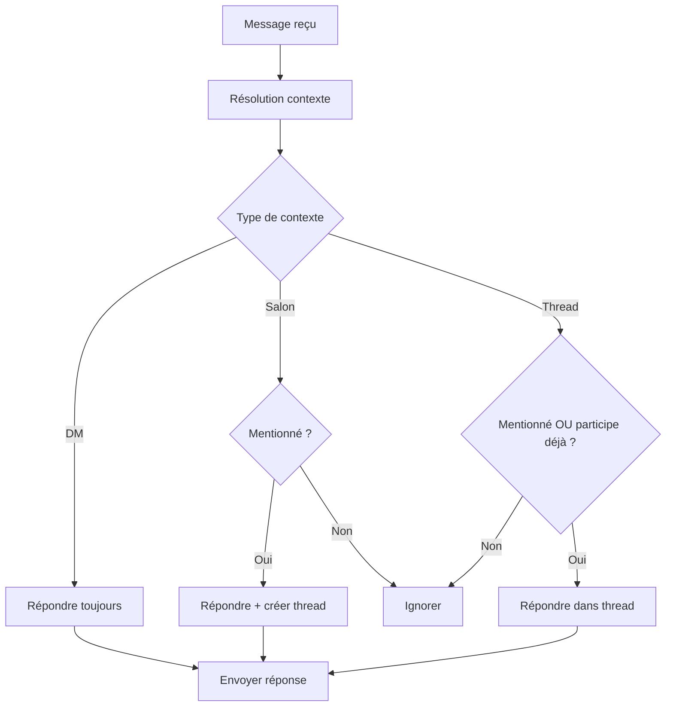

# Implémentation du Contexte Tchap Intelligent

## Vue d'ensemble

Le système de contexte Tchap intelligent permet à Colaig d'interagir de manière naturelle selon le contexte de communication, exactement comme le ferait un collègue humain sur Tchap.

## Logique de comportement

### 🎯 **Règles de base**

1. **Messages directs (DM)** : Colaig répond toujours, sans besoin de mention
2. **Salon général** : Colaig répond uniquement s'il est mentionné, et crée un thread
3. **Fil de discussion** : Colaig répond si :
   - Il est mentionné explicitement dans le message, OU
   - Il a été mentionné dans le message racine du thread (participation continue)

### 📋 **Scénarios d'usage**

#### Scénario 1 : Message direct
```
Utilisateur → Colaig (DM): "Bonjour, peux-tu m'aider ?"
Colaig → Utilisateur (DM): "Bonjour ! Bien sûr, comment puis-je vous aider ?"
```

#### Scénario 2 : Salon général - Mention initiale
```
Utilisateur → Salon: "Salut @colaig, que penses-tu de ce document ?"
Colaig → Salon (Thread): "Bonjour ! Je vais analyser ce document..."
```

#### Scénario 3 : Fil de discussion - Participation continue
```
Utilisateur → Salon: "Salut @colaig, que penses-tu de ce document ?" (Message racine)
Colaig → Thread: "Bonjour ! Je vais analyser ce document..."
Utilisateur → Thread: "Peux-tu être plus précis ?" (Pas de mention)
Colaig → Thread: "Bien sûr ! Voici les détails..." (Répond quand même)
```

#### Scénario 4 : Fil de discussion - Non concerné
```
Utilisateur A → Salon: "Salut @utilisateur_b, regarde ce document"
Utilisateur B → Thread: "Intéressant !"
Utilisateur A → Thread: "Qu'est-ce qu'on fait maintenant ?"
Colaig → (Pas de réponse, non concerné par ce thread)
```

## Architecture technique

### Composants principaux

1. **TchapContextResolver** : Résout le contexte de chaque message
2. **TchapContext** : Structure de données du contexte
3. **NotificationFormatter** : Formatage unifié des réponses
4. **Extensions EventParser** : Méthodes d'aide contextuelle

### Flux de traitement



## Utilisation dans les commandes

### Exemple d'adaptation d'une commande

```python
@register_feature(
    group="documents",
    onEvent=RoomMessageText,
    command="analyser",
    help="Analyse un document"
)
@only_allowed_user
async def handle_analyze_command(ep: EventParser, matrix_client: MatrixClient):
    """Commande d'analyse avec contexte intelligent"""
    
    # Vérifier le contexte
    if not await ep.should_respond_in_context():
        return
    
    # Obtenir le contexte pour le formatage
    context = await ep.get_tchap_context()
    
    # Traitement de la commande...
    result = await analyze_document(document)
    
    # Réponse formatée selon le contexte
    from app.services.notification_formatter import NotificationFormatter
    await NotificationFormatter.send_formatted_message(
        matrix_client,
        ep.room.room_id,
        result,
        context,
        "success",
        ep.event.event_id
    )
```

### Adaptation des commandes existantes

Pour adapter une commande existante :

1. **Remplacer la logique de threading manuelle** :
```python
# Ancien code
thread_root = matrix_thread_id if is_in_matrix_thread else None

# Nouveau code
thread_root = await ep.get_response_thread_id()
```

2. **Utiliser le formateur de notifications** :
```python
# Ancien code
await matrix_client.send_markdown_message(
    room_id, 
    message, 
    msgtype="m.notice"
)

# Nouveau code
await NotificationFormatter.send_formatted_message(
    matrix_client, 
    room_id, 
    message, 
    context, 
    "info", 
    event_id
)
```

3. **Vérifier le contexte en début de commande** :
```python
# Ajout au début de la commande
if not await ep.should_respond_in_context():
    return
    
context = await ep.get_tchap_context()
```

## Exemples d'utilisation

### Formateur de notifications

```python
from app.services.notification_formatter import NotificationFormatter

# Notification de succès
params = NotificationFormatter.format_notification(
    "Document analysé avec succès",
    context,
    "success",
    event_id
)

# Réponse de commande
params = NotificationFormatter.format_command_response(
    "Analyse terminée",
    context,
    "analyser",
    True,
    event_id
)

# Mise à jour de progression
params = NotificationFormatter.format_progress_update(
    "Analyse en cours...",
    context,
    "Étape 2/3",
    event_id
)
```

### Résolution de contexte

```python
# Obtenir le contexte complet
context = await ep.get_tchap_context()

print(f"Type: {context.context_type}")
print(f"Mentionné: {context.is_mentioned}")
print(f"Participe au thread: {context.is_bot_participating_in_thread}")
print(f"Doit répondre: {context.should_respond}")

# Vérification simple
if await ep.should_respond_in_context():
    # Traiter le message
    thread_id = await ep.get_response_thread_id()
```

## Tests et validation

### Tests unitaires

```python
async def test_dm_context():
    """Test du contexte DM"""
    # Setup avec un salon DM
    context = await resolver.resolve_context(ep_dm)
    assert context.context_type == TchapContextType.DIRECT_MESSAGE
    assert context.should_respond == True

async def test_salon_mention():
    """Test mention en salon"""
    # Setup avec mention du bot
    context = await resolver.resolve_context(ep_salon_mention)
    assert context.context_type == TchapContextType.SALON_GENERAL
    assert context.is_mentioned == True
    assert context.should_respond == True

async def test_thread_participation():
    """Test participation continue en thread"""
    # Setup avec thread où le bot participe
    context = await resolver.resolve_context(ep_thread)
    assert context.context_type == TchapContextType.THREAD
    assert context.is_bot_participating_in_thread == True
    assert context.should_respond == True
```

### Validation manuelle

1. **DM** : Envoi de message sans mention → Réponse attendue
2. **Salon** : Envoi sans mention → Pas de réponse
3. **Salon** : Envoi avec mention → Réponse en thread
4. **Thread** : Participation continue après mention initiale

## Migration progressive

### Phase 1 : Infrastructure
- ✅ TchapContextResolver
- ✅ Extensions EventParser
- ✅ NotificationFormatter
- ✅ Modification handle_conversation

### Phase 2 : Adaptation commandes critiques
- [ ] Commande `!pj` / `!classer`
- [ ] Commande `!docquery`
- [ ] Commandes web

### Phase 3 : Harmonisation complète
- [ ] Toutes les commandes
- [ ] Tests d'intégration
- [ ] Documentation utilisateur

## Bonnes pratiques

1. **Toujours vérifier le contexte** en début de commande
2. **Utiliser le formateur unifié** pour les réponses
3. **Logger les décisions contextuelles** pour le debugging
4. **Tester tous les scénarios** (DM, salon, thread)
5. **Maintenir la cohérence** dans le formatage des messages

## Résolution de problèmes

### Problèmes courants

1. **Bot ne répond pas en thread** 
   - Vérifier que le message racine contenait bien une mention
   - Vérifier les logs `[TCHAP_CONTEXT]`

2. **Réponse dans le mauvais contexte**
   - Vérifier le `response_thread_id` dans les logs
   - Vérifier la logique de `_get_response_thread_id`

3. **Mentions non détectées**
   - Vérifier le `formatted_body` du message
   - Vérifier la regex dans `_extract_mentions`

### Logs de debugging

```
[TCHAP_CONTEXT] DM détecté - Réponse automatique
[TCHAP_CONTEXT] Thread - Bot déjà participant (mentionné dans le message racine)
[TCHAP_CONTEXT] Salon général - Non mentionné, pas de réponse
[CONVERSATION] Contexte résolu: thread, mentionné: False, participe au thread: True
[CONVERSATION] Réponse envoyée dans le thread $abc123
``` 