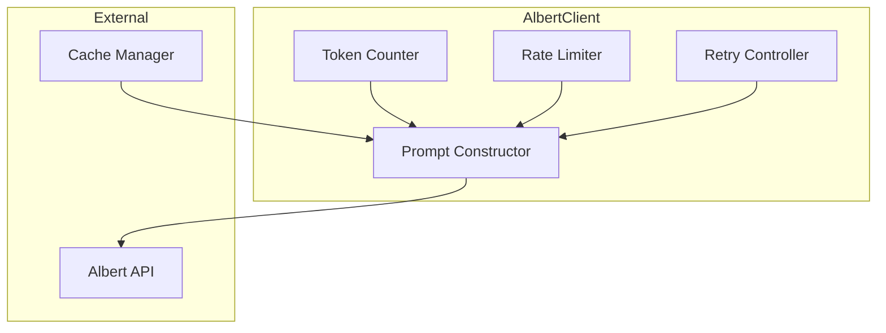
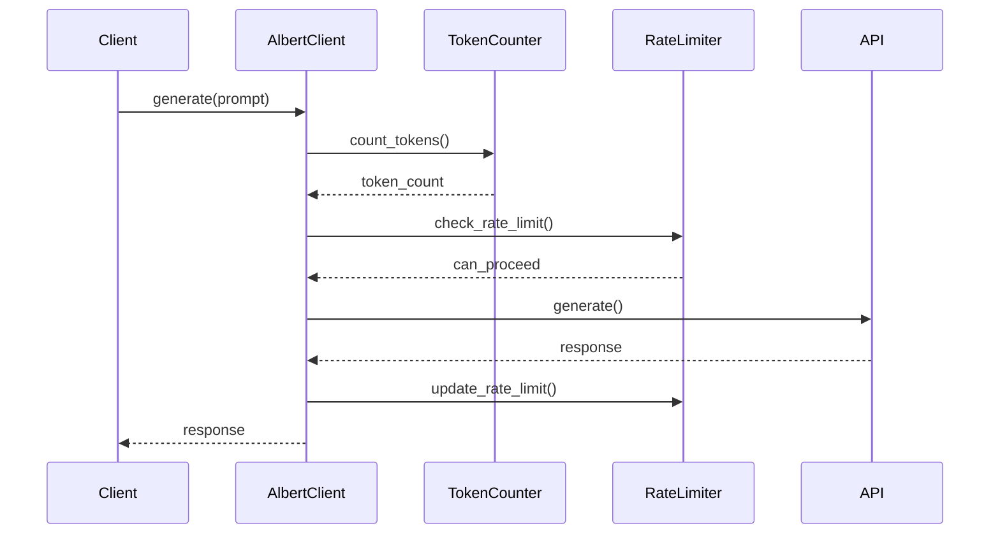

# Client Albert

Le Client Albert est responsable de la communication avec le modèle de langage Albert. Il gère les requêtes, le formatage des prompts, la gestion des tokens et le rate limiting.

## Responsabilités

1. Communication avec l'API Albert
2. Formatage des prompts
3. Gestion des tokens
4. Rate limiting
5. Retry et gestion des erreurs

## Architecture



## Interfaces

### Client Principal
```python
class AlbertClient:
    async def generate(
        self,
        prompt: str,
        params: Dict[str, Any] = None
    ) -> str:
        """Génère une réponse"""
        pass

    async def generate_embeddings(
        self,
        texts: List[str]
    ) -> List[List[float]]:
        """Génère des embeddings"""
        pass

    async def count_tokens(
        self,
        text: str
    ) -> int:
        """Compte les tokens"""
        pass
```

### Constructeur de Prompt
```python
class PromptConstructor:
    def construct_rag_prompt(
        self,
        query: str,
        context: List[str]
    ) -> str:
        """Construit un prompt RAG"""
        pass

    def construct_chat_prompt(
        self,
        messages: List[Dict[str, str]]
    ) -> str:
        """Construit un prompt de chat"""
        pass

    def construct_system_prompt(
        self,
        role: str
    ) -> str:
        """Construit un prompt système"""
        pass
```

## Workflow de Génération



## Configuration

```python
class AlbertConfig:
    # API
    API_URL: str = "https://api.albert.example.com"
    API_VERSION: str = "v1"
    API_KEY: str = None
    
    # Rate Limiting
    REQUESTS_PER_MINUTE: int = 60
    TOKENS_PER_MINUTE: int = 40000
    
    # Retry
    MAX_RETRIES: int = 3
    RETRY_DELAY: float = 1.0
    RETRY_MULTIPLIER: float = 2.0
    
    # Tokens
    MAX_TOKENS_PER_REQUEST: int = 4096
    MAX_RESPONSE_TOKENS: int = 1024
    
    # Timeouts
    REQUEST_TIMEOUT: float = 30.0
    SOCKET_TIMEOUT: float = 10.0
```

## Prompts Système

```python
SYSTEM_PROMPTS = {
    "assistant": """Tu es un assistant IA nommé COLAIG, conçu pour aider les utilisateurs
    à trouver des informations dans la documentation. Réponds de manière concise et précise.""",
    
    "indexer": """Tu es un indexeur de documents. Ton rôle est d'extraire les informations
    pertinentes des documents et de les organiser de manière structurée.""",
    
    "moderator": """Tu es un modérateur qui vérifie le contenu des messages pour
    s'assurer qu'ils respectent les règles de la communauté."""
}
```

## Gestion des Tokens

```python
class TokenCounter:
    def count_tokens(self, text: str) -> int:
        """Compte les tokens dans un texte"""
        pass
    
    def truncate_text(
        self,
        text: str,
        max_tokens: int
    ) -> str:
        """Tronque un texte au nombre de tokens spécifié"""
        pass
    
    def split_text(
        self,
        text: str,
        chunk_size: int
    ) -> List[str]:
        """Divise un texte en chunks de taille spécifiée"""
        pass
```

## Rate Limiting

```python
class RateLimiter:
    def __init__(self, config: AlbertConfig):
        self.requests_limit = config.REQUESTS_PER_MINUTE
        self.tokens_limit = config.TOKENS_PER_MINUTE
        self.window = 60  # secondes
    
    async def check_rate_limit(
        self,
        tokens: int
    ) -> bool:
        """Vérifie si la requête peut être effectuée"""
        pass
    
    async def update_rate_limit(
        self,
        tokens: int
    ) -> None:
        """Met à jour les compteurs de rate limit"""
        pass
    
    async def wait_if_needed(
        self,
        tokens: int
    ) -> None:
        """Attend si nécessaire pour respecter les limites"""
        pass
```

## Monitoring

```python
@dataclass
class AlbertMetrics:
    # Métriques requêtes
    total_requests: int = 0
    successful_requests: int = 0
    failed_requests: int = 0
    
    # Métriques tokens
    total_tokens: int = 0
    prompt_tokens: int = 0
    completion_tokens: int = 0
    
    # Métriques temps
    avg_response_time: float = 0.0
    max_response_time: float = 0.0
    
    # Métriques rate limit
    rate_limit_hits: int = 0
    rate_limit_wait_time: float = 0.0
    
    # Métriques retry
    total_retries: int = 0
    successful_retries: int = 0
```

## Utilisation

### Initialisation
```python
client = AlbertClient(
    config=AlbertConfig(
        API_KEY="your-api-key"
    )
)
```

### Génération Simple
```python
response = await client.generate(
    prompt="Quelle est la procédure pour X ?",
    params={
        "temperature": 0.7,
        "max_tokens": 200
    }
)
```

### Génération RAG
```python
# Construction du prompt
prompt = client.prompt_constructor.construct_rag_prompt(
    query="Comment faire X ?",
    context=["Document 1...", "Document 2..."]
)

# Génération
response = await client.generate(prompt)
```

## Gestion des Erreurs

```python
class AlbertError(Exception):
    """Erreur de base pour le client Albert"""
    pass

class APIError(AlbertError):
    """Erreur d'API"""
    pass

class RateLimitError(AlbertError):
    """Erreur de rate limit"""
    pass

class TokenLimitError(AlbertError):
    """Erreur de limite de tokens"""
    pass

class TimeoutError(AlbertError):
    """Erreur de timeout"""
    pass
```

## Extension

Le Client Albert peut être étendu via :

1. Nouveaux constructeurs de prompt
```python
class CustomPromptConstructor(PromptConstructorInterface):
    def construct_prompt(
        self,
        **kwargs
    ) -> str:
        # Implémentation personnalisée
        pass
```

2. Nouvelles stratégies de retry
```python
class CustomRetryStrategy(RetryStrategyInterface):
    async def should_retry(
        self,
        error: Exception,
        attempt: int
    ) -> bool:
        # Implémentation personnalisée
        pass
```

3. Nouveaux compteurs de tokens
```python
class CustomTokenCounter(TokenCounterInterface):
    def count_tokens(
        self,
        text: str
    ) -> int:
        # Implémentation personnalisée
        pass
``` 