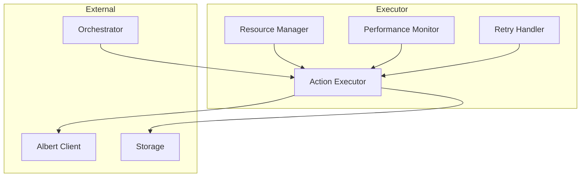
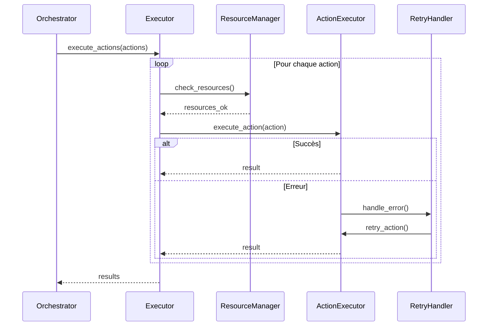
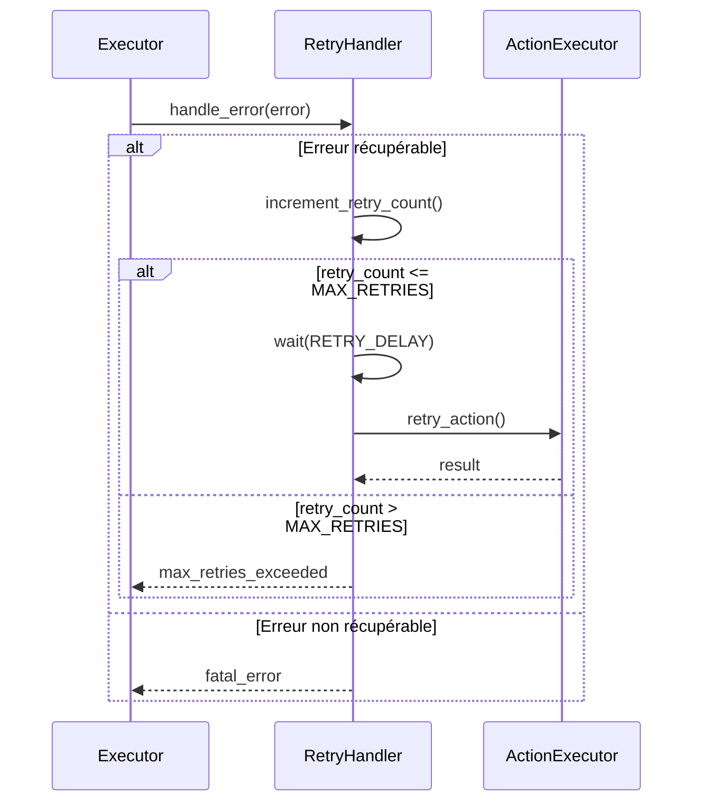

# Executor

L'Executor est le composant responsable de l'exécution des actions générées par l'Orchestrator. Il gère l'exécution parallèle, la gestion des ressources et le monitoring des actions.

## Responsabilités

1. Exécution des actions de workflow
2. Gestion des ressources (CPU, mémoire)
3. Monitoring des performances
4. Gestion des timeouts et retries
5. Coordination avec les autres composants

## Architecture



## Types d'Actions Supportées

```python
class ActionExecutor:
    async def execute_search(self, params: Dict[str, Any]) -> SearchResult:
        """Exécute une recherche RAG"""
        pass

    async def execute_chat(self, params: Dict[str, Any]) -> ChatResult:
        """Exécute une génération de réponse"""
        pass

    async def execute_index(self, params: Dict[str, Any]) -> IndexResult:
        """Exécute une indexation de document"""
        pass

    async def execute_clear(self, params: Dict[str, Any]) -> ClearResult:
        """Exécute un nettoyage"""
        pass
```

## Workflow d'Exécution



## Gestion des Ressources

```python
@dataclass
class ResourceLimits:
    max_cpu_percent: float = 80.0
    max_memory_percent: float = 80.0
    max_concurrent_actions: int = 10
    max_action_duration: int = 30  # secondes
```

## Monitoring

```python
@dataclass
class ActionMetrics:
    action_id: str
    action_type: str
    start_time: datetime
    end_time: datetime
    duration: float
    cpu_usage: float
    memory_usage: float
    status: str
    error: Optional[str]
```

## Configuration

```python
class ExecutorConfig:
    # Limites de ressources
    RESOURCE_LIMITS: ResourceLimits = ResourceLimits()
    
    # Retry configuration
    MAX_RETRIES: int = 3
    RETRY_DELAY: int = 1  # secondes
    
    # Timeouts
    DEFAULT_TIMEOUT: int = 30  # secondes
    SEARCH_TIMEOUT: int = 10
    CHAT_TIMEOUT: int = 20
    INDEX_TIMEOUT: int = 60
    
    # Monitoring
    METRICS_ENABLED: bool = True
    METRICS_INTERVAL: int = 1  # secondes
```

## Gestion des Erreurs

```python
class ExecutorError(Exception):
    """Erreur de base pour l'executor"""
    pass

class ResourceExhaustedError(ExecutorError):
    """Ressources insuffisantes"""
    pass

class ActionTimeoutError(ExecutorError):
    """Timeout d'action"""
    pass

class ActionFailedError(ExecutorError):
    """Échec d'action"""
    pass
```

## Retry Logic



## Utilisation

### Initialisation
```python
executor = Executor(
    albert_client=AlbertClient(),
    webdav_client=WebDAVClient(),
    config=ExecutorConfig()
)
```

### Exécution d'Actions
```python
# Création des actions
actions = [
    Action(
        type=ActionType.SEARCH,
        params={"query": "procédure X", "k": 5}
    ),
    Action(
        type=ActionType.CHAT,
        params={"prompt": "...", "temperature": 0.7}
    )
]

# Exécution
results = await executor.execute_actions(actions)
```

## Monitoring et Métriques

### Métriques Collectées
```python
@dataclass
class ExecutorMetrics:
    # Métriques globales
    total_actions: int = 0
    successful_actions: int = 0
    failed_actions: int = 0
    
    # Métriques de performance
    avg_action_duration: float = 0.0
    avg_cpu_usage: float = 0.0
    avg_memory_usage: float = 0.0
    
    # Métriques de retry
    total_retries: int = 0
    successful_retries: int = 0
    
    # Métriques de ressources
    current_concurrent_actions: int = 0
    peak_concurrent_actions: int = 0
```

### Visualisation
```python
async def get_metrics_report(self) -> str:
    """
    Génère un rapport de métriques formaté.
    
    Returns:
        str: Rapport de métriques
    """
    metrics = await self.metrics_collector.get_metrics()
    
    return (
        f"=== Rapport d'Exécution ===\n"
        f"Actions totales: {metrics.total_actions}\n"
        f"Actions réussies: {metrics.successful_actions}\n"
        f"Actions échouées: {metrics.failed_actions}\n"
        f"Durée moyenne: {metrics.avg_action_duration:.2f}s\n"
        f"CPU moyen: {metrics.avg_cpu_usage:.1f}%\n"
        f"Mémoire moyenne: {metrics.avg_memory_usage:.1f}%\n"
        f"Retries totaux: {metrics.total_retries}\n"
        f"Actions concurrentes: {metrics.current_concurrent_actions}"
    )
```

## Extension

L'Executor peut être étendu via :

1. Nouveaux types d'actions
```python
class CustomActionExecutor(ActionExecutorInterface):
    async def execute(
        self,
        action: Action,
        context: Dict[str, Any]
    ) -> ActionResult:
        # Implémentation personnalisée
        pass
```

2. Nouvelles stratégies de retry
```python
class CustomRetryStrategy(RetryStrategyInterface):
    async def should_retry(
        self,
        error: Exception,
        retry_count: int
    ) -> bool:
        # Implémentation personnalisée
        pass
```

3. Nouveaux collecteurs de métriques
```python
class CustomMetricsCollector(MetricsCollectorInterface):
    async def collect_metrics(
        self,
        action: Action,
        result: ActionResult
    ) -> None:
        # Implémentation personnalisée
        pass
``` 