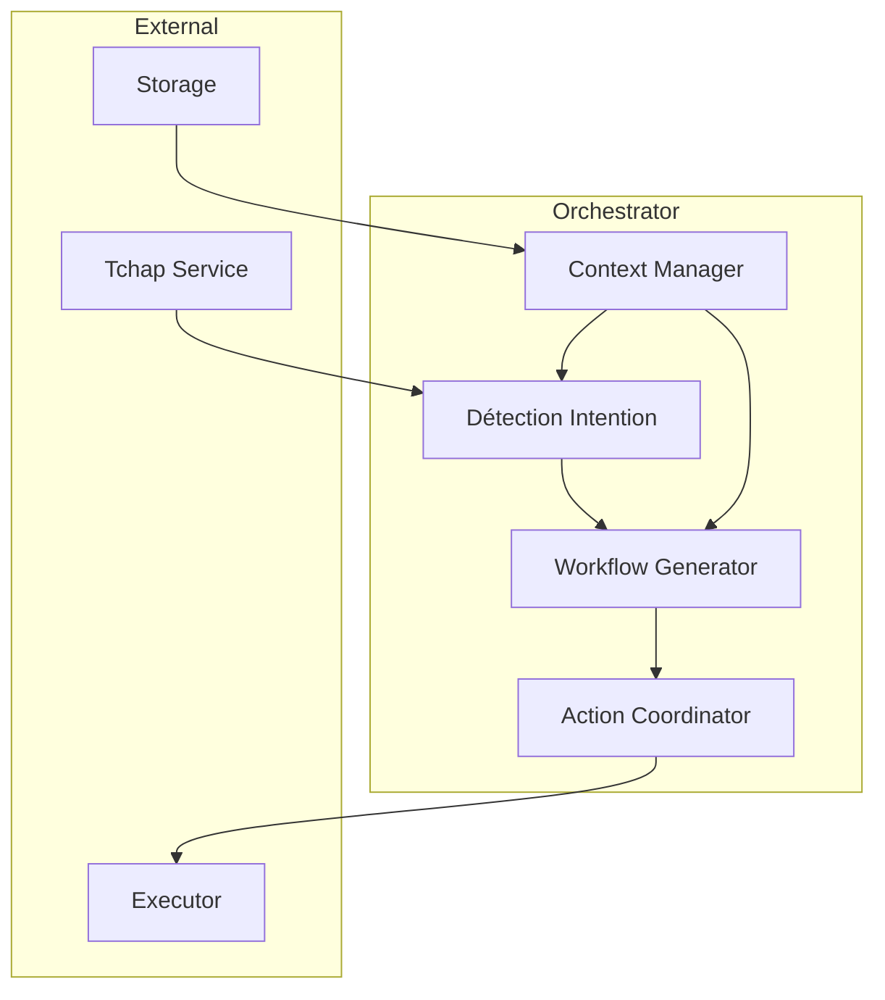
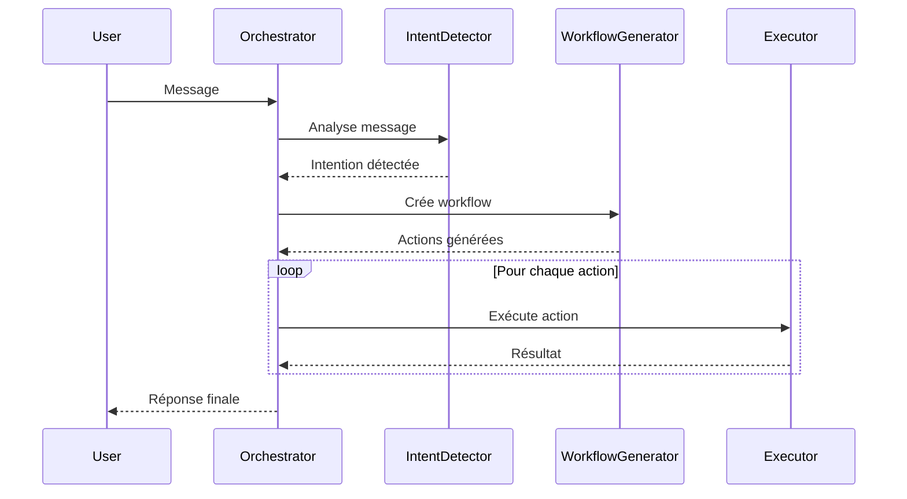
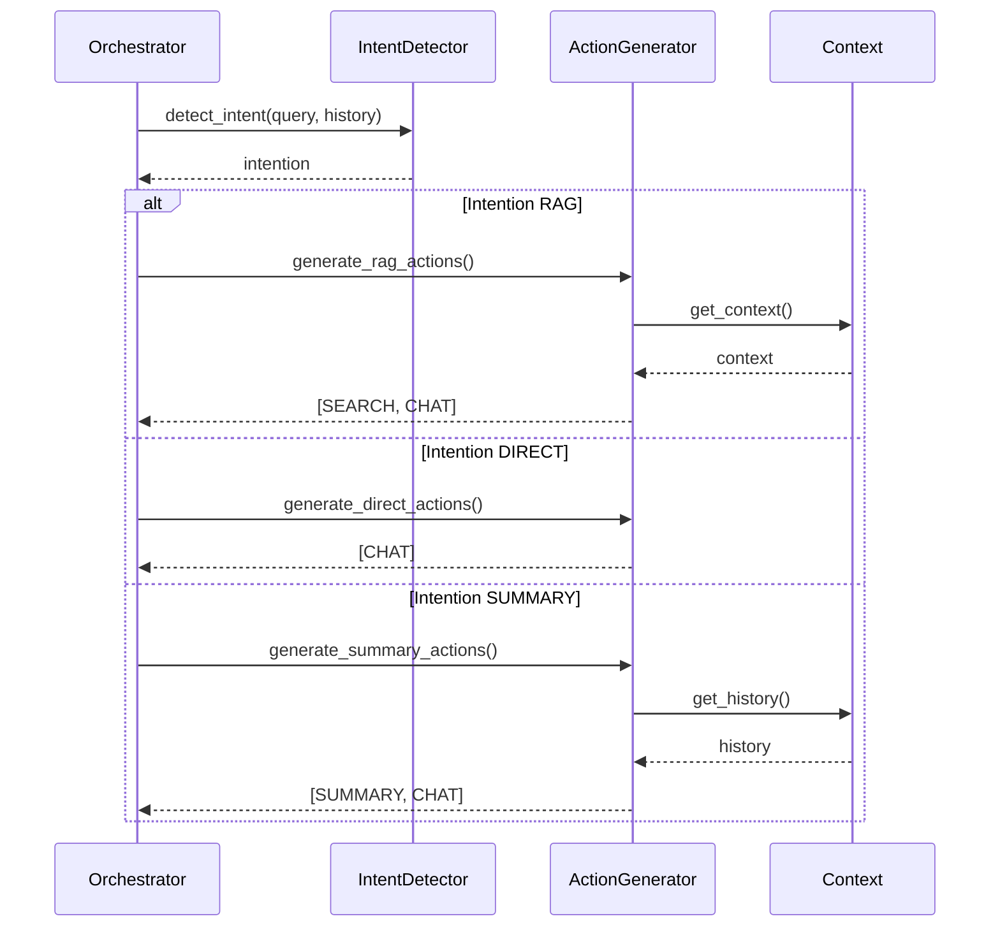
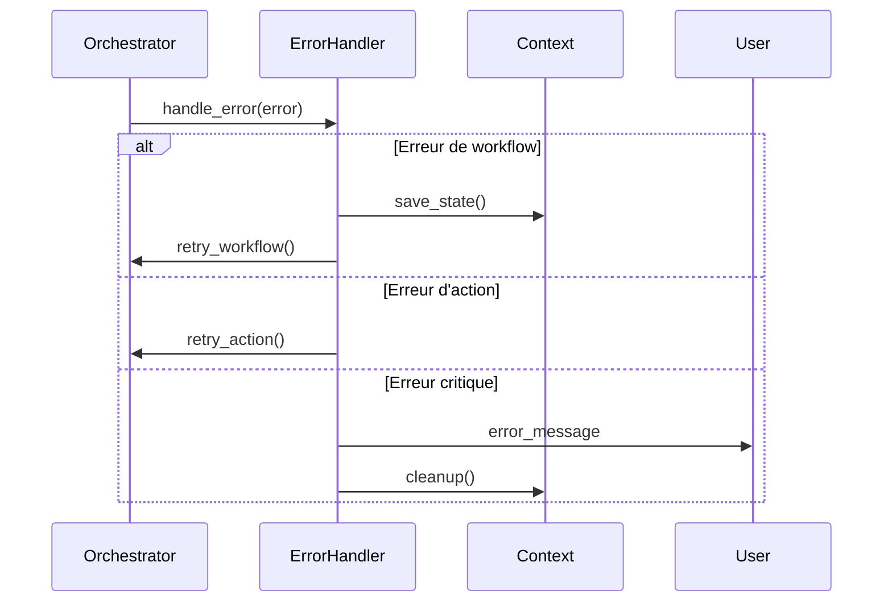

# Orchestrator

L'Orchestrator est le composant central de COLAIG qui coordonne les workflows et détecte les intentions des utilisateurs.

## Responsabilités

1. Détection d'intention à partir des messages utilisateur
2. Génération des workflows appropriés
3. Coordination des actions entre les composants
4. Gestion du contexte de conversation

## Architecture



## Types d'Actions

```python
class ActionType(Enum):
    SEARCH = "search"      # Recherche RAG
    CHAT = "chat"         # Chat direct
    INDEX = "index"       # Indexation
    CLEAR = "clear"       # Nettoyage
```

## Workflow



## Détection d'Intention

```python
async def detect_intent(
    self,
    query: str,
    conversation_history: List[Dict[str, str]]
) -> List[Action]:
    """
    Détecte l'intention de l'utilisateur et génère un workflow.
    
    Args:
        query: Requête utilisateur
        conversation_history: Historique de conversation
        
    Returns:
        List[Action]: Liste d'actions à exécuter
    """
```

### Prompt de Détection

```python
intent_prompt = (
    "En te basant sur la requête suivante et l'historique de conversation, "
    "détermine si la réponse nécessite :\n"
    "1. Une recherche dans la base documentaire (RAG)\n"
    "2. Une réponse directe sans recherche\n"
    "3. Une synthèse de l'historique\n\n"
    f"Requête : {query}\n\n"
    "Historique récent :\n"
    f"{conversation_history[-3:] if conversation_history else 'Pas d\'historique'}\n\n"
    "Réponds uniquement avec un des mots-clés suivants :\n"
    "- RAG\n"
    "- DIRECT\n"
    "- SUMMARY"
)
```

## Génération de Workflow



## Gestion du Contexte

```python
@dataclass
class WorkflowContext:
    room_id: str
    user_id: str
    message: str
    metadata: Dict[str, Any] = None
    intermediate_responses: Dict[str, Any] = None
```

## Configuration

```python
class OrchestratorConfig:
    # Paramètres de détection d'intention
    MAX_HISTORY_MESSAGES: int = 5
    INTENT_TEMPERATURE: float = 0.1
    
    # Paramètres de workflow
    DEFAULT_RAG_K: int = 5
    MAX_ACTIONS_PER_WORKFLOW: int = 5
    
    # Timeouts
    WORKFLOW_TIMEOUT: int = 30  # secondes
    ACTION_TIMEOUT: int = 10    # secondes
```

## Formatage des Prompts

### RAG
```python
async def format_rag_prompt(
    self,
    query: str,
    relevant_chunks: List[Dict]
) -> str:
    """
    Formate un prompt pour la génération de réponse avec RAG.
    
    Args:
        query: Requête utilisateur
        relevant_chunks: Chunks pertinents
        
    Returns:
        str: Prompt formaté
    """
    chunks_text = "\n\n".join(
        f"Document: {chunk.metadata['title']}\n"
        f"Extrait: {chunk.text}"
        for chunk, _ in relevant_chunks
    )
    
    return (
        "Réponds à la question suivante en te basant sur les extraits "
        "de documents fournis.\n"
        "Si la réponse ne peut pas être trouvée dans les documents, "
        "dis-le clairement.\n\n"
        f"Question : {query}\n\n"
        "Documents pertinents :\n"
        f"{chunks_text}\n\n"
        "Réponse :"
    )
```

## Gestion des Erreurs



## Utilisation

### Initialisation
```python
orchestrator = Orchestrator(
    albert_client=AlbertClient(),
    webdav_client=WebDAVClient()
)
```

### Traitement de Message
```python
# Création du contexte
context = WorkflowContext(
    room_id="room123",
    user_id="user456",
    message="Quelle est la procédure pour X ?"
)

# Détection et exécution
actions = await orchestrator.detect_intent(
    context.message,
    conversation_history
)
result = await orchestrator.execute_workflow(actions, context)
```

## Extension

L'Orchestrator peut être étendu via :

1. Nouveaux types d'actions
```python
class CustomAction(Action):
    type: ActionType = ActionType.CUSTOM
    params: Dict[str, Any]
```

2. Nouveaux détecteurs d'intention
```python
class CustomIntentDetector(IntentDetectorInterface):
    async def detect(
        self,
        query: str,
        history: List[Dict]
    ) -> str:
        # Implémentation personnalisée
        pass
```

3. Nouveaux générateurs de workflow
```python
class CustomWorkflowGenerator(WorkflowGeneratorInterface):
    async def generate(
        self,
        intent: str,
        context: WorkflowContext
    ) -> List[Action]:
        # Implémentation personnalisée
        pass
``` 