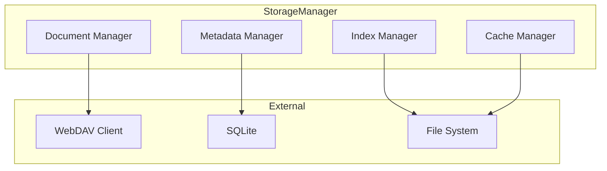
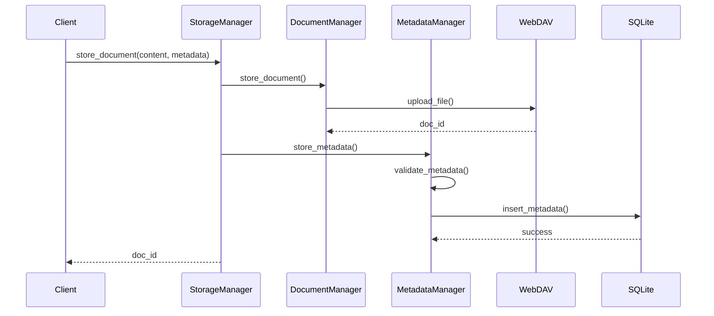

# Gestionnaire de Stockage

Le Gestionnaire de Stockage est responsable de la persistance des données dans COLAIG. Il gère le stockage des documents, des métadonnées, des index et des conversations via WebDAV.

## Responsabilités

1. Stockage et récupération des documents
2. Gestion des métadonnées
3. Persistance des index
4. Archivage des conversations
5. Gestion du cache

## Architecture



## Structure des Données

```
/data
├── documents/
│   ├── {room_id}/
│   │   ├── {doc_id}.pdf
│   │   └── {doc_id}.md
│   └── metadata.db
├── index/
│   ├── faiss/
│   │   ├── index.faiss
│   │   └── metadata.pkl
│   └── chunks/
│       └── {doc_id}/
│           └── chunks.json
├── conversations/
│   └── {room_id}/
│       ├── history.json
│       └── context.json
└── cache/
    ├── embeddings/
    │   └── {hash}.npy
    └── chunks/
        └── {hash}.json
```

## Interfaces

### Document Manager
```python
class DocumentManager:
    async def store_document(
        self,
        room_id: str,
        doc_id: str,
        content: bytes,
        metadata: Dict[str, Any]
    ) -> str:
        """Stocke un document"""
        pass

    async def get_document(
        self,
        room_id: str,
        doc_id: str
    ) -> Tuple[bytes, Dict[str, Any]]:
        """Récupère un document"""
        pass

    async def list_documents(
        self,
        room_id: str
    ) -> List[Dict[str, Any]]:
        """Liste les documents d'une room"""
        pass

    async def delete_document(
        self,
        room_id: str,
        doc_id: str
    ) -> None:
        """Supprime un document"""
        pass
```

### Metadata Manager
```python
class MetadataManager:
    async def store_metadata(
        self,
        doc_id: str,
        metadata: Dict[str, Any]
    ) -> None:
        """Stocke les métadonnées"""
        pass

    async def get_metadata(
        self,
        doc_id: str
    ) -> Dict[str, Any]:
        """Récupère les métadonnées"""
        pass

    async def update_metadata(
        self,
        doc_id: str,
        updates: Dict[str, Any]
    ) -> None:
        """Met à jour les métadonnées"""
        pass
```

## Workflow de Stockage



## Configuration

```python
class StorageConfig:
    # Chemins
    WEBDAV_URL: str = "https://webdav.example.com"
    WEBDAV_ROOT: str = "/data"
    DB_PATH: str = "./data/metadata.db"
    
    # Cache
    CACHE_SIZE: int = 1024  # MB
    CACHE_TTL: int = 3600   # secondes
    
    # Compression
    COMPRESSION_ENABLED: bool = True
    COMPRESSION_LEVEL: int = 6
    
    # Chunks
    MAX_CHUNK_SIZE: int = 1024  # KB
    
    # Timeouts
    UPLOAD_TIMEOUT: int = 30    # secondes
    DOWNLOAD_TIMEOUT: int = 30  # secondes
```

## Schéma de Métadonnées

```python
@dataclass
class DocumentMetadata:
    # Identifiants
    doc_id: str
    room_id: str
    
    # Informations document
    title: str
    type: str
    size: int
    hash: str
    
    # Dates
    created_at: datetime
    updated_at: datetime
    
    # Indexation
    indexed: bool = False
    last_indexed: Optional[datetime] = None
    num_chunks: int = 0
    
    # Statistiques
    view_count: int = 0
    search_count: int = 0
```

## Gestion du Cache

```python
class CacheManager:
    def __init__(self, config: StorageConfig):
        self.cache = LRUCache(
            maxsize=config.CACHE_SIZE,
            ttl=config.CACHE_TTL
        )
    
    async def get(self, key: str) -> Optional[Any]:
        """Récupère une valeur du cache"""
        pass
    
    async def set(
        self,
        key: str,
        value: Any,
        ttl: Optional[int] = None
    ) -> None:
        """Stocke une valeur dans le cache"""
        pass
    
    async def invalidate(self, key: str) -> None:
        """Invalide une entrée du cache"""
        pass
    
    async def cleanup(self) -> None:
        """Nettoie les entrées expirées"""
        pass
```

## Compression

```python
class CompressionManager:
    def __init__(self, config: StorageConfig):
        self.enabled = config.COMPRESSION_ENABLED
        self.level = config.COMPRESSION_LEVEL
    
    async def compress(self, data: bytes) -> bytes:
        """Compresse les données"""
        if not self.enabled:
            return data
        return gzip.compress(data, self.level)
    
    async def decompress(self, data: bytes) -> bytes:
        """Décompresse les données"""
        if not self.enabled:
            return data
        return gzip.decompress(data)
```

## Monitoring

```python
@dataclass
class StorageMetrics:
    # Métriques documents
    total_documents: int = 0
    total_size: int = 0
    documents_per_room: Dict[str, int] = field(default_factory=dict)
    
    # Métriques cache
    cache_hits: int = 0
    cache_misses: int = 0
    cache_size: int = 0
    
    # Métriques WebDAV
    upload_count: int = 0
    download_count: int = 0
    avg_upload_time: float = 0.0
    avg_download_time: float = 0.0
    
    # Métriques compression
    compression_ratio: float = 0.0
    compressed_size: int = 0
    original_size: int = 0
```

## Utilisation

### Initialisation
```python
storage = StorageManager(
    webdav_client=WebDAVClient(),
    config=StorageConfig()
)
```

### Stockage Document
```python
# Stockage document
doc_id = await storage.store_document(
    room_id="room123",
    content=pdf_bytes,
    metadata={
        "title": "Document X",
        "type": "pdf",
        "tags": ["procédure", "guide"]
    }
)

# Récupération document
content, metadata = await storage.get_document(
    room_id="room123",
    doc_id=doc_id
)
```

## Gestion des Erreurs

```python
class StorageError(Exception):
    """Erreur de base pour le stockage"""
    pass

class DocumentNotFoundError(StorageError):
    """Document non trouvé"""
    pass

class MetadataError(StorageError):
    """Erreur de métadonnées"""
    pass

class WebDAVError(StorageError):
    """Erreur WebDAV"""
    pass

class CacheError(StorageError):
    """Erreur de cache"""
    pass
```

## Extension

Le Gestionnaire de Stockage peut être étendu via :

1. Nouveaux backends de stockage
```python
class CustomStorageBackend(StorageBackendInterface):
    async def store(
        self,
        path: str,
        data: bytes
    ) -> str:
        # Implémentation personnalisée
        pass
```

2. Nouveaux formats de métadonnées
```python
class CustomMetadataFormat(MetadataFormatInterface):
    def validate(
        self,
        metadata: Dict[str, Any]
    ) -> bool:
        # Implémentation personnalisée
        pass
```

3. Nouvelles stratégies de cache
```python
class CustomCacheStrategy(CacheStrategyInterface):
    async def should_cache(
        self,
        key: str,
        value: Any
    ) -> bool:
        # Implémentation personnalisée
        pass
``` 