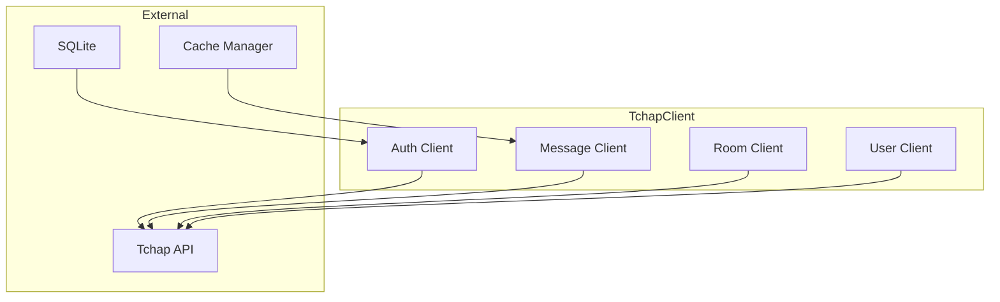
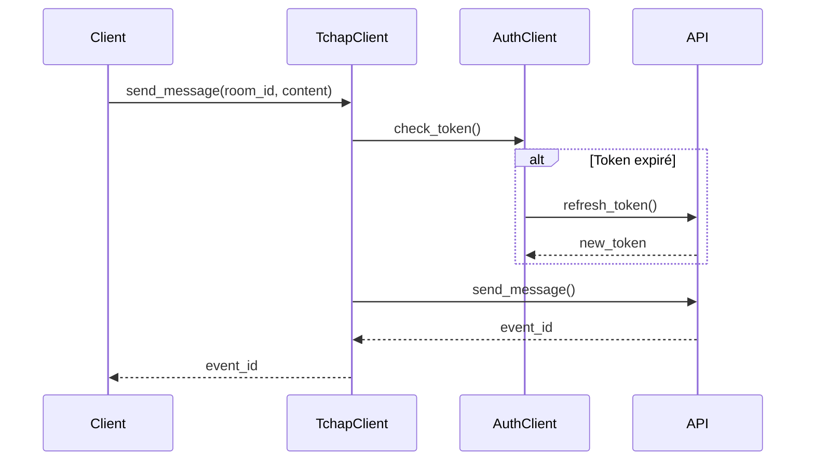

# Client Tchap

Le client Tchap est responsable de la communication avec l'API Tchap. Il gère l'authentification, l'envoi et la réception de messages, ainsi que la gestion des salles.

## Configuration

Le client peut être configuré de deux manières :

1. Via les variables d'environnement :
```env
TCHAP_API_URL=https://api.tchap.gouv.fr
TCHAP_USERNAME=utilisateur@domaine.gouv.fr
TCHAP_PASSWORD=mot_de_passe
```

2. Via les paramètres du constructeur :
```python
client = TchapClient(
    base_url="https://api.tchap.gouv.fr",
    username="utilisateur@domaine.gouv.fr",
    password="mot_de_passe"
)
```

## Authentification

Le client utilise l'authentification par email/mot de passe. L'authentification est gérée automatiquement :
- À l'initialisation du client
- Lors de la réouverture d'une session expirée
- Après une période d'inactivité (5 minutes par défaut)

## Fonctionnalités

### Gestion des messages

```python
# Envoi d'un message
await client.send_message(room_id="!room:tchap.gouv.fr", content="Message")

# Récupération des messages
messages = await client.get_messages(room_id="!room:tchap.gouv.fr", limit=50)
```

### Gestion des salles

```python
# Création d'une salle
room = await client.create_room(name="Nouvelle salle", topic="Description")

# Invitation d'un utilisateur
await client.invite_user(room_id=room.id, user_id="@user:tchap.gouv.fr")
```

## Gestion des sessions

Le client gère automatiquement :
- La création et fermeture des sessions HTTP
- La réauthentification en cas d'expiration du token
- Le maintien en vie des connexions actives

## Gestion des erreurs

Le client gère les erreurs courantes :
- Erreurs d'authentification
- Erreurs réseau
- Limites de taux
- Timeouts

## Exemple d'utilisation

```python
from colaig.tools.tchap_client import TchapClient

async def main():
    # Initialisation du client
    client = TchapClient(
        username="utilisateur@domaine.gouv.fr",
        password="mot_de_passe"
    )
    
    # Envoi d'un message
    await client.send_message(
        room_id="!room:tchap.gouv.fr",
        content="Message de test"
    )
    
    # Fermeture propre
    await client.close()
```

## Bonnes pratiques

1. Toujours utiliser le client dans un contexte asynchrone
2. Fermer proprement le client après utilisation
3. Gérer les exceptions potentielles
4. Ne pas stocker les identifiants en dur dans le code
5. Utiliser les variables d'environnement pour la configuration

## Responsabilités

1. Communication avec l'API Tchap
2. Authentification et gestion des tokens
3. Gestion des messages
4. Gestion des rooms
5. Gestion des utilisateurs

## Architecture



## Interfaces

### Client Principal
```python
class TchapClient:
    async def send_message(
        self,
        room_id: str,
        content: str,
        msgtype: str = "m.text"
    ) -> str:
        """Envoie un message"""
        pass

    async def get_messages(
        self,
        room_id: str,
        limit: int = 50
    ) -> List[Dict[str, Any]]:
        """Récupère les messages"""
        pass

    async def join_room(
        self,
        room_id: str
    ) -> None:
        """Rejoint une room"""
        pass

    async def leave_room(
        self,
        room_id: str
    ) -> None:
        """Quitte une room"""
        pass
```

### Client d'Authentification
```python
class AuthClient:
    async def login(
        self,
        username: str,
        password: str
    ) -> str:
        """Authentifie l'utilisateur"""
        pass

    async def refresh_token(
        self,
        refresh_token: str
    ) -> str:
        """Rafraîchit le token"""
        pass

    async def logout(self) -> None:
        """Déconnecte l'utilisateur"""
        pass
```

## Workflow de Message



## Configuration

```python
class TchapConfig:
    # API
    API_URL: str = "https://api.tchap.gouv.fr"
    API_VERSION: str = "v1"
    
    # Auth
    TOKEN_REFRESH_MARGIN: int = 300  # secondes
    MAX_LOGIN_ATTEMPTS: int = 3
    
    # Messages
    MAX_MESSAGE_LENGTH: int = 4096
    MAX_MEDIA_SIZE: int = 10 * 1024 * 1024  # 10 MB
    
    # Rate Limiting
    MESSAGES_PER_MINUTE: int = 100
    JOINS_PER_MINUTE: int = 10
    
    # Timeouts
    REQUEST_TIMEOUT: float = 30.0
    SYNC_TIMEOUT: float = 30000  # ms
```

## Types de Messages

```python
class MessageType:
    TEXT = "m.text"
    NOTICE = "m.notice"
    EMOTE = "m.emote"
    IMAGE = "m.image"
    FILE = "m.file"
    LOCATION = "m.location"
```

## Gestion des Rooms

```python
class RoomClient:
    async def create_room(
        self,
        name: str,
        topic: str = None,
        is_direct: bool = False
    ) -> str:
        """Crée une nouvelle room"""
        pass
    
    async def invite_user(
        self,
        room_id: str,
        user_id: str
    ) -> None:
        """Invite un utilisateur"""
        pass
    
    async def get_members(
        self,
        room_id: str
    ) -> List[Dict[str, Any]]:
        """Récupère les membres"""
        pass
    
    async def set_room_name(
        self,
        room_id: str,
        name: str
    ) -> None:
        """Définit le nom de la room"""
        pass
```

## Gestion des Utilisateurs

```python
class UserClient:
    async def get_profile(
        self,
        user_id: str
    ) -> Dict[str, Any]:
        """Récupère le profil"""
        pass
    
    async def set_display_name(
        self,
        display_name: str
    ) -> None:
        """Définit le nom d'affichage"""
        pass
    
    async def set_avatar_url(
        self,
        avatar_url: str
    ) -> None:
        """Définit l'avatar"""
        pass
```

## Monitoring

```python
@dataclass
class TchapMetrics:
    # Métriques messages
    messages_sent: int = 0
    messages_received: int = 0
    media_sent: int = 0
    media_received: int = 0
    
    # Métriques auth
    login_attempts: int = 0
    token_refreshes: int = 0
    
    # Métriques rooms
    rooms_joined: int = 0
    rooms_left: int = 0
    invites_sent: int = 0
    
    # Métriques API
    api_calls: int = 0
    api_errors: int = 0
    avg_response_time: float = 0.0
```

## Utilisation

### Initialisation
```python
client = TchapClient(
    config=TchapConfig()
)

# Login
await client.auth.login(
    username="user@gouv.fr",
    password="password"
)
```

### Envoi de Messages
```python
# Message texte
event_id = await client.send_message(
    room_id="!room:tchap.gouv.fr",
    content="Bonjour, voici la réponse à votre question..."
)

# Message avec formatage
event_id = await client.send_message(
    room_id="!room:tchap.gouv.fr",
    content="**Titre**\n- Point 1\n- Point 2",
    msgtype="m.text"
)
```

## Gestion des Erreurs

```python
class TchapError(Exception):
    """Erreur de base pour le client Tchap"""
    pass

class AuthError(TchapError):
    """Erreur d'authentification"""
    pass

class RoomError(TchapError):
    """Erreur de room"""
    pass

class MessageError(TchapError):
    """Erreur de message"""
    pass

class APIError(TchapError):
    """Erreur d'API"""
    pass
```

## Persistance

```python
class TchapStorage:
    def __init__(self, db_path: str):
        self.db_path = db_path
    
    async def save_auth_token(
        self,
        token: str,
        refresh_token: str,
        expiry: int
    ) -> None:
        """Sauvegarde les tokens"""
        pass
    
    async def get_auth_token(self) -> Dict[str, Any]:
        """Récupère les tokens"""
        pass
    
    async def clear_auth_token(self) -> None:
        """Supprime les tokens"""
        pass
```

## Extension

Le Client Tchap peut être étendu via :

1. Nouveaux types de messages
```python
class CustomMessageHandler(MessageHandlerInterface):
    async def handle_message(
        self,
        event: Dict[str, Any]
    ) -> None:
        # Implémentation personnalisée
        pass
```

2. Nouveaux filtres de room
```python
class CustomRoomFilter(RoomFilterInterface):
    def filter_room(
        self,
        room: Dict[str, Any]
    ) -> bool:
        # Implémentation personnalisée
        pass
```

3. Nouveaux handlers d'événements
```python
class CustomEventHandler(EventHandlerInterface):
    async def handle_event(
        self,
        event: Dict[str, Any]
    ) -> None:
        # Implémentation personnalisée
        pass
``` 