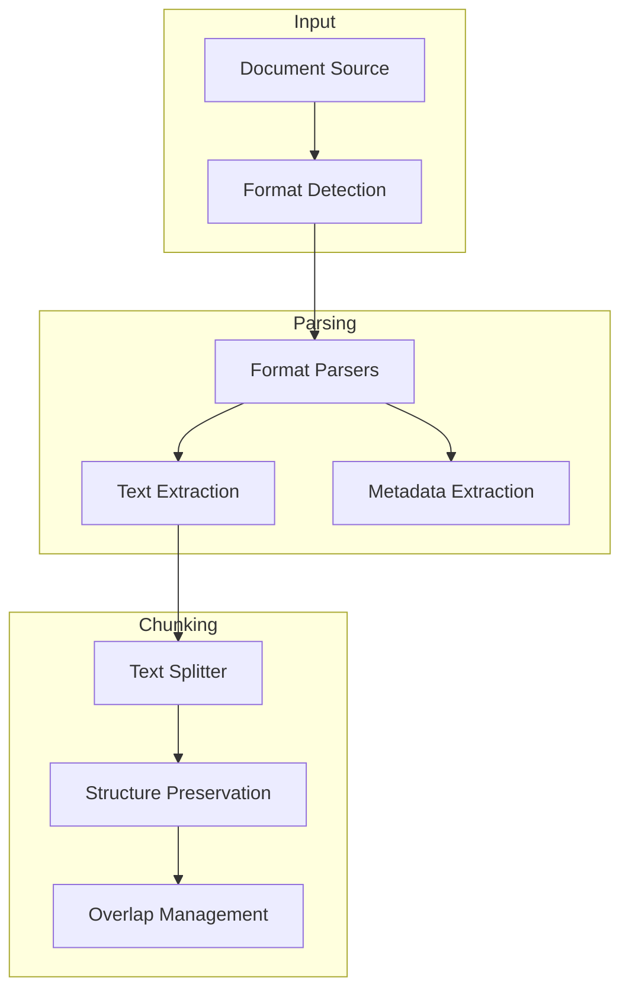
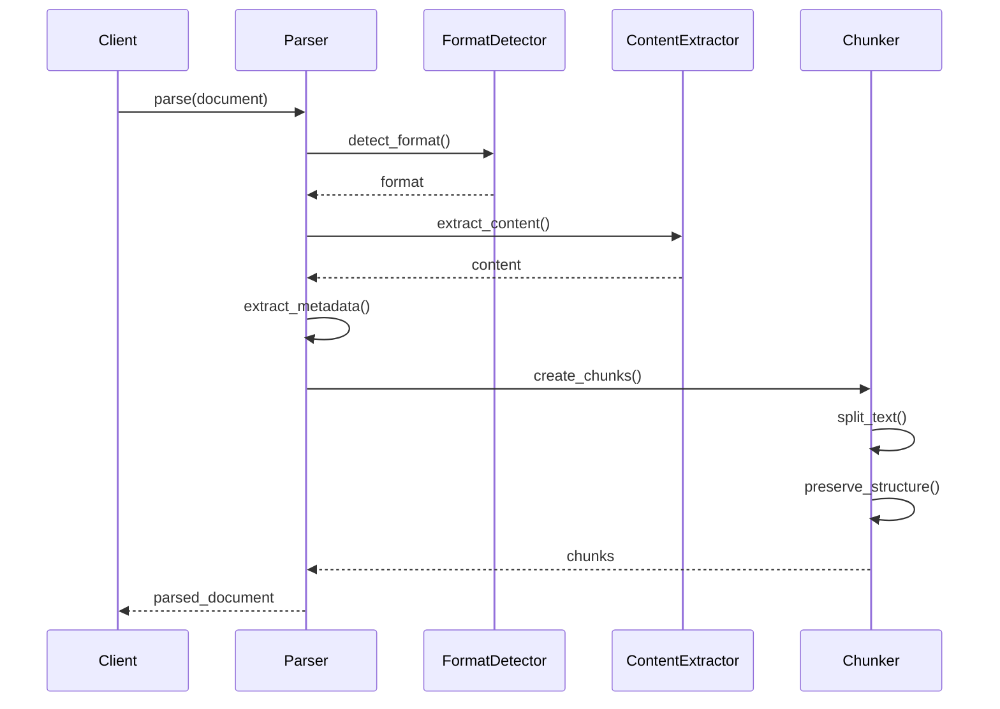

# Parseur de Documents

Le parseur de documents est responsable de l'extraction et du traitement du contenu des documents dans différents formats, ainsi que de leur découpage en chunks pour l'indexation.

## Architecture



## Interface

```python
class DocumentParser:
    async def parse(self, document: Document) -> ParsedDocument:
        """Parse un document et extrait son contenu."""
        pass

    async def create_chunks(self, content: str) -> List[DocumentChunk]:
        """Découpe le contenu en chunks."""
        pass

    def detect_format(self, document: Document) -> DocumentFormat:
        """Détecte le format du document."""
        pass

    async def extract_metadata(self, document: Document) -> Dict:
        """Extrait les métadonnées du document."""
        pass
```

## Formats Supportés

```python
class DocumentFormat(Enum):
    PDF = "pdf"
    MARKDOWN = "md"
    HTML = "html"
    TEXT = "txt"
    DOCX = "docx"
    JSON = "json"
```

## Types de Données

```python
@dataclass
class DocumentChunk:
    """Représente un chunk de document."""
    content: str
    metadata: Dict
    start_index: int
    end_index: int
    section: Optional[str]

@dataclass
class ParsedDocument:
    """Document après parsing."""
    content: str
    metadata: Dict
    format: DocumentFormat
    chunks: List[DocumentChunk]
```

## Flux de Parsing



## Configuration

```python
class ParserConfig:
    # Configuration générale
    DEFAULT_ENCODING: str = "utf-8"
    MAX_FILE_SIZE: int = 10 * 1024 * 1024  # 10MB
    
    # Configuration du chunking
    CHUNK_SIZE: int = 512
    CHUNK_OVERLAP: int = 128
    CHUNK_MIN_SIZE: int = 100
    
    # Extraction de texte
    PRESERVE_WHITESPACE: bool = False
    STRIP_NEWLINES: bool = True
    
    # Formats supportés
    SUPPORTED_FORMATS: List[str] = [
        "pdf", "md", "html", "txt", "docx", "json"
    ]
```

## Implémentation des Parseurs

### 1. PDF Parser
```python
class PDFParser(BaseParser):
    async def extract_content(self, document: Document) -> str:
        """Extrait le contenu d'un PDF."""
        async with document.open() as pdf:
            text = ""
            for page in pdf.pages:
                text += await self._extract_page(page)
            return text

    async def extract_metadata(self) -> Dict:
        """Extrait les métadonnées du PDF."""
        return {
            "title": self.pdf.metadata.get("Title"),
            "author": self.pdf.metadata.get("Author"),
            "creation_date": self.pdf.metadata.get("CreationDate")
        }
```

### 2. Markdown Parser
```python
class MarkdownParser(BaseParser):
    def extract_content(self, content: str) -> str:
        """Extrait le contenu d'un fichier Markdown."""
        # Supprime les balises Markdown tout en préservant la structure
        return self._clean_markdown(content)

    def extract_sections(self, content: str) -> List[Section]:
        """Extrait les sections du Markdown."""
        sections = []
        current_section = None
        for line in content.split("\n"):
            if line.startswith("#"):
                current_section = self._parse_header(line)
                sections.append(current_section)
        return sections
```

## Chunking Intelligent

### 1. Préservation de la Structure
```python
class StructurePreservingChunker:
    def split_text(self, text: str) -> List[DocumentChunk]:
        """Découpe le texte en préservant la structure."""
        chunks = []
        sections = self._identify_sections(text)
        for section in sections:
            section_chunks = self._split_section(section)
            chunks.extend(section_chunks)
        return chunks
```

### 2. Gestion des Chevauchements
```python
class OverlapManager:
    def add_overlap(self, chunks: List[DocumentChunk]) -> List[DocumentChunk]:
        """Ajoute du chevauchement entre les chunks."""
        result = []
        for i in range(len(chunks)):
            if i > 0:
                overlap = self._calculate_overlap(
                    chunks[i-1],
                    chunks[i]
                )
                chunks[i].start_index -= len(overlap)
            result.append(chunks[i])
        return result
```

## Monitoring

Le parseur fournit des métriques détaillées :

```python
{
    "parsing": {
        "total_documents": 100,
        "successful": 98,
        "failed": 2,
        "formats": {
            "pdf": 45,
            "markdown": 30,
            "html": 25
        }
    },
    "chunking": {
        "total_chunks": 1500,
        "avg_chunk_size": 450,
        "avg_overlap_size": 100
    },
    "performance": {
        "avg_parsing_time": 0.5,
        "avg_chunking_time": 0.2,
        "memory_usage": 256
    }
}
```

## Utilisation

### 1. Initialisation
```python
config = ParserConfig()
parser = DocumentParser(
    config=config,
    format_parsers={
        DocumentFormat.PDF: PDFParser(),
        DocumentFormat.MARKDOWN: MarkdownParser(),
        DocumentFormat.HTML: HTMLParser()
    }
)
```

### 2. Parsing Simple
```python
document = Document(path="document.pdf")
parsed_doc = await parser.parse(document)
print(f"Contenu extrait: {len(parsed_doc.content)} caractères")
print(f"Métadonnées: {parsed_doc.metadata}")
```

### 3. Chunking
```python
content = "Long texte à découper..."
chunks = await parser.create_chunks(content)
for chunk in chunks:
    print(f"Chunk {chunk.start_index}-{chunk.end_index}")
    print(f"Contenu: {chunk.content[:50]}...")
```

## Bonnes Pratiques

1. **Performance**
   - Utiliser des parseurs asynchrones
   - Mettre en cache les résultats fréquents
   - Optimiser l'extraction de texte

2. **Qualité**
   - Préserver la structure du document
   - Valider le contenu extrait
   - Gérer les encodages correctement

3. **Maintenance**
   - Logger les erreurs de parsing
   - Monitorer les performances
   - Mettre à jour les parseurs régulièrement

## Tests

```python
async def test_document_parser():
    # Configuration
    config = ParserConfig()
    parser = DocumentParser(config)
    
    # Test PDF
    pdf_doc = Document(path="test.pdf")
    parsed_pdf = await parser.parse(pdf_doc)
    assert parsed_pdf.format == DocumentFormat.PDF
    assert len(parsed_pdf.chunks) > 0
    
    # Test Markdown
    md_content = "# Titre\nContenu test"
    chunks = await parser.create_chunks(md_content)
    assert len(chunks) > 0
    assert chunks[0].section == "Titre"
    
    # Test de métadonnées
    metadata = await parser.extract_metadata(pdf_doc)
    assert "title" in metadata
    assert "creation_date" in metadata
``` 