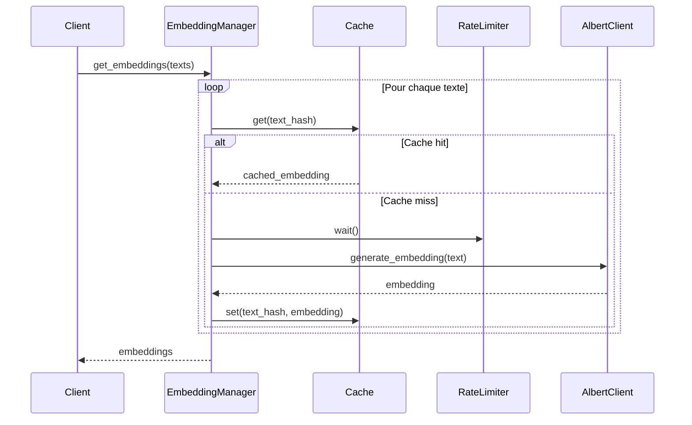
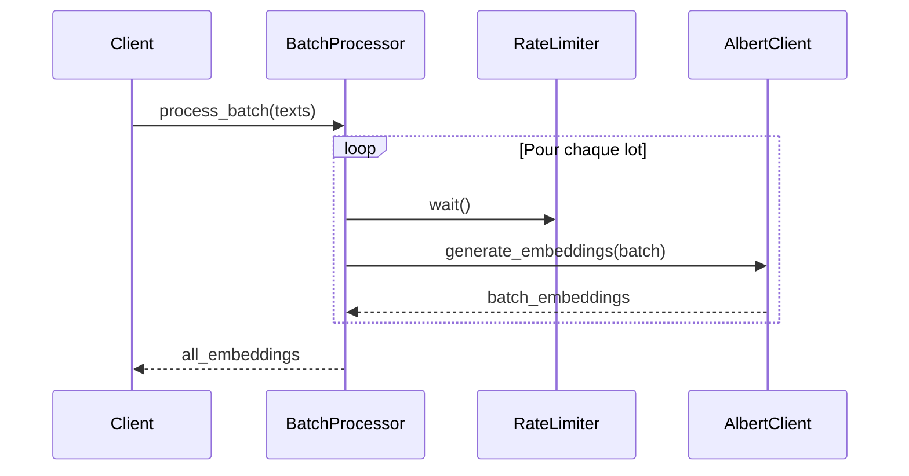

# Gestionnaire d'Embeddings

Le gestionnaire d'embeddings est responsable de la génération et de la gestion des représentations vectorielles des documents et des requêtes.

## Interface

```python
class EmbeddingManager:
    async def get_embeddings(self, texts: List[str]) -> List[List[float]]:
        """Génère les embeddings pour une liste de textes."""
        pass

    async def get_embedding(self, text: str) -> List[float]:
        """Génère l'embedding pour un texte unique."""
        pass

    async def process_batch(self, texts: List[str]) -> List[List[float]]:
        """Traite un lot de textes avec gestion du rate limiting."""
        pass
```

## Fonctionnalités

### 1. Génération d'Embeddings


### 2. Gestion du Cache
- Utilisation d'un cache LRU avec TTL
- Clés basées sur le hash SHA-256 du texte
- Nettoyage automatique des entrées expirées

### 3. Traitement par Lots


## Configuration

```python
class EmbeddingConfig:
    # Dimensions de l'embedding
    EMBEDDING_DIMENSION: int = 768
    
    # Configuration du cache
    CACHE_SIZE: int = 10000
    CACHE_TTL: int = 3600  # secondes
    
    # Configuration des lots
    BATCH_SIZE: int = 10
    
    # Rate limiting
    REQUESTS_PER_MINUTE: int = 60
    BURST_SIZE: int = 10
```

## Gestion des Erreurs

```python
class EmbeddingError(Exception):
    """Erreur de base pour les opérations d'embedding."""
    pass

class BatchProcessingError(EmbeddingError):
    """Erreur lors du traitement par lots."""
    def __init__(self, failed_indices: List[int], message: str):
        self.failed_indices = failed_indices
        super().__init__(message)

class RateLimitExceededError(EmbeddingError):
    """Erreur de dépassement du rate limit."""
    pass
```

## Monitoring

Le gestionnaire fournit des métriques détaillées :

```python
{
    "cache": {
        "size": 8500,
        "hits": 15000,
        "misses": 5000,
        "hit_ratio": 0.75
    },
    "rate_limiting": {
        "current_rate": 45,
        "limit": 60,
        "burst_count": 2
    },
    "batch_processing": {
        "total_batches": 1000,
        "failed_batches": 5,
        "average_batch_size": 8.5
    }
}
```

## Utilisation

### 1. Initialisation
```python
config = EmbeddingConfig()
embedding_manager = EmbeddingManager(
    albert_client=albert_client,
    cache=Cache(config.CACHE_SIZE, config.CACHE_TTL),
    rate_limiter=RateLimiter(config.REQUESTS_PER_MINUTE)
)
```

### 2. Génération Simple
```python
text = "Document à vectoriser"
embedding = await embedding_manager.get_embedding(text)
```

### 3. Traitement par Lots
```python
texts = ["Doc 1", "Doc 2", "Doc 3"]
embeddings = await embedding_manager.process_batch(texts)
```

## Bonnes Pratiques

1. **Performance**
   - Utiliser le traitement par lots quand possible
   - Configurer le cache selon l'usage
   - Ajuster les paramètres de rate limiting

2. **Gestion des Erreurs**
   - Implémenter une stratégie de retry
   - Logger les erreurs avec contexte
   - Monitorer les taux d'erreur

3. **Maintenance**
   - Nettoyer le cache périodiquement
   - Vérifier les métriques régulièrement
   - Ajuster les configurations si nécessaire

## Intégration

### 1. Avec l'Index Manager
```python
class IndexManager:
    def __init__(self, embedding_manager: EmbeddingManager):
        self.embedding_manager = embedding_manager

    async def add_document(self, text: str):
        embedding = await self.embedding_manager.get_embedding(text)
        self.index.add(embedding)
```

### 2. Avec le Document Parser
```python
class DocumentParser:
    def __init__(self, embedding_manager: EmbeddingManager):
        self.embedding_manager = embedding_manager

    async def process_chunks(self, chunks: List[str]):
        return await self.embedding_manager.process_batch(chunks)
```

## Tests

```python
async def test_embedding_manager():
    # Configuration du test
    config = EmbeddingConfig()
    mock_client = MockAlbertClient()
    manager = EmbeddingManager(mock_client)

    # Test de génération simple
    text = "Test document"
    embedding = await manager.get_embedding(text)
    assert len(embedding) == config.EMBEDDING_DIMENSION

    # Test de cache
    cached_embedding = await manager.get_embedding(text)
    assert cached_embedding == embedding

    # Test de traitement par lots
    texts = ["Doc 1", "Doc 2", "Doc 3"]
    embeddings = await manager.process_batch(texts)
    assert len(embeddings) == len(texts)
``` 