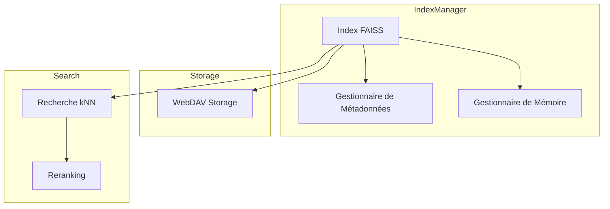
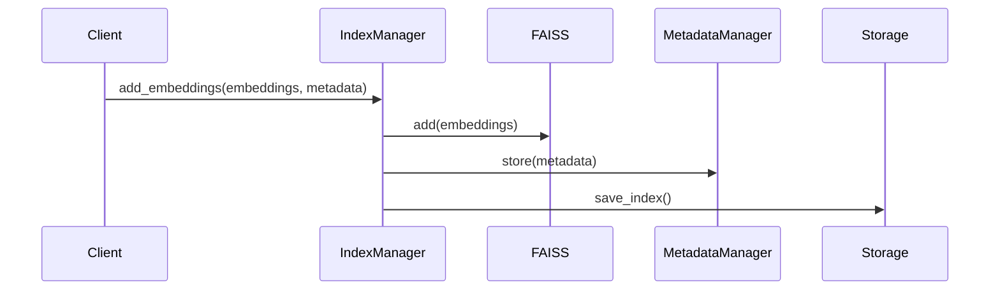
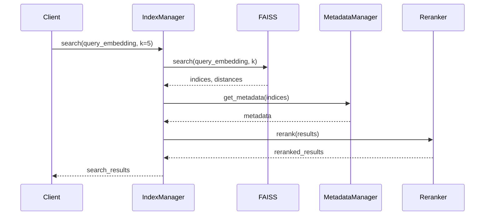

# Gestionnaire d'Index

Le gestionnaire d'index est responsable de la gestion de l'index vectoriel FAISS, permettant la recherche sémantique efficace dans les documents.

## Interface

```python
class IndexManager:
    async def add_embeddings(self, embeddings: List[List[float]], metadata: List[Dict]) -> None:
        """Ajoute des embeddings à l'index avec leurs métadonnées."""
        pass

    async def search(self, query_embedding: List[float], k: int = 5) -> List[SearchResult]:
        """Recherche les k plus proches voisins d'un embedding de requête."""
        pass

    async def save(self) -> None:
        """Sauvegarde l'index et les métadonnées sur le stockage persistant."""
        pass

    async def load(self) -> None:
        """Charge l'index et les métadonnées depuis le stockage persistant."""
        pass
```

## Architecture



## Fonctionnalités

### 1. Gestion de l'Index FAISS



### 2. Recherche Sémantique



## Configuration

```python
class IndexConfig:
    # Configuration FAISS
    INDEX_TYPE: str = "IVFFlat"  # ou "Flat", "HNSW", etc.
    DIMENSION: int = 768
    N_LISTS: int = 100  # pour IVF
    
    # Chemins de stockage
    INDEX_PATH: str = "./data/index.faiss"
    METADATA_PATH: str = "./data/metadata.pkl"
    
    # Paramètres de recherche
    NPROBE: int = 10  # nombre de cellules à explorer
    DEFAULT_K: int = 5
    
    # Gestion de la mémoire
    MAX_MEMORY_MB: int = 2048
    BATCH_SIZE: int = 1000
```

## Types de Données

```python
@dataclass
class SearchResult:
    """Résultat d'une recherche dans l'index."""
    id: str
    score: float
    metadata: Dict
    content: str
    distance: float

@dataclass
class IndexStats:
    """Statistiques de l'index."""
    size: int
    dimension: int
    index_type: str
    memory_usage: int
    last_modified: datetime
```

## Gestion de la Mémoire

Le gestionnaire implémente plusieurs stratégies de gestion de la mémoire :

1. **Chargement Partiel**
```python
async def load_partial(self, start_idx: int, end_idx: int):
    """Charge une partie spécifique de l'index."""
    pass
```

2. **Nettoyage Automatique**
```python
async def cleanup(self):
    """Libère la mémoire si nécessaire."""
    if self.memory_usage > self.config.MAX_MEMORY_MB:
        await self._reduce_memory_usage()
```

3. **Indexation par Lots**
```python
async def add_batch(self, batch: List[List[float]]):
    """Ajoute un lot d'embeddings avec gestion de la mémoire."""
    if self._will_exceed_memory(batch):
        await self.cleanup()
    await self.add_embeddings(batch)
```

## Monitoring

Le système fournit des métriques détaillées :

```python
{
    "index": {
        "size": 1000000,
        "dimension": 768,
        "type": "IVFFlat",
        "n_lists": 100
    },
    "memory": {
        "usage_mb": 1024,
        "max_mb": 2048,
        "cleanup_count": 5
    },
    "search": {
        "avg_latency_ms": 25.5,
        "queries_per_second": 100,
        "cache_hit_ratio": 0.8
    }
}
```

## Utilisation

### 1. Initialisation
```python
config = IndexConfig()
index_manager = IndexManager(
    config=config,
    storage=WebDAVStorage(),
    metadata_manager=MetadataManager()
)
await index_manager.initialize()
```

### 2. Ajout de Documents
```python
embeddings = [[0.1, 0.2, ...], [0.3, 0.4, ...]]
metadata = [
    {"id": "doc1", "title": "Document 1"},
    {"id": "doc2", "title": "Document 2"}
]
await index_manager.add_embeddings(embeddings, metadata)
```

### 3. Recherche
```python
query_embedding = [0.1, 0.2, ...]
results = await index_manager.search(
    query_embedding,
    k=5,
    rerank=True
)
```

## Bonnes Pratiques

1. **Performance**
   - Optimiser les paramètres FAISS (nprobe, etc.)
   - Utiliser le bon type d'index pour votre cas
   - Implémenter un cache de recherche

2. **Fiabilité**
   - Sauvegarder régulièrement l'index
   - Monitorer l'usage mémoire
   - Valider les embeddings avant insertion

3. **Maintenance**
   - Reconstruire l'index périodiquement
   - Nettoyer les métadonnées obsolètes
   - Optimiser l'index si nécessaire

## Tests

```python
async def test_index_manager():
    # Configuration
    config = IndexConfig()
    manager = IndexManager(config)
    
    # Test d'ajout
    embeddings = [[0.1] * 768, [0.2] * 768]
    metadata = [{"id": "1"}, {"id": "2"}]
    await manager.add_embeddings(embeddings, metadata)
    
    # Test de recherche
    query = [0.1] * 768
    results = await manager.search(query, k=1)
    assert len(results) == 1
    assert results[0].metadata["id"] == "1"
    
    # Test de sauvegarde/chargement
    await manager.save()
    new_manager = IndexManager(config)
    await new_manager.load()
    assert new_manager.size() == manager.size()
``` 