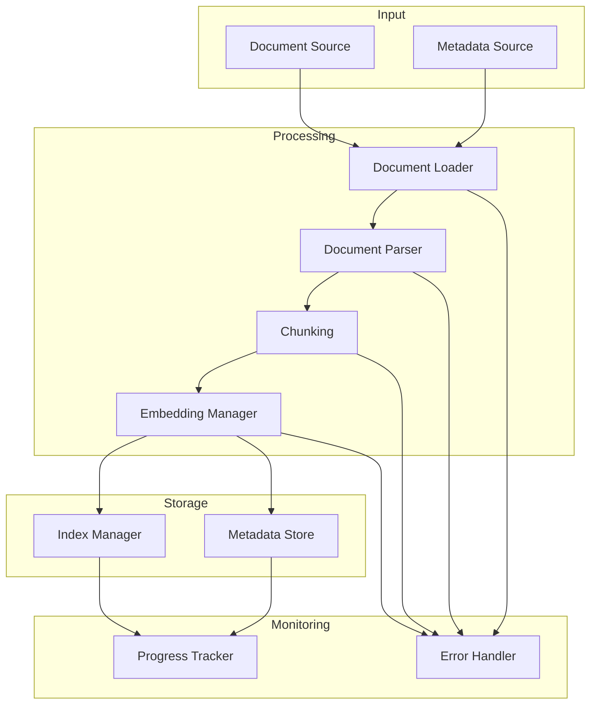
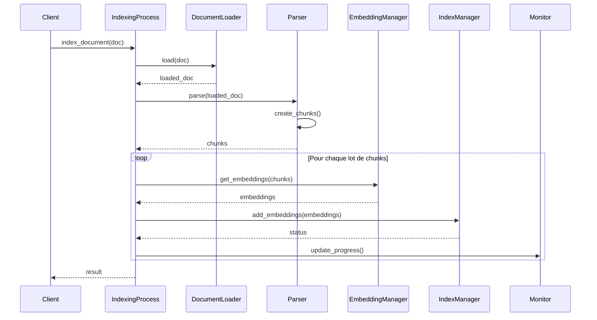

# Processus d'Indexation

Le processus d'indexation gère le flux complet d'indexation des documents, de leur chargement jusqu'à leur stockage dans l'index vectoriel.

## Architecture



## Interface

```python
class IndexingProcess:
    async def index_document(self, document: Document) -> IndexingResult:
        """Indexe un document unique."""
        pass

    async def index_batch(self, documents: List[Document]) -> BatchIndexingResult:
        """Indexe un lot de documents."""
        pass

    async def reindex_all(self) -> ReindexingResult:
        """Réindexe tous les documents."""
        pass

    async def update_document(self, document_id: str, document: Document) -> IndexingResult:
        """Met à jour un document existant."""
        pass
```

## Flux de Données



## Configuration

```python
class IndexingConfig:
    # Configuration du chunking
    CHUNK_SIZE: int = 512
    CHUNK_OVERLAP: int = 128
    
    # Configuration des lots
    BATCH_SIZE: int = 10
    MAX_CONCURRENT_TASKS: int = 3
    
    # Timeouts et retries
    INDEXING_TIMEOUT: int = 300  # secondes
    MAX_RETRIES: int = 3
    RETRY_DELAY: int = 5  # secondes
    
    # Monitoring
    PROGRESS_UPDATE_INTERVAL: int = 1  # secondes
```

## Types de Données

```python
@dataclass
class IndexingResult:
    """Résultat de l'indexation d'un document."""
    document_id: str
    status: IndexingStatus
    chunks_count: int
    duration: float
    errors: List[IndexingError]

@dataclass
class BatchIndexingResult:
    """Résultat de l'indexation d'un lot."""
    successful: List[str]
    failed: List[Tuple[str, str]]
    total_chunks: int
    total_duration: float
```

## Gestion des Erreurs

```python
class IndexingError(Exception):
    """Erreur de base pour l'indexation."""
    pass

class ChunkingError(IndexingError):
    """Erreur lors du chunking."""
    pass

class EmbeddingError(IndexingError):
    """Erreur lors de la génération d'embeddings."""
    pass

async def handle_error(self, error: IndexingError, document: Document) -> None:
    """Gère une erreur d'indexation."""
    if isinstance(error, ChunkingError):
        await self._handle_chunking_error(error, document)
    elif isinstance(error, EmbeddingError):
        await self._handle_embedding_error(error, document)
```

## Monitoring

Le processus fournit des métriques détaillées :

```python
{
    "progress": {
        "total_documents": 100,
        "processed": 45,
        "failed": 2,
        "percentage": 45.0
    },
    "performance": {
        "avg_processing_time": 2.5,
        "documents_per_minute": 24,
        "current_batch_size": 10
    },
    "resources": {
        "memory_usage": 1024,
        "cpu_usage": 65.5,
        "queue_size": 5
    },
    "errors": [
        {
            "document_id": "doc123",
            "error_type": "ChunkingError",
            "timestamp": "2024-02-20T14:30:00",
            "details": "Invalid document format"
        }
    ]
}
```

## Utilisation

### 1. Initialisation
```python
config = IndexingConfig()
indexing_process = IndexingProcess(
    document_loader=DocumentLoader(),
    parser=DocumentParser(),
    embedding_manager=EmbeddingManager(),
    index_manager=IndexManager(),
    config=config
)
```

### 2. Indexation Simple
```python
document = Document(
    id="doc1",
    content="Contenu du document",
    metadata={"title": "Document 1"}
)
result = await indexing_process.index_document(document)
```

### 3. Indexation par Lots
```python
documents = [
    Document(id="doc1", content="..."),
    Document(id="doc2", content="...")
]
result = await indexing_process.index_batch(documents)
```

## Optimisation

### 1. Chunking Intelligent
```python
class SmartChunker:
    def chunk_document(self, content: str) -> List[str]:
        """Découpe le document en respectant la structure."""
        chunks = []
        # Logique de découpage intelligent
        return chunks
```

### 2. Gestion de la Mémoire
```python
class MemoryManager:
    async def check_memory(self) -> bool:
        """Vérifie la disponibilité mémoire."""
        if self._memory_pressure():
            await self._reduce_batch_size()
            return False
        return True
```

### 3. Pipeline Parallèle
```python
class ParallelPipeline:
    async def process(self, documents: List[Document]) -> None:
        """Traite les documents en parallèle."""
        chunks = await self._chunk_parallel(documents)
        embeddings = await self._embed_parallel(chunks)
        await self._index_parallel(embeddings)
```

## Bonnes Pratiques

1. **Performance**
   - Ajuster la taille des chunks
   - Optimiser le parallélisme
   - Gérer la mémoire efficacement

2. **Fiabilité**
   - Implémenter des retries
   - Sauvegarder l'état régulièrement
   - Gérer les timeouts

3. **Maintenance**
   - Monitorer les performances
   - Nettoyer les documents obsolètes
   - Optimiser périodiquement

## Tests

```python
async def test_indexing_process():
    # Configuration
    config = IndexingConfig()
    process = IndexingProcess(config)
    
    # Test d'indexation simple
    document = Document(id="1", content="Test content")
    result = await process.index_document(document)
    assert result.status == IndexingStatus.SUCCESS
    
    # Test d'indexation par lots
    documents = [
        Document(id="2", content="Test 2"),
        Document(id="3", content="Test 3")
    ]
    batch_result = await process.index_batch(documents)
    assert len(batch_result.successful) == 2
    
    # Test de gestion d'erreur
    invalid_doc = Document(id="4", content=None)
    result = await process.index_document(invalid_doc)
    assert result.status == IndexingStatus.ERROR
``` 