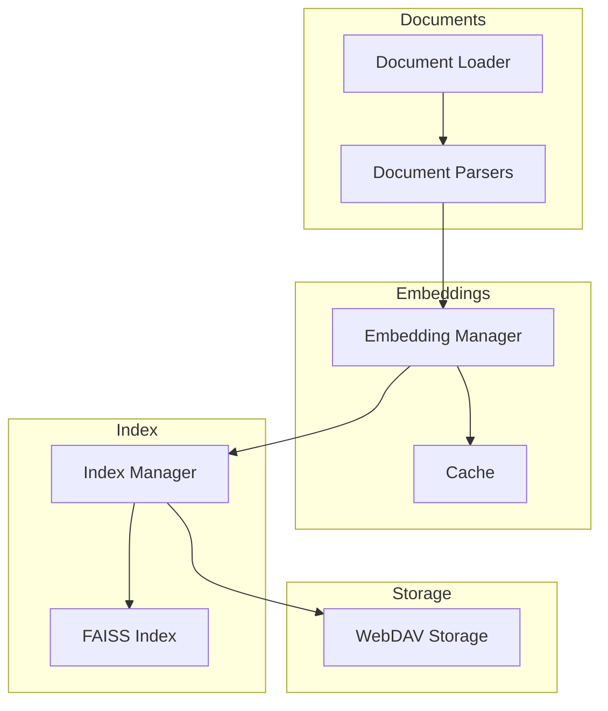
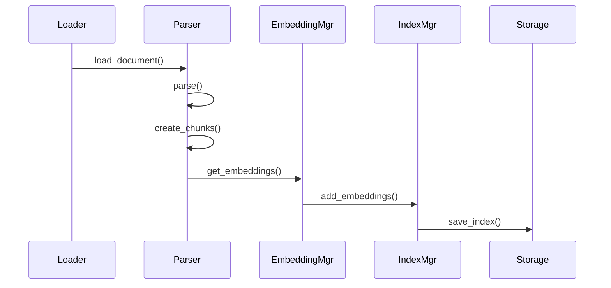
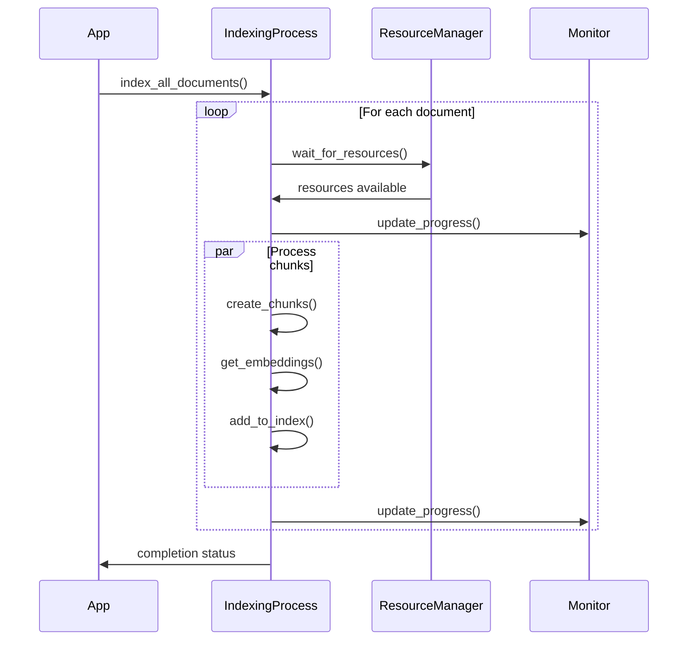
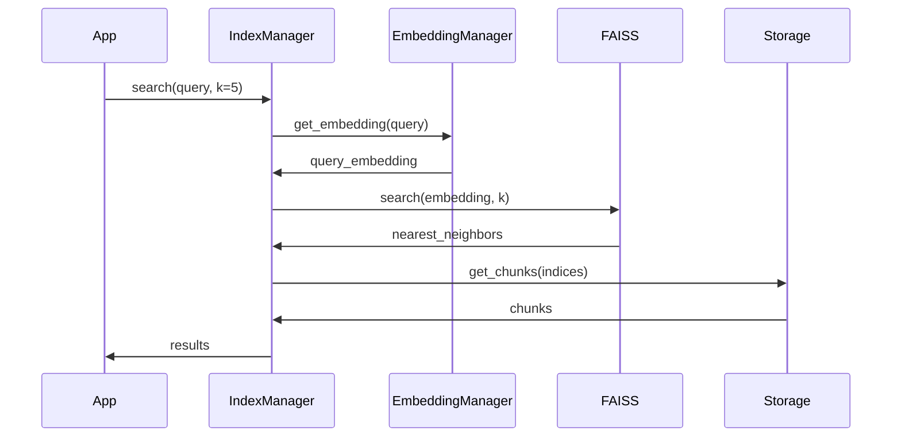

# Module d'Indexation

Le module d'indexation est responsable de la gestion des documents, de leur traitement, et de leur indexation vectorielle pour la recherche sémantique.

## Architecture



## Composants

### 1. Document Loader
- Chargement asynchrone des documents
- Support WebDAV
- Gestion des métadonnées

### 2. Document Parsers
- Support multi-format (PDF, Markdown, HTML)
- Extraction de texte
- Chunking intelligent

### 3. Embedding Manager
- Génération d'embeddings
- Cache avec TTL
- Traitement par lots

### 4. Index Manager
- Index vectoriel FAISS
- Persistance WebDAV
- Gestion de la mémoire

## Flux de Données



## Configuration

```python
# Indexation
INDEX_PATH=./data/index.faiss
METADATA_PATH=./data/metadata.pkl
CHUNK_SIZE=512
CHUNK_OVERLAP=128

# Embeddings
EMBEDDING_DIMENSION=768
EMBEDDING_BATCH_SIZE=10
EMBEDDING_CACHE_SIZE=1000
EMBEDDING_CACHE_TTL=3600
```

## Processus d'Indexation



## Recherche



## Gestion des Ressources

Le module implémente une gestion intelligente des ressources :

1. **Mémoire**
   - Limite configurable
   - Nettoyage automatique
   - Chunking adaptatif

2. **CPU**
   - Traitement par lots
   - Parallélisation
   - Prioritisation

3. **Stockage**
   - Compression des index
   - Nettoyage périodique
   - Gestion des versions

## Monitoring

Le système fournit des métriques détaillées :

```python
{
    "phase": "indexation",
    "progress": "45/100",
    "percentage": 45.0,
    "duration": 120.5,
    "estimated_remaining": 147.3,
    "errors": [
        {
            "timestamp": "2024-02-20T14:30:00",
            "error": "Failed to process document",
            "document_id": "doc123"
        }
    ]
}
```

## Extension

Le module est conçu pour être extensible :

1. **Nouveaux Formats**
   ```python
   class CustomParser(BaseDocumentParser):
       def parse(self, file_path: str) -> ParsedDocument:
           # Implémentation personnalisée
           pass
   ```

2. **Nouveaux Index**
   ```python
   class CustomIndex(IndexInterface):
       async def add_embeddings(self, embeddings: List[List[float]]):
           # Implémentation personnalisée
           pass
   ```

3. **Nouveaux Sources**
   ```python
   class CustomLoader(DocumentLoader):
       async def load_document(self, source: str) -> Document:
           # Implémentation personnalisée
           pass
   ```

## Bonnes Pratiques

1. **Indexation**
   - Chunking approprié
   - Gestion de la mémoire
   - Monitoring continu

2. **Recherche**
   - Cache des requêtes fréquentes
   - Optimisation des paramètres k
   - Reranking si nécessaire

3. **Maintenance**
   - Réindexation périodique
   - Nettoyage du cache
   - Backup des index 