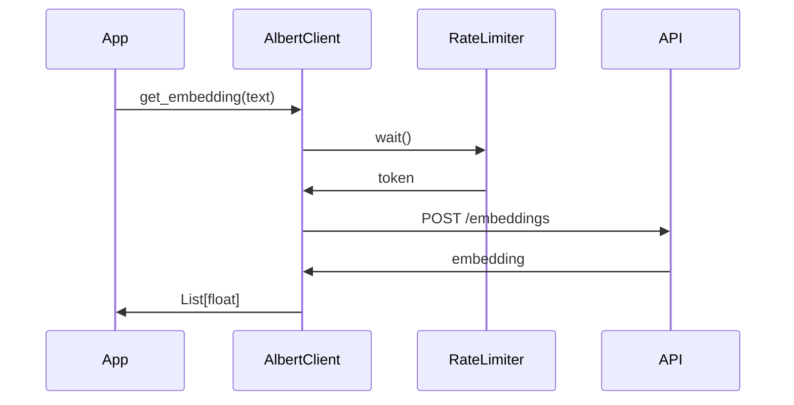
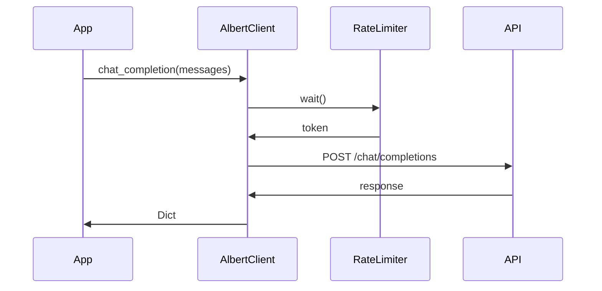
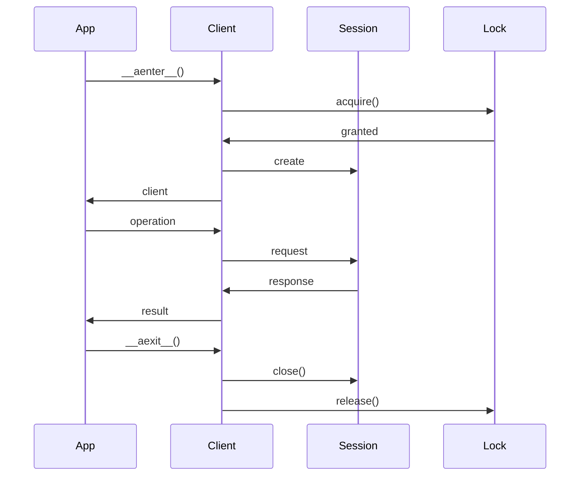

# Client Albert

Le client Albert est responsable de l'interaction avec l'API Albert pour la génération d'embeddings et les complétion de chat.

## Fonctionnalités

- Génération d'embeddings (single et batch)
- Complétion de chat
- Gestion des collections de documents
- Gestion des fichiers
- Rate limiting intégré
- Gestion de session asynchrone

## Configuration

```python
ALBERT_API_KEY=votre_clé_api_albert
ALBERT_API_URL=https://albert.api.etalab.gouv.fr/v1
ALBERT_RATE_LIMIT=60  # Requêtes par minute
ALBERT_BATCH_SIZE=10  # Taille des lots pour les embeddings
```

## Utilisation

### Initialisation

```python
from colaig.tools.albert_client import AlbertClient

client = AlbertClient(
    api_key="votre_clé",
    api_url="https://albert.api.etalab.gouv.fr/v1",
    rate_limit=60
)
```

### Génération d'Embeddings



### Complétion de Chat



## API

### Embeddings

```python
async def get_embedding(
    self,
    text: str,
    model: str = "albert-embedding"
) -> List[float]
```

```python
async def get_embeddings_batch(
    self,
    texts: List[str],
    model: str = "albert-embedding"
) -> List[List[float]]
```

### Chat

```python
async def chat_completion(
    self,
    messages: List[Dict[str, str]],
    model: str = "albert-chat",
    temperature: float = 0.7,
    max_tokens: Optional[int] = None
) -> Dict
```

### Collections

```python
async def create_collection(
    self,
    name: str,
    model: str = "albert-embedding",
    description: Optional[str] = None
) -> str
```

```python
async def delete_collection(self, collection_id: str)
async def list_collections(self) -> List[Dict]
async def get_collection(self, collection_id: str) -> Dict
```

### Documents

```python
async def add_documents(
    self,
    collection_id: str,
    documents: List[Dict],
    chunk_size: int = 100
) -> List[str]
```

```python
async def delete_documents(
    self,
    collection_id: str,
    document_ids: List[str]
)
```

```python
async def search_documents(
    self,
    prompt: str,
    collections: List[str],
    k: int = 4,
    method: str = "semantic",
    filter: Optional[Dict] = None,
    rerank: bool = False
) -> List[Dict]
```

## Gestion des Sessions

Le client utilise `aiohttp.ClientSession` pour gérer les connexions HTTP de manière asynchrone :



## Rate Limiting

Le rate limiting est géré par la classe `RateLimit` :

- Limite de requêtes par minute configurable
- Burst size configurable
- Attente asynchrone pour les tokens
- Protection thread-safe avec verrous

## Gestion des Erreurs

Le client gère les erreurs suivantes :

- Erreurs d'authentification
- Erreurs de rate limiting
- Erreurs de réseau
- Erreurs de l'API
- Timeouts

## Bonnes Pratiques

1. Utiliser le client comme context manager
2. Configurer le rate limiting approprié
3. Utiliser le batch processing pour les embeddings
4. Gérer les erreurs de manière appropriée
5. Fermer proprement les sessions 