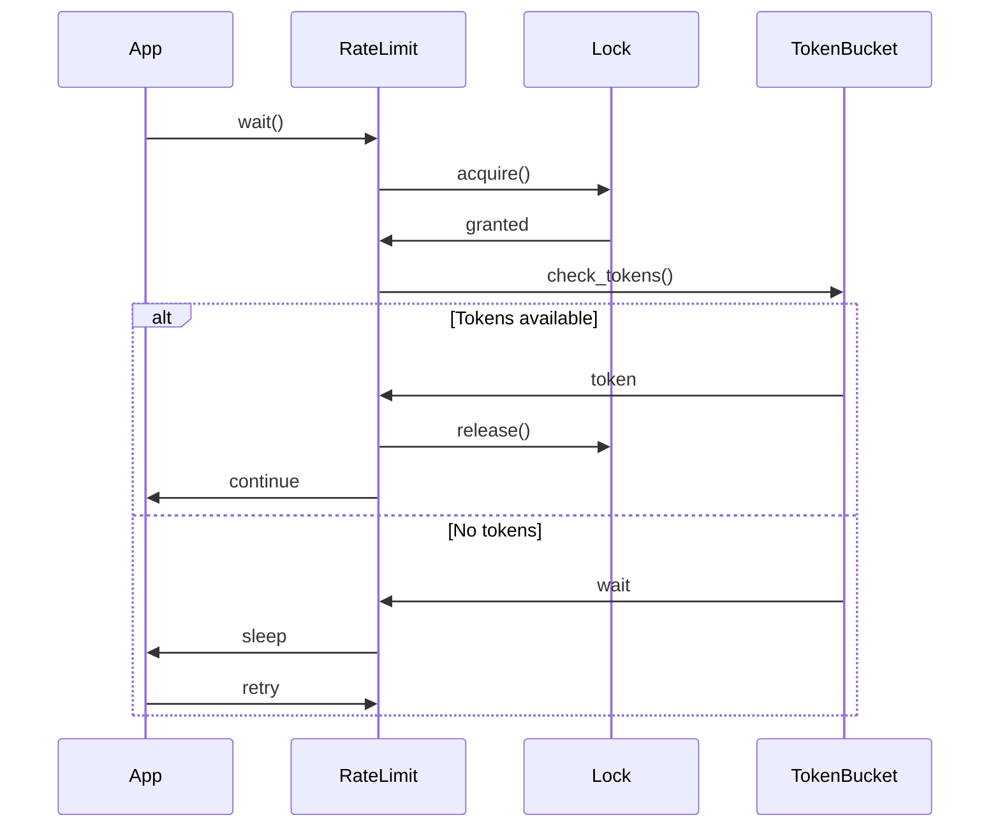
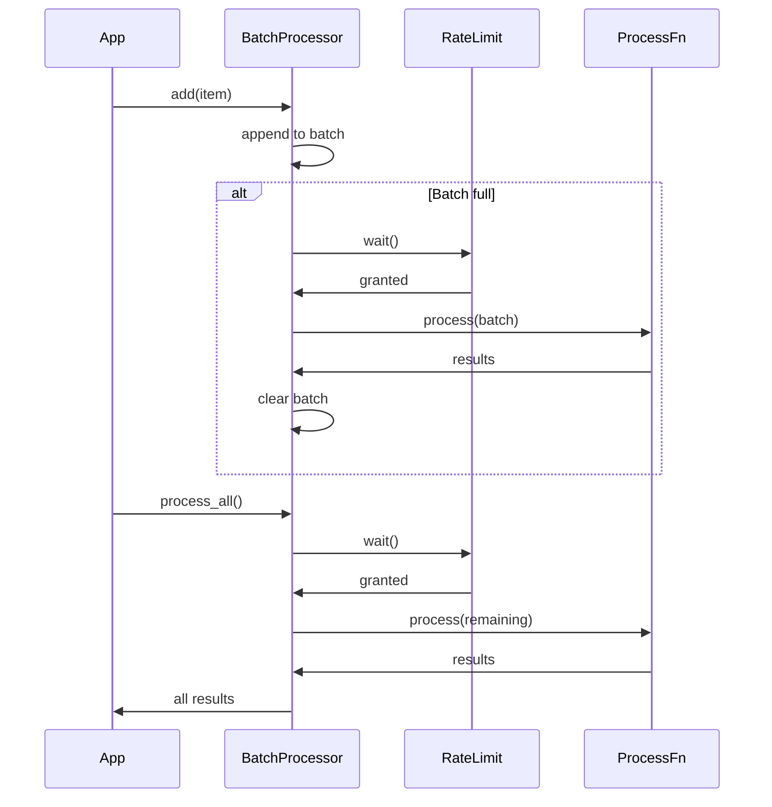
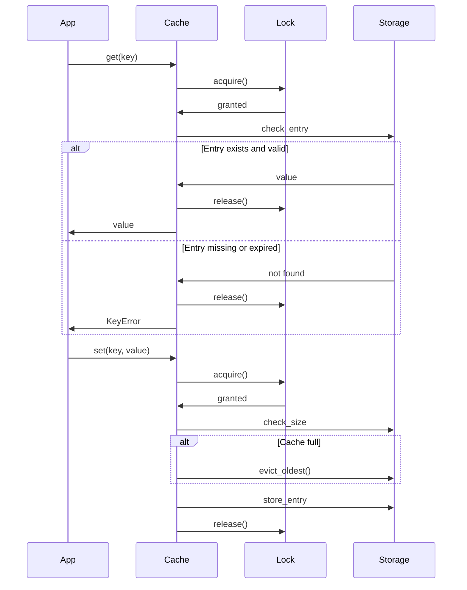

# Rate Limiter

Le gestionnaire de rate limiting fournit des mécanismes pour contrôler le débit des requêtes et gérer le traitement par lots.

## Composants

1. `RateLimit` : Contrôle du débit des requêtes
2. `BatchProcessor` : Traitement par lots avec rate limiting
3. `Cache` : Cache avec expiration

## Rate Limit

### Configuration

```python
rate_limit = RateLimit(
    requests_per_minute=60,
    burst_size=10  # Optionnel
)
```

### Fonctionnement



### API

```python
class RateLimit:
    async def acquire(self) -> bool:
        """Tente d'acquérir un token."""
        
    async def wait(self):
        """Attend jusqu'à ce qu'un token soit disponible."""
```

## Batch Processor

### Configuration

```python
processor = BatchProcessor(
    batch_size=10,
    rate_limit=rate_limit,
    process_fn=async_process_function
)
```

### Fonctionnement



### API

```python
class BatchProcessor(Generic[T, R]):
    async def add(self, item: T):
        """Ajoute un élément au lot."""
        
    async def process_all(self) -> List[R]:
        """Traite tous les éléments restants."""
```

## Cache

### Configuration

```python
cache = Cache(
    max_size=1000,
    ttl=3600  # Secondes
)
```

### Fonctionnement



### API

```python
class Cache(Generic[T]):
    async def get(self, key: str) -> T:
        """Récupère une valeur du cache."""
        
    async def set(self, key: str, value: T):
        """Ajoute ou met à jour une valeur."""
        
    async def clear(self):
        """Vide le cache."""
```

## Utilisation Combinée

### Exemple avec Embeddings

```python
# Configuration
rate_limit = RateLimit(requests_per_minute=60)
cache = Cache[List[float]](max_size=1000, ttl=3600)
processor = BatchProcessor(
    batch_size=10,
    rate_limit=rate_limit,
    process_fn=get_embeddings
)

# Utilisation
async def process_texts(texts: List[str]) -> List[List[float]]:
    results = []
    for text in texts:
        # Vérifier le cache
        try:
            embedding = await cache.get(text)
            results.append(embedding)
            continue
        except KeyError:
            pass
            
        # Ajouter au batch
        await processor.add(text)
        
    # Traiter le reste
    embeddings = await processor.process_all()
    
    # Mettre en cache
    for text, embedding in zip(texts, embeddings):
        await cache.set(text, embedding)
        
    return embeddings
```

## Bonnes Pratiques

1. **Rate Limiting**
   - Configurer des limites appropriées
   - Utiliser le burst size pour les pics
   - Gérer les timeouts

2. **Batch Processing**
   - Choisir une taille de lot optimale
   - Traiter les erreurs par lot
   - Implémenter une logique de retry

3. **Cache**
   - Définir une TTL appropriée
   - Gérer la taille maximale
   - Implémenter une stratégie d'éviction

4. **Concurrence**
   - Utiliser les verrous appropriés
   - Gérer les accès concurrents
   - Éviter les deadlocks

## Métriques et Monitoring

- Taux d'utilisation du rate limit
- Taille des lots
- Hit ratio du cache
- Temps d'attente
- Erreurs et retries 