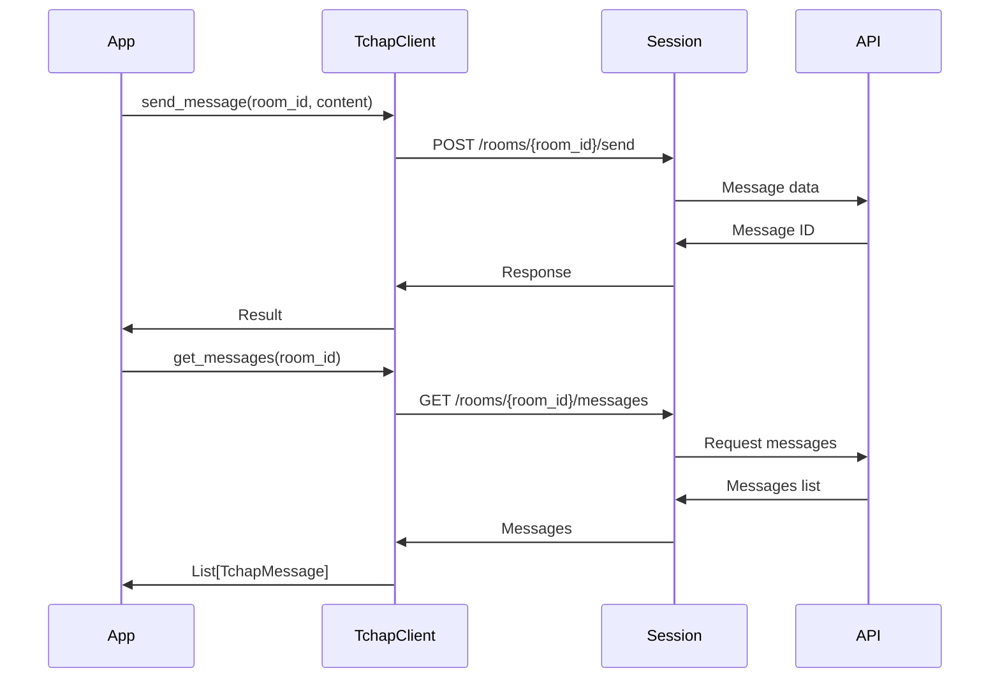
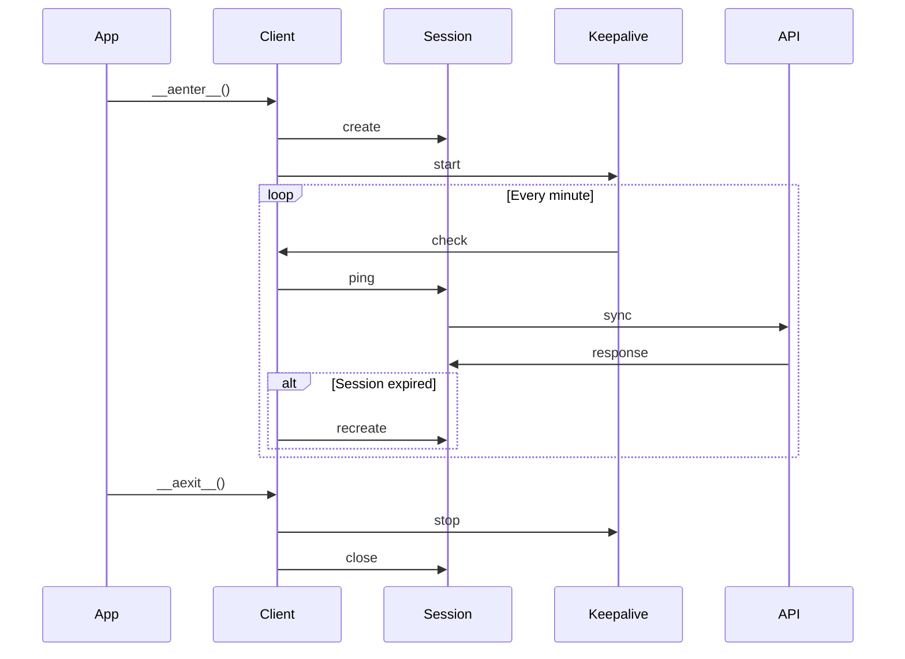
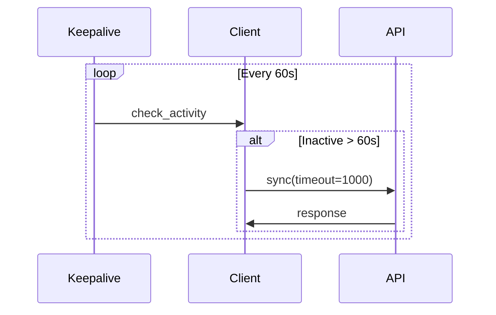

# Client Tchap

Le client Tchap fournit une interface asynchrone pour interagir avec l'API Tchap, permettant la gestion des conversations et des messages.

## Fonctionnalités

- Gestion des messages
- Gestion des salles
- Synchronisation en temps réel
- Gestion de session
- Rate limiting
- Keepalive automatique

## Configuration

```python
TCHAP_API_URL=https://api.tchap.gouv.fr
TCHAP_ACCESS_TOKEN=votre_token_tchap
TCHAP_USER_ID=@votre_id:tchap.gouv.fr
```

## Modèles de Données

### Message

```python
class TchapMessage(BaseModel):
    id: str
    room_id: str
    sender: str
    content: Dict[str, str]
    timestamp: int
    type: str = "m.room.message"
```

### Salle

```python
class TchapRoom(BaseModel):
    id: str
    name: str
    topic: Optional[str] = None
    members: List[str] = Field(default_factory=list)
    is_direct: bool = False
```

## Utilisation

### Initialisation

```python
from colaig.tools.tchap_client import TchapClient

client = TchapClient(
    base_url="https://api.tchap.gouv.fr",
    access_token="votre_token",
    user_id="@votre_id:tchap.gouv.fr"
)
```

### Flux de Messages



## API

### Messages

```python
async def send_message(
    self,
    room_id: str,
    content: Union[str, Dict],
    message_type: str = "m.text"
) -> Dict

async def get_messages(
    self,
    room_id: str,
    limit: int = 50,
    from_token: Optional[str] = None
) -> List[TchapMessage]
```

### Salles

```python
async def get_rooms(
    self,
    include_leave: bool = False
) -> List[TchapRoom]

async def create_room(
    self,
    name: str,
    topic: Optional[str] = None,
    is_direct: bool = False,
    invitees: List[str] = None
) -> TchapRoom

async def join_room(self, room_id: str) -> Dict
async def leave_room(self, room_id: str) -> Dict
async def get_room_members(self, room_id: str) -> List[str]
```

### Synchronisation

```python
async def sync(
    self,
    timeout: int = 30000,
    since: Optional[str] = None
) -> Dict

def start_listening(
    self,
    callback,
    sync_delay: int = 30000
)
```

## Gestion des Sessions

Le client implémente une gestion de session robuste avec reconnexion automatique :



## Keepalive

Le système de keepalive maintient la session active :



## Gestion des Erreurs

Le client gère les erreurs suivantes :

- Erreurs d'authentification
- Erreurs de réseau
- Erreurs de protocole Matrix
- Timeouts
- Erreurs de synchronisation

## Bonnes Pratiques

1. Utiliser le client comme context manager
2. Implémenter une gestion appropriée des erreurs
3. Utiliser le système de callback pour la synchronisation
4. Gérer les reconnexions automatiques
5. Maintenir une session active avec keepalive

## Exemple Complet

```python
async with TchapClient(...) as client:
    # Rejoindre les salles
    rooms = await client.get_rooms()
    for room in rooms:
        await client.join_room(room.id)

    # Envoyer un message
    await client.send_message(
        room_id="!room:tchap.gouv.fr",
        content="Hello, world!"
    )

    # Récupérer les messages
    messages = await client.get_messages(
        room_id="!room:tchap.gouv.fr",
        limit=10
    )

    # Écouter les nouveaux messages
    def message_callback(message: TchapMessage):
        print(f"Nouveau message de {message.sender}: {message.content}")

    client.start_listening(message_callback)
``` 