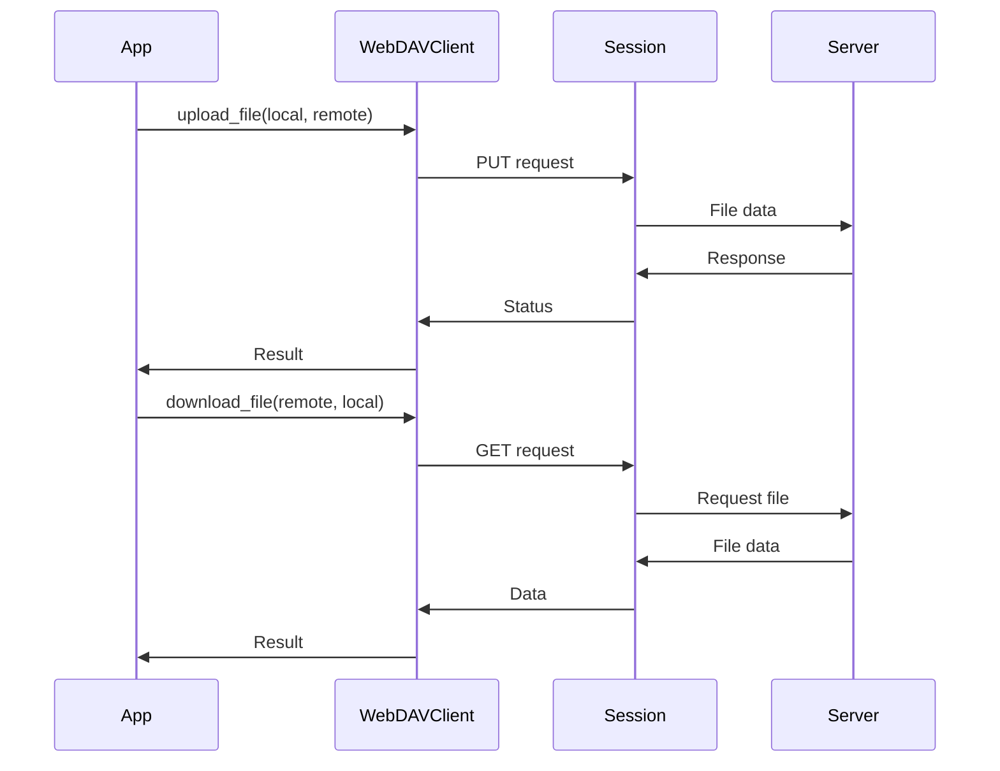
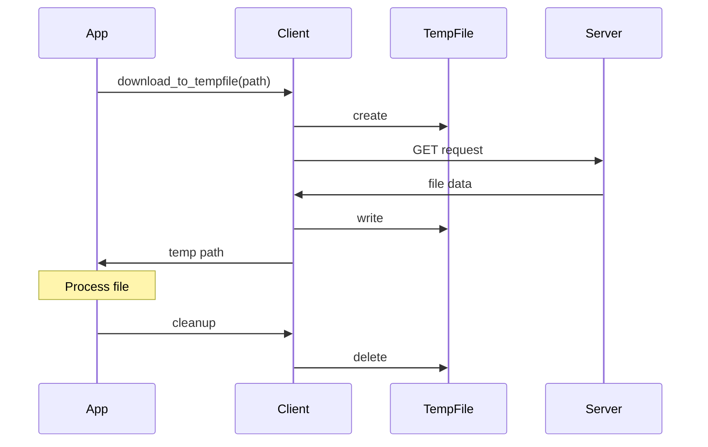
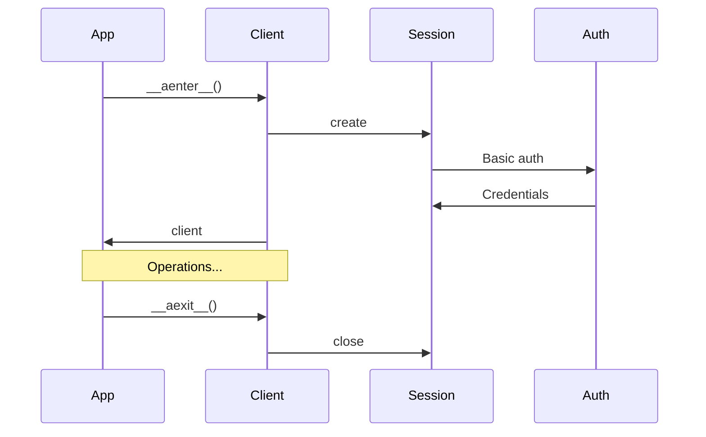

# Client WebDAV

Le client WebDAV fournit une interface asynchrone pour interagir avec un serveur WebDAV, permettant le stockage et la récupération de fichiers.

## Fonctionnalités

- Opérations de fichiers asynchrones
- Gestion de session HTTP
- Support des opérations de base WebDAV
- Gestion des métadonnées
- Support des fichiers temporaires

## Configuration

```python
WEBDAV_URL=https://webdav.example.com
WEBDAV_USERNAME=votre_utilisateur
WEBDAV_PASSWORD=votre_mot_de_passe
WEBDAV_ROOT=/
```

## Utilisation

### Initialisation

```python
from colaig.tools.webdav_client import WebDAVClient

client = WebDAVClient(
    hostname="https://webdav.example.com",
    login="utilisateur",
    password="mot_de_passe",
    root="/"
)
```

### Opérations sur les Fichiers



## API

### Opérations de Base

```python
def exists(self, path: str) -> bool
def create_directory(self, path: str)
def delete(self, path: str)
def list_directory(self, path: str) -> List[str]
def is_dir(self, path: str) -> bool
```

### Opérations Asynchrones

```python
async def download_file(
    self,
    remote_path: str,
    local_path: str
)

async def upload_file(
    self,
    local_path: str,
    remote_path: str
)

async def get_file_content(
    self,
    remote_path: str
) -> bytes

async def get_text_content(
    self,
    remote_path: str,
    encoding: str = 'utf-8'
) -> str
```

### Gestion des Fichiers Temporaires

```python
@asynccontextmanager
async def download_to_tempfile(
    self,
    remote_path: str
) -> AsyncContextManager[str]
```

## Gestion des Métadonnées

```python
class WebDAVFileInfo:
    path: str
    name: str
    size: int
    modified: str
    created: str
    is_dir: bool
    content_type: str
```

## Flux de Travail Typique



## Gestion des Sessions

Le client maintient une session HTTP asynchrone pour optimiser les performances :



## Gestion des Erreurs

Le client gère les erreurs suivantes :

- Erreurs d'authentification
- Erreurs de réseau
- Erreurs de permissions
- Erreurs de fichiers
- Timeouts

## Bonnes Pratiques

1. Utiliser le client comme context manager
2. Utiliser les fichiers temporaires pour les opérations de fichiers
3. Gérer proprement les ressources
4. Vérifier les permissions avant les opérations
5. Utiliser les méthodes asynchrones pour les opérations de fichiers
6. Implémenter une gestion appropriée des erreurs

## Exemple Complet

```python
async with WebDAVClient(...) as client:
    # Vérification de l'existence
    if not client.exists("/documents"):
        client.create_directory("/documents")

    # Upload avec contexte temporaire
    await client.upload_file("local.txt", "/documents/remote.txt")

    # Download avec contexte temporaire
    async with client.download_to_tempfile("/documents/remote.txt") as temp_path:
        # Traitement du fichier
        async with aiofiles.open(temp_path, 'r') as f:
            content = await f.read()

    # Listing de répertoire
    files = client.list_directory("/documents") 