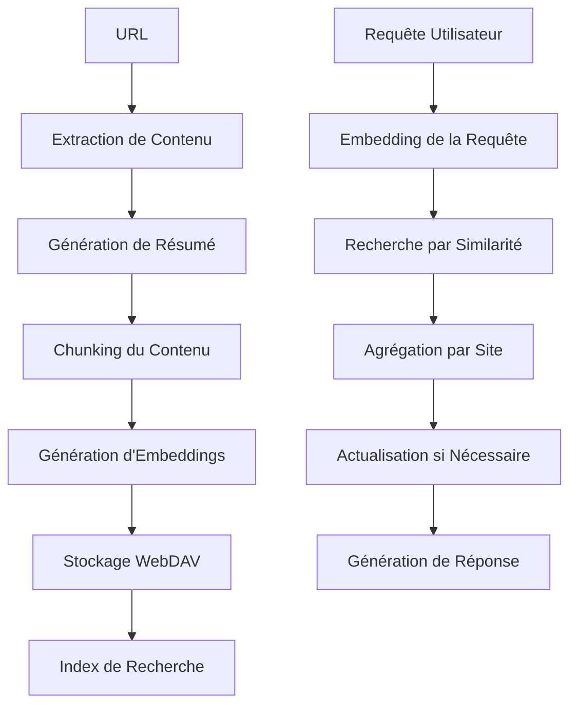

# Commandes Web - Système de Recherche Local

Le module de commandes web de Colaig-Albert fournit un système complet de gestion et de recherche dans le contenu web local. Ce système permet d'indexer des sites web, de les maintenir à jour automatiquement et d'effectuer des recherches intelligentes dans le contenu indexé.

## Vue d'Ensemble

Le système de commandes web est organisé autour de trois fonctionnalités principales :

1. **Indexation de contenu** : Extraction, résumé et vectorisation automatique du contenu web
2. **Recherche intelligente** : Recherche sémantique avec actualisation automatique des sources
3. **Gestion des liens** : Organisation et maintenance de la base de données de liens

## Architecture

### Composants Principaux

- **WebContentManager** : Gestionnaire principal pour l'indexation et la recherche
- **WebLinksManager** : Gestionnaire de la base de données de liens
- **AlbertApiClient** : Client pour la génération d'embeddings et de résumés
- **WebDAV Storage** : Stockage persistant des contenus et vecteurs

### Flux de Données



## Commandes Disponibles

### 1. !recherche_web - Recherche Intelligente

**Syntaxe** : `!recherche_web [question]`

**Description** : Effectue une recherche sémantique dans le contenu indexé avec actualisation automatique des sources pertinentes.

**Fonctionnalités** :
- Recherche par similarité sémantique orientée "site" (pas par chunks)
- Actualisation automatique des sources obsolètes
- Seuils de fraîcheur adaptatifs selon le type de contenu :
  - Actualités : 1 jour
  - Blogs : 3 jours
  - Documentation : 7 jours
  - Général : 3 jours
- Priorisation des sources récemment actualisées

**Exemples** :
```
!recherche_web Qu'est-ce que Tchap ?
!recherche_web Comment fonctionne l'administration numérique ?
!recherche_web Dernières actualités sur la transformation digitale
```

**Réponse Type** :
```
🔍 Recherche avec données actualisées : Qu'est-ce que Tchap ?

[Réponse générée basée sur les sites indexés]

📚 Sources consultées (3) :
1. **Tchap — beta.gouv.fr** - https://beta.gouv.fr/startups/tchap.html (sim: 0.85, actualisée)
2. **Documentation Tchap** - https://doc.tchap.gouv.fr (sim: 0.72, récente)
3. **Guide utilisateur** - https://guide.tchap.gouv.fr (sim: 0.68, ancienne)

🔄 Actualisation effectuée :
- 1 source(s) mise(s) à jour pour cette recherche
- Données garanties fraîches au moment de la réponse
```

**Logique d'Actualisation** :
- Sources avec similarité > 0.5 : Actualisation si obsolètes
- Sources avec similarité > 0.3 : Actualisation si obsolètes
- Maximum 5 sources actualisées par recherche
- Actualisation synchrone avant génération de réponse

### 2. !ajouter_lien - Indexation de Contenu

**Syntaxe** : `!ajouter_lien [URL] [titre?] [catégorie?]`

**Description** : Ajoute un lien à la base de données avec extraction, résumé et indexation complète du contenu.

**Processus d'Indexation** :
1. **Extraction** : Contenu textuel via Playwright
2. **Résumé** : Génération automatique avec Albert
3. **Chunking** : Division en fragments de ~1000 mots avec chevauchement
4. **Vectorisation** : Génération d'embeddings avec le modèle Albert
5. **Stockage** : Sauvegarde sur WebDAV (contenu + vecteurs)
6. **Catalogage** : Ajout au gestionnaire de liens

**Exemples** :
```
!ajouter_lien https://beta.gouv.fr/startups/tchap.html
!ajouter_lien https://www.service-public.fr "Service Public" administration
!ajouter_lien https://doc.tchap.gouv.fr "Documentation Tchap" documentation
```

**Réponse Type** :
```
✅ Lien ajouté et indexé avec succès

📄 Informations:
- URL: https://beta.gouv.fr/startups/tchap.html
- Titre: Tchap — beta.gouv.fr
- Catégorie: general

📊 Indexation:
- Contenu: 4,115 caractères
- Fragments: 12 chunks indexés
- Vecteurs: 12 embeddings générés

📝 Résumé:
Tchap : Messagerie Instantanée Sécurisée pour les Agents Publics
[Résumé automatique du contenu...]

Ce lien sera désormais pris en compte dans les recherches via !recherche_web
```

### 3. !explorer_lien - Analyse de Contenu

**Syntaxe** : `!explorer_lien [URL] [--ocr]`

**Description** : Explore et analyse le contenu d'une URL sans l'ajouter à l'index permanent.

**Options** :
- `--ocr` : Active l'extraction OCR pour les images et graphiques

**Exemples** :
```
!explorer_lien https://www.service-public.fr
!explorer_lien https://example.com/chart.html --ocr
```

**Fonctionnalités** :
- Extraction de contenu en temps réel
- Détection automatique du type de contenu
- Support OCR pour l'analyse d'éléments visuels
- Génération de résumé contextuel
- Pas de stockage permanent

### 4. !liste_liens - Gestion des Liens

**Syntaxe** : `!liste_liens [catégorie?]`

**Description** : Affiche les liens indexés organisés par catégorie.

**Exemples** :
```
!liste_liens
!liste_liens administration
!liste_liens documentation
```

**Catégories par Défaut** :
- `administration` : Sites administratifs et gouvernementaux
- `general` : Contenu généraliste
- `technique` : Documentation technique
- `documentation` : Guides et manuels

## Système de Recherche Orienté "Site"

### Principe

Le système de recherche a été conçu pour présenter les résultats par **site web** plutôt que par fragments de contenu (chunks). Cette approche offre une meilleure expérience utilisateur.

### Agrégation des Résultats

1. **Recherche par Chunks** : Le système recherche d'abord dans tous les fragments indexés
2. **Regroupement par Site** : Les résultats sont regroupés par URL source
3. **Score Global** : Calcul d'un score composite pour chaque site :
   - 70% du meilleur score de similarité
   - 30% de la moyenne des scores
4. **Présentation Unifiée** : Chaque site est présenté avec :
   - Titre et résumé global
   - Meilleur extrait pertinent
   - Nombre de sections correspondantes
   - Statut de fraîcheur

### Exemple de Résultat Agrégé

```json
{
  "url": "https://beta.gouv.fr/startups/tchap.html",
  "title": "Tchap — beta.gouv.fr",
  "summary": "Messagerie instantanée sécurisée pour les agents publics...",
  "similarity": 0.85,
  "chunks_matched": 3,
  "best_chunk_text": "Tchap est une messagerie instantanée sécurisée...",
  "is_fresh": true,
  "was_refreshed": false
}
```

## Gestion de la Fraîcheur

### Seuils Adaptatifs

Le système utilise des seuils de fraîcheur différents selon le type de contenu détecté :

```python
FRESHNESS_THRESHOLDS = {
    "news": 1,      # Actualités : 1 jour
    "blog": 3,      # Blogs : 3 jours  
    "docs": 7,      # Documentation : 7 jours
    "general": 3    # Général : 3 jours
}
```

### Détection Automatique du Type

Le système analyse l'URL, le titre et le contenu pour déterminer automatiquement le type :

- **Actualités** : Mots-clés comme "news", "actualité", "breaking"
- **Blogs** : URLs contenant "blog", "post", "article"
- **Documentation** : URLs avec "doc", "guide", "manual", "wiki"
- **Général** : Tout autre contenu

### Logique d'Actualisation

1. **Analyse de Pertinence** : Évaluation de la similarité avec la requête
2. **Vérification de Fraîcheur** : Comparaison avec les seuils adaptatifs
3. **Décision d'Actualisation** :
   - Haute pertinence (>0.5) + obsolète → Actualisation
   - Pertinence moyenne (>0.3) + obsolète → Actualisation
   - Faible pertinence ou récent → Pas d'actualisation

## Stockage et Persistence

### Structure WebDAV

```
.albert/web_links/
├── content/
│   └── {hash}.json          # Contenu textuel et métadonnées
├── vectors/
│   └── {hash}.json          # Embeddings et vecteurs
└── links.json               # Index des liens par catégorie
```

### Format de Stockage du Contenu

```json
{
  "url": "https://example.com",
  "title": "Titre de la page",
  "content": "Contenu textuel complet...",
  "summary": "Résumé automatique...",
  "collected_at": "2024-01-15T10:30:00",
  "content_length": 4115
}
```

### Format de Stockage des Vecteurs

```json
{
  "url": "https://example.com",
  "embedding_model": "text-embedding-ada-002",
  "created_at": "2024-01-15T10:30:00",
  "vectors": [
    {
      "text": "Fragment de contenu...",
      "vector": [0.1, 0.2, ...],
      "position": 0
    }
  ]
}
```

## Configuration et Paramètres

### Variables d'Environnement

```bash
# API Albert pour embeddings et génération
ALBERT_API_URL=https://albert.api.etalab.gouv.fr
ALBERT_API_TOKEN=your_token_here
ALBERT_MODEL_EMBEDDING=text-embedding-ada-002

# Stockage WebDAV
WEBDAV_URL=https://webdav.example.com
WEBDAV_USERNAME=username
WEBDAV_PASSWORD=password
WEBDAV_ROOT_PATH=/colaig
```

### Paramètres de Recherche

```python
# Seuils de similarité
MIN_SIMILARITY_HIGH_QUALITY = 0.3
MIN_SIMILARITY_FALLBACK = 0.25

# Limites de résultats
MAX_SITES_RETURNED = 6
MAX_SOURCES_TO_REFRESH = 5
MAX_INITIAL_SEARCH = 15

# Timeouts
SEARCH_TIMEOUT = 300.0  # 5 minutes
INDEXING_TIMEOUT = 180.0  # 3 minutes
EXPLORATION_TIMEOUT = 120.0  # 2 minutes
```

## Bonnes Pratiques

### Pour les Utilisateurs

1. **Indexation Progressive** : Commencez par 3-5 sites de référence
2. **Catégorisation** : Organisez vos liens par catégories thématiques
3. **Requêtes Précises** : Formulez des questions spécifiques
4. **Maintenance** : Laissez le système actualiser automatiquement

### Pour les Développeurs

1. **Gestion d'Erreurs** : Tous les appels API sont protégés avec retry
2. **Performance** : Traitement par lots des embeddings
3. **Mémoire** : Troncature automatique du contenu trop long
4. **Monitoring** : Logs détaillés pour le debugging

## Dépannage

### Problèmes Courants

**Aucun résultat trouvé** :
- Vérifiez que des liens sont indexés avec `!liste_liens`
- Reformulez la requête avec des termes différents
- Ajoutez des sources pertinentes avec `!ajouter_lien`

**Erreur d'extraction** :
- Vérifiez la connectivité réseau
- Testez l'URL manuellement dans un navigateur
- Certains sites bloquent l'extraction automatique

**Performance lente** :
- L'actualisation de sources peut prendre du temps
- Limitez le nombre de sources indexées
- Vérifiez la latence vers l'API Albert

### Logs de Débogage

```bash
# Activer les logs détaillés
export LOG_LEVEL=DEBUG

# Rechercher des erreurs spécifiques
grep "Erreur lors de" logs/albert.log
grep "search_stored_content" logs/albert.log
```

## Évolutions Futures

### Fonctionnalités Prévues

1. **Recherche Fédérée** : Combinaison recherche locale + web
2. **Indexation Programmée** : Actualisation automatique périodique
3. **Filtres Avancés** : Recherche par date, type, catégorie
4. **Export/Import** : Sauvegarde et partage d'index
5. **Analytics** : Statistiques d'utilisation et de pertinence

### Améliorations Techniques

1. **Cache Intelligent** : Mise en cache des embeddings fréquents
2. **Compression** : Optimisation du stockage des vecteurs
3. **Parallélisation** : Actualisation simultanée de sources
4. **Machine Learning** : Amélioration continue des seuils de pertinence 